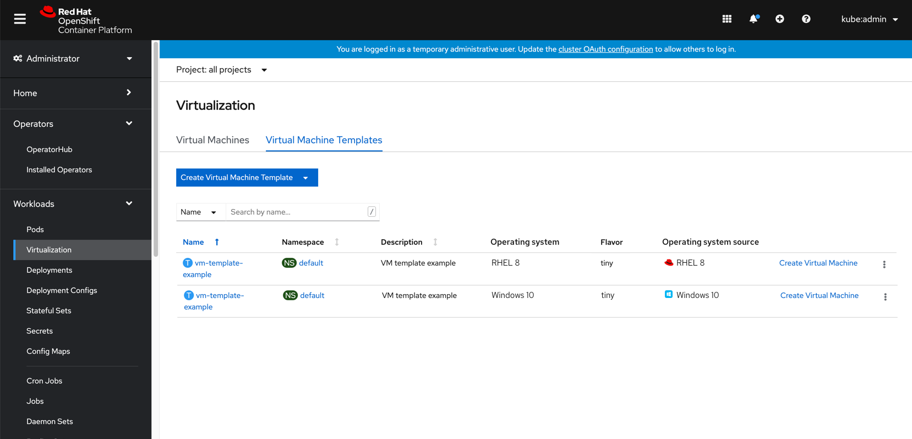

parent: Virtualization
version: 4.x
---
# Templates backed by golden images

Adding to the UI the option of showing users when and which templates are backed by golden images (that are provided by OpenShift Virtualization/ or created by an admin).
This PR will also allow users to quickly create VMs from templates that have backing images.

## Adding an ‘Operating System source’ column 

Add an ‘Operating System source’ column to the list view to show which Operating System is running on the VM and adding an icon to differentiate whether it's a vendor OS image or a custom OS image.

## Allowing users to quickly create VMs from templates that have backing images

At the Virtual Machine Templates list page, from each template, users can either click the link ‘Create Virtual Machine’ or open the kebab menu and select to create it from there.

They will get to a modal where they'll need to fill in the the name of the VM they wish to create.
Once they click ‘Create’, the VM will quickly get created.
If they click ‘Edit Virtual Machine’ they will get to the Create VM wizard where they will be able to configure things and create the VM by following the wizard’s steps.

