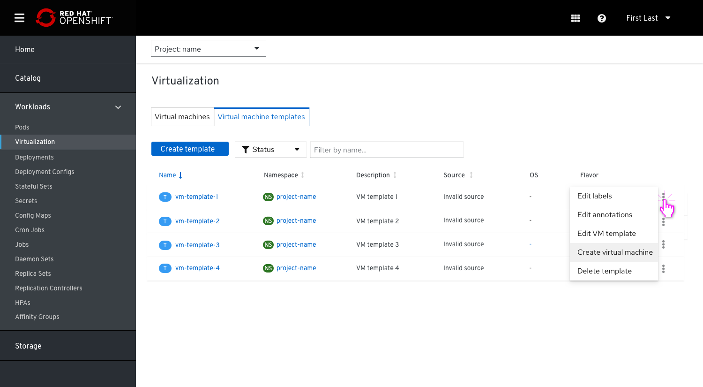
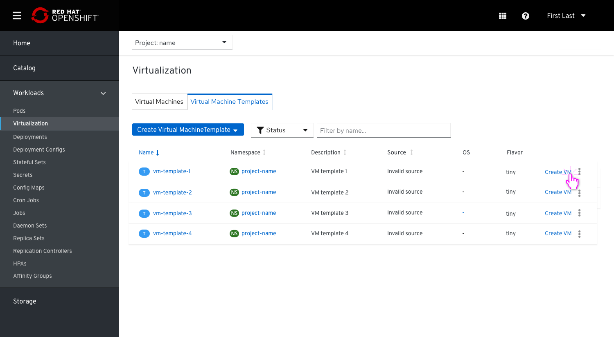
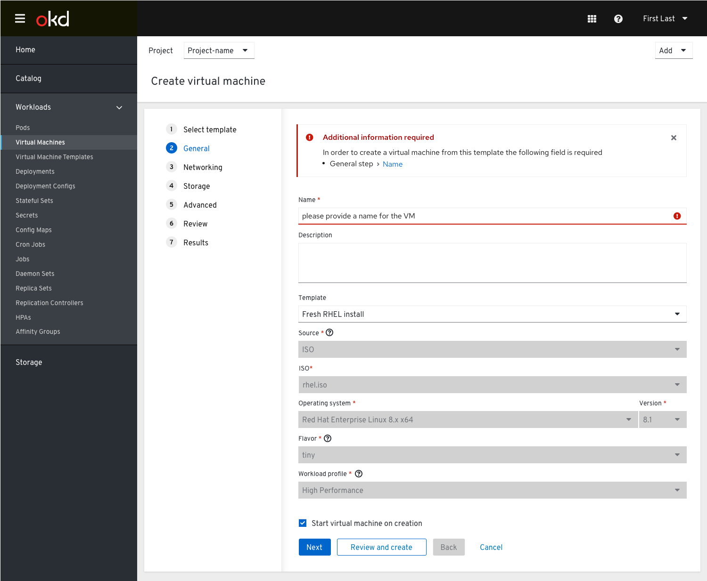
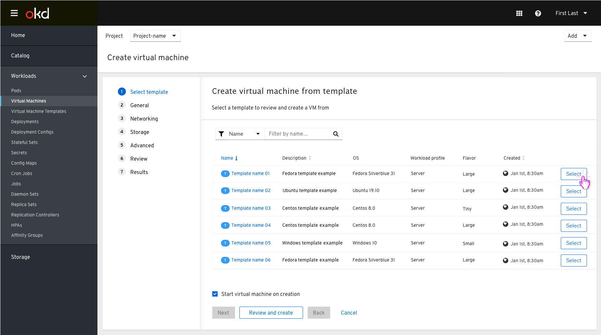
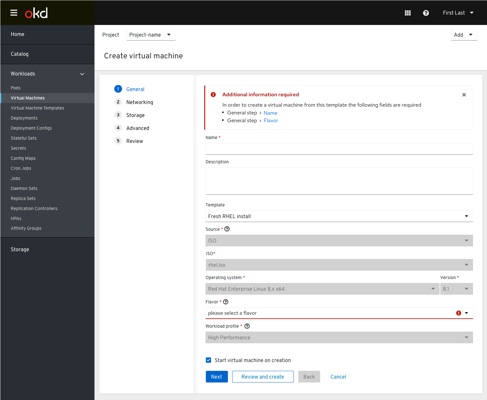
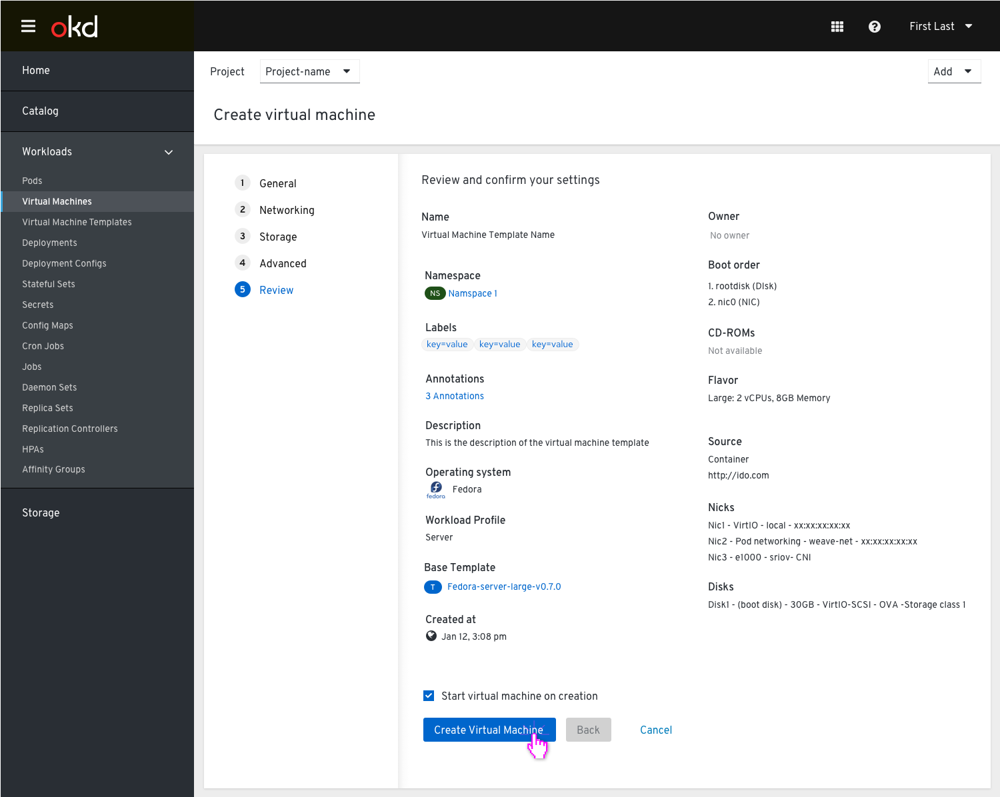

# Templates

## Virtual machines and VM templates are located under Virtualization

One of the options for users to create a VM is when they choose a to create it from a template.
Under the left side navigation tab ‘Virtualization’ we'll have 2 tabs: ‘Virtual Machine Templates’ and ‘Virtual Machines’.

### Virtual Machine Templates Tab

From the Virtualization left nav item the user goes to the Virtual machine templates tab where they can see the full list of templates.
From this point, we suggest 2 options to create a VM:

Create VM via an action from the kebab menu and also allow an action link.

Both options will lead the user to the general step of the wizard where they will need to provide a name for the VM they want to create.

If all they need is to provide a name for the VM, they can skip to the 'Review and create' step where they can review the settings and create the VM.

If they need to edit any of the settings for this VM that are different from the template they started with, they will need to go through the steps to edit the settings and then create the VM. F.e. if a user wants to change the flavor, they will need to go to the general step and reedit this field.

### Virtual Machine Tab

From the Virtualization left nav item the user goes to the Virtual machines tab and from the dropdown selects the option to create a VM from a template.

They will get to the list of templates where they can select a template to create the VM from. Once the user clicks 'Select' they will go immediately to next required step (the 'General' step) to give the VM a name, then review the settings and create the VM.

In case a user selects a template that has required info missing, an inline alert will be shown and indicate via a clickable link which info is missing and where it is located, so the user can quickly complete the required info and then create the VM.

Once the info is completed the user will be able to create the VM.

