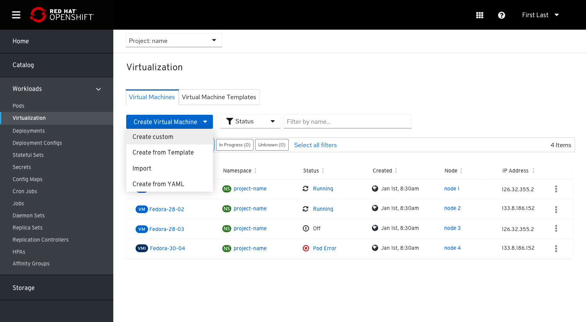
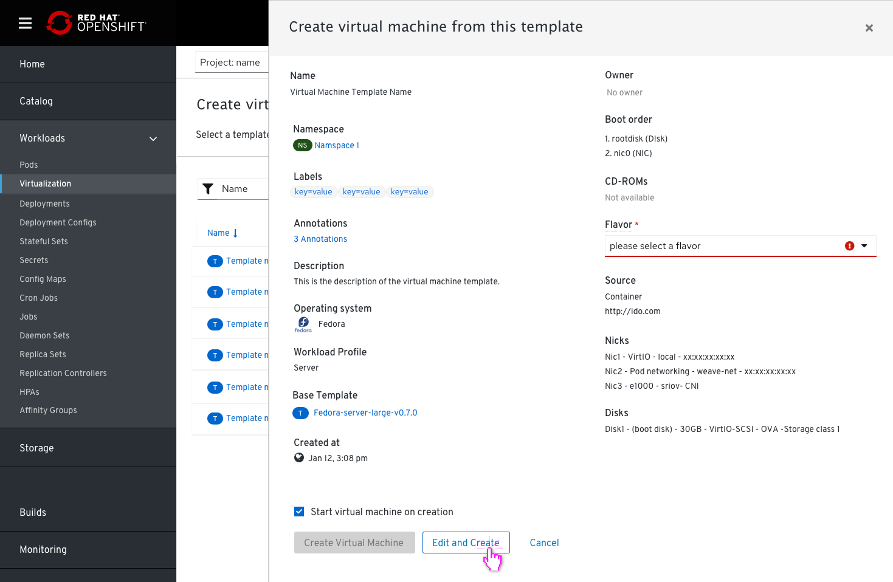
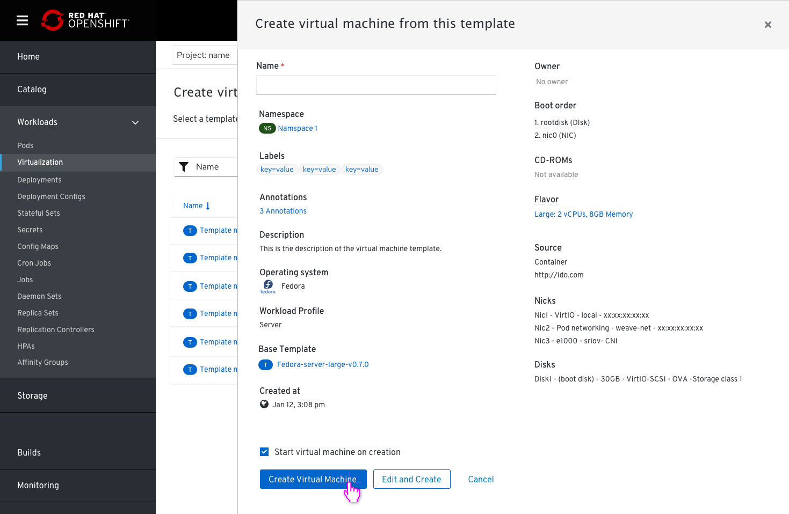

# Templates

## Virtual machines and VM templates are located under Virtualization

Removing the tab ‘Virtual Machine Templates’ from the side navigation and combining it with ‘Virtual Machines’, so both are located under ‘Virtualization’.
This PR will focus on how users can create a VM when they choose a to create a VM from a Template.

### Virtual Machines Tab

### Virtual Machine Templates Tab

If a user wants to create a Virtual Machine, there are 4 options to do it from the drop down menu of the create Virtual Machines dropdown:

- Create custom
- Create from template
- Import
- Create from YAML

#### If they choose to create a custom VM

they will get to the first page of the wizard (note that the template field is removed now)

#### If they choose to create a VM from a Template

They will get a list of templates to select from.

In case a user selects a template that has required fields that are missing, these fields will be popped out and the 'create VM' button will become disabled until they are edited.

Missing fields as well as a name are required to create a VM so users will need to fill these fields in order to proceed.

Once completed the user will be able to create the VM.
