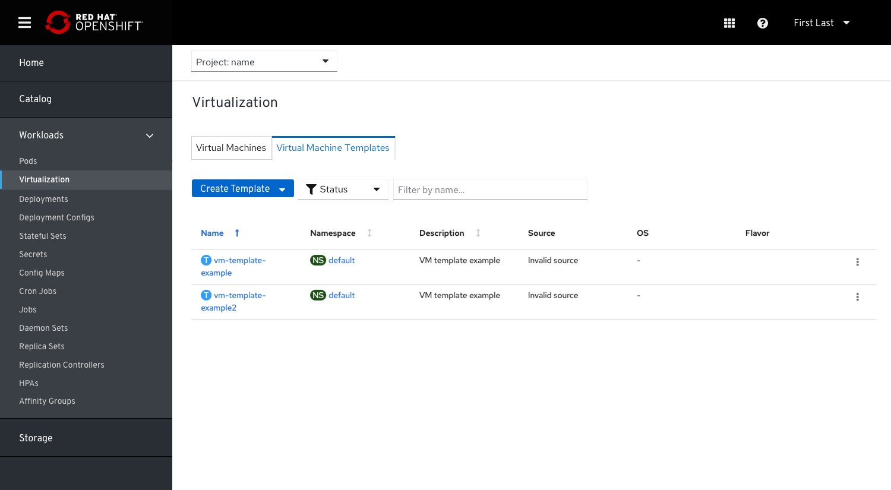
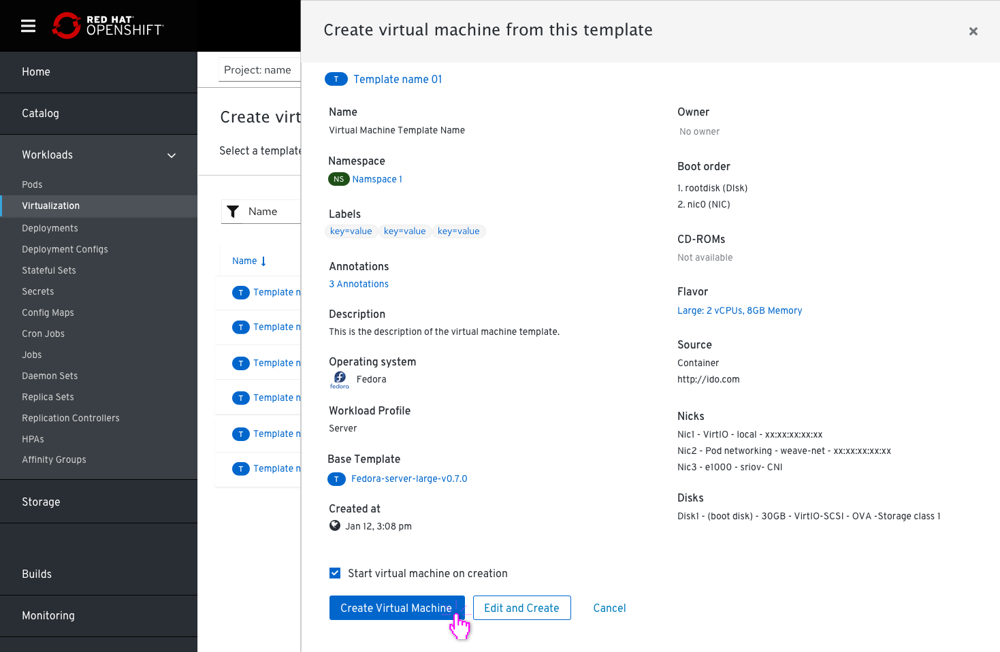

# Templates

## Removing the tab 'Virtual Machine Templates' and adding it to 'Virtual Machines' to be under 'Virtualization'

Removing the tab ‘Virtual Machine Templates’ from the side navigation and combine it with the ‘Virtual Machines’ item. A new left navigation tab named ‘Virtualization’ will now nest 2 inner tabs: 'Virtual Machines' and 'Virtual Machines Templates'.
This PR will also show how users can create VMs from each of the 4 options they have in the dropdown of creating Virtual Machine.

### Virtual Machines Tab

### Virtual Machine Templates Tab

If a user wants to create a Virtual Machine, there are several options to do it from the drop down menu of the Virtual Machines tab:

- Create custom
- Create from template
- Import
- Create from YAML

#### If they choose to create a custom VM

they will get to the first page of the wizard (note that the template field is removed now)

#### If they choose to create a VM from Template

They will get a list of templates to select from.

In case a user selects a template that has required fields that aren’t filled and need some additional editing by the user, they will be notified about it.

This can be done in the General step of the wizard with all the editing options we have for creating a VM.  The info will be already provided into the wizard and the names of the required fields will be mentioned in the message so that they could be easily located and the user can complete them.

Once completed the user will be able to create the VM.

#### If they choose to Import

If they choose Import from the drop down menu, they will get to the import wizard.

#### If they choose YAML

If they choose YAML they will get the YAML flow.

