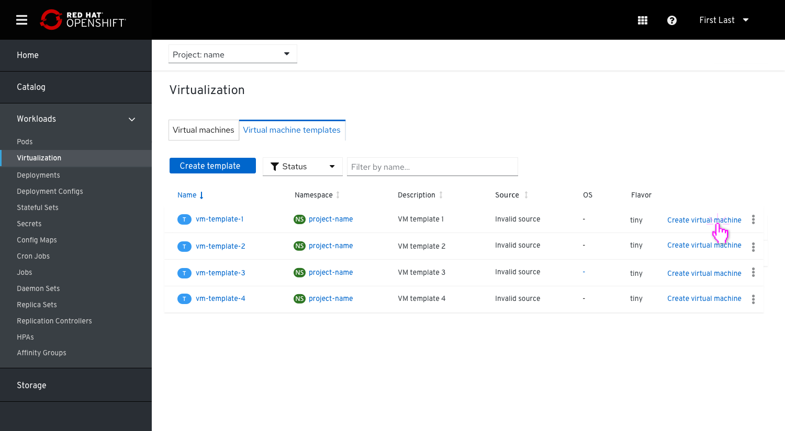

# Templates

## Virtual machines and VM templates are located under Virtualization

Removing the tab ‘Virtual Machine Templates’ from the side navigation and combining it with ‘Virtual Machines’, so both are located under ‘Virtualization’.
This PR will focus on how users can create a VM when they choose a to create a VM from a Template.

### Virtual Machine Templates Tab

From the Virtualization left nav item the user goes to the Virtual Machine Templates Tab where they can see the full list of templates.
From this point, we suggest 2 options to create a VM:

- Create template via an action from the kebab menu

- Create template via an action from the kebab menu and also allow an action link

Both options will open a modal where the user will need to provide a name for the VM they want to create.
Users can click the button external link ‘View Template details’ to view the Template details page, so they don't exit the modal.
Clicking the secondary button ‘Edit and Create’ will allow them to edit the template before they create the VM.

In case a user selects a template that has required info missing, they will be taken to the wizard to edit the details and then create the VM. An inline alert will be shown and indicate which info is missing.

Once completed the user will be able to create the VM.

### Virtual Machine Tab

From the Virtualization left nav item the user goes to the Virtual Machines Tab and from the dropdown selects the option to create a VM from Template.

They will get to the list of Templates where they can select a template to create the VM from.

Users need to provide a name before they can create the VM. The same as in the Virtual Machine Templates Tab, they can click the button link ‘View Template details’ to view the Template details page. 
Clicking the secondary button ‘Edit and Create’ will allow them to edit the template before they create the VM.

The same as in the Virtual Machine Templates Tab, in case a user selects a template that has required info missing, they will be taken to the wizard to edit the details and then create the VM.
An inline alert will be shown and indicate which info is missing.

Same here, once completed the user will be able to create the VM.

