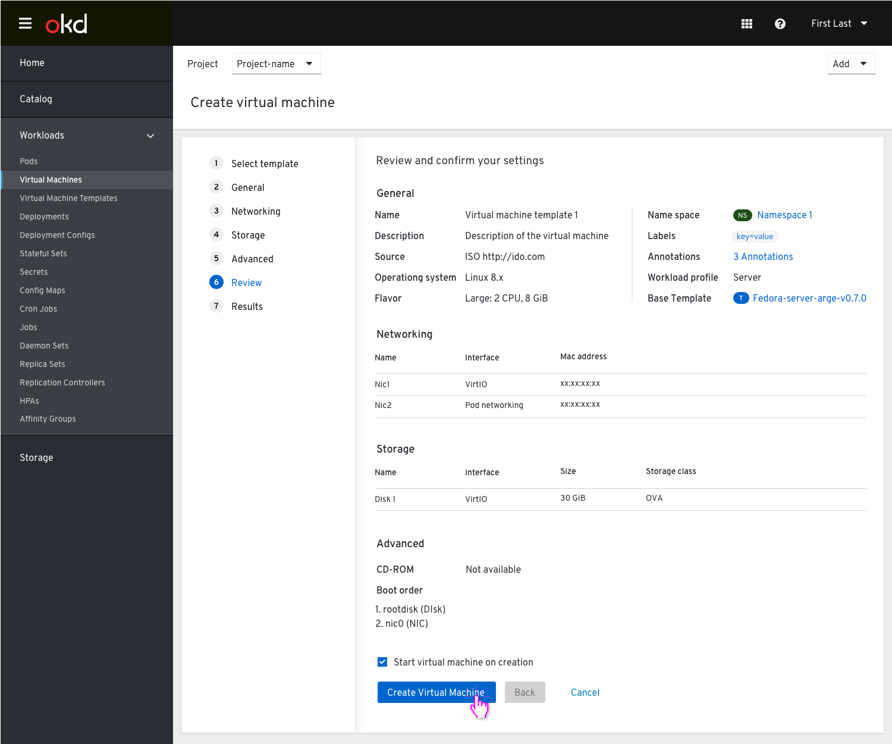

# Templates

## Virtual machines and VM templates are located under Virtualization

Removing the tab ‘Virtual Machine Templates’ from the side navigation and combining it with ‘Virtual Machines’, so both are located under ‘Virtualization’.
This PR will focus on how users can create a VM when they choose a to create a VM from a template.

### Virtual Machine Templates Tab

From the Virtualization left nav item the user goes to the Virtual machine templates tab where they can see the full list of templates.
From this point, we suggest 2 options to create a VM:

- Create template via an action from the kebab menu

- Create template via an action from the kebab menu and also allow an action link

Both options will lead the user to the first step of the wizard where they will need to provide a name for the VM they want to create.

If all they need is to provide a name for the VM, they can skip to the 'Review and create' step where they can review the settings and create the VM.

If they need to edit the template before they create the VM, they will need to go through the steps to edit the settings and then create the VM.

### Virtual Machine Tab

From the Virtualization left nav item the user goes to the Virtual machines tab and from the dropdown selects the option to create a VM from a template.

They will get to the list of templates where they can select a template to create the VM from.

In case a user selects a template that has required info missing, an inline alert will be shown and indicate via a clickable link which info is missing and where it is located, so the user can quickly complete the required info and then create the VM.

Once the info is completed the user will be able to create the VM.

