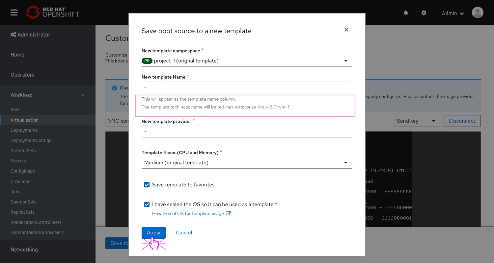

# VM Templates - Boot Source Customization
Updating the flow of the boot source customization.
Removing the complexity of surfacing to the user the backend implementation of cloning the origin template first.
Removing the option of resuming the customization process from the template clone to a notification at the top of the VM templates list.
This PR will display the delta from the current implementation.

## Entering the customization flow

The user can customize any available boot source for any template on the VM templates list.
In order to enter it, the user can select "customize boot source" from the template actions menu,
or by clicking the boot source itself and "customize" from within the popover.

Note: a description is added to the boot source column title.

On clicking 'Customize boot source' the user will enter the creation flow.
First, a modal will present itself, explaining to the user that BS customization will apply on a new template, cloned from the original one.
This modal can be dismissed by "Don't show again" checkbox.

Note: the entire copy of this modal has changed from the original one.

The user enters a prerequisites form.
Over there, the user will be required to name the new boot source and provide other additional info, as in the previous implementation.
The boot source name field will have a description, mentioning that this is the "display name", the "technical name" (Provider) is static.

The micro-copy if this step has changed, and includes new title, page description, and a new CTA.

This screen display the process of preparing the boot source (clone) for customization.
From here, the user can exit the wait and resume the process later.

## Resuming the boot source customization process

In case the user chose to exit the customization flow, he can resume it from the templates page.
A notification above the list will present itself, displaying that there are [n] unfinished customization processes and that the user can view them (and decide what to do with them next).

On clicking the "View pending boot source..." button, the user lands on a "hidden list" page.
This page lists the pending boot source customization processes in a table view.
This table provides the valuable info required to identify the process.
Each item contains a "resume" and "Discard" actions.

On clicking "Discard all"/"Discard item" the user will be presented with a confirmation modal.

## Boot source customization - manual process

This is a manual, mandatory step of viewing (and customizing) boot source within a temp VMI.
The user is required to manually confirm when the process is done by clicking  the "Save BS to a new template"

The micro-copy of this step has been modified to align with the new flo.

The micro-copy and required fields of this modal, were modified to match the new flow.

## process complete
When clicking "Create new template", the user will land on the details page of that template

Back to the Templates list, the notification is gone and the new template is now available on the list.
(time to drink coffee)
