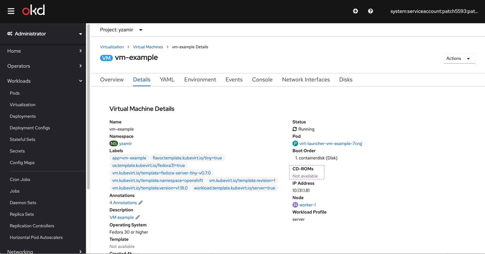
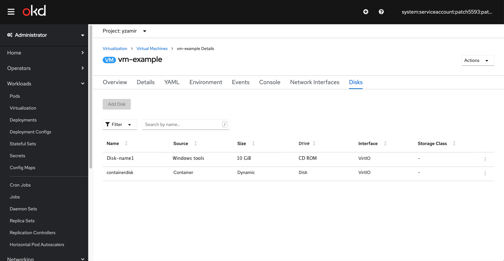
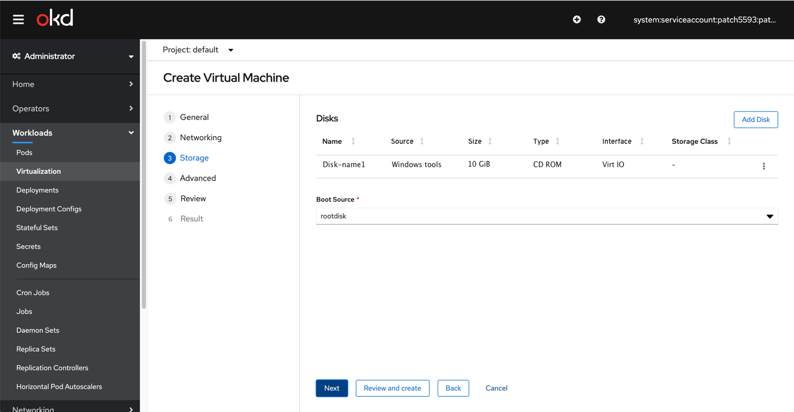
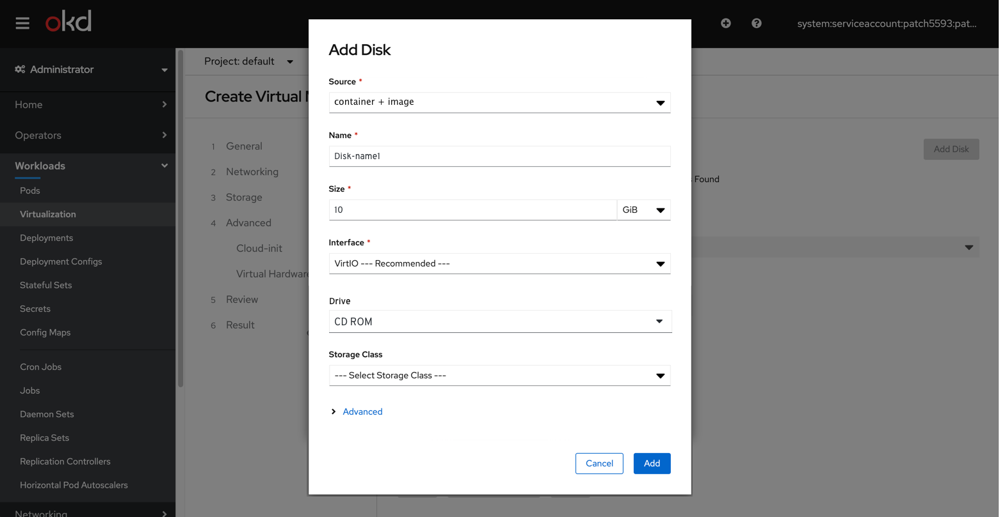

# CD ROMs

This PR deals with removing CD-ROMs from the details view and including them in the disks tab.

## CD-ROMs on VM Details page

We can remove CD ROMs from the VM Details view

and add a ‘Drive’ column to the ‘Disks’ table view.
The default type will be ‘Disk’ and the other option(s) will be ‘CD ROM’ and possibly ‘LUN’.

## CD-ROMs on Create VM wizard

We can remove the CD ROMs from the ‘Advanced’ step and place it in the Storage step.
For cases where we point the user to them (windows guest tools), we’ll direct the users to the table at the Storage step.

This is the current state (CD ROM is placed under the Advanced step)

If we take out the CD ROMs from the ‘Advanced’ step, the ‘Virtual hardware’ sub-step will be omitted and we’ll only have the ‘Cloud-init’ as a single option in the Advance step.

Moving the CD-ROM creation to the storage step, will enable us (instead of directing users to the ‘Advanced>CD ROMs’) to direct them to the ‘Storage>Disks’ table.

So opening the ‘Add Disk’ modal once they get redirected from General step to Storage step will ensure they know they have the right disk selected.

