# create VM dropdowns

This item will cover various updates to the VM creation wizard
- Adding descriptions to the dropdown fields (using this pattern https://github.com/patternfly/patternfly-design-kit/issues/218)
- Renaming fields
- Reordering fields

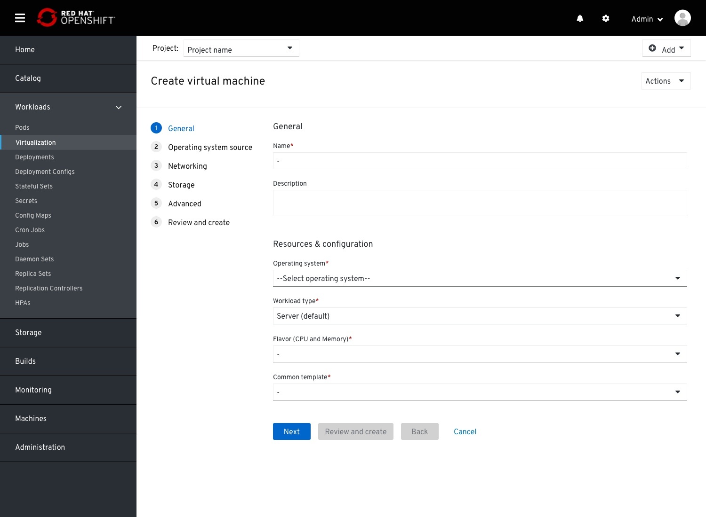
Landing on the General step, Default mode.
Section titles added, and fields reorgenized and renamed.
'General' section:
- 'Name'
- 'Description'
'Resources & configuration' section'
- 'Operating system'
- 'VM configuration' (previously Workload profile)
- 'Flavor (CPU and Memory)' (previously only 'flavor')
'Operating system image source' section
- 'Boot operating system via' (previously 'source')

## General step

On selecting an Operating system, the VM configuration and Flavor (CPU and Memory) fields will be enabled and selected on default

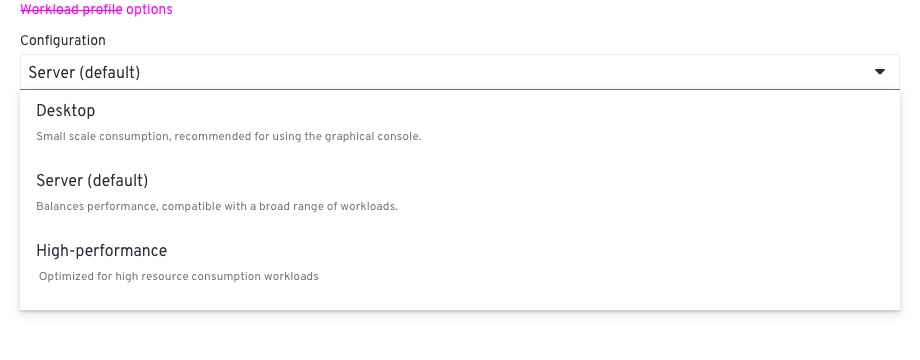
VM Configuration options
Server is the default

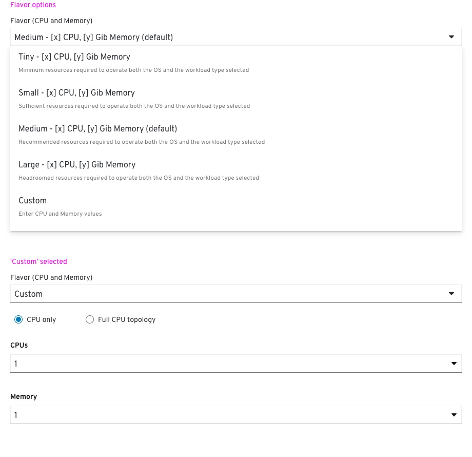
Flavor options
Medium is the default

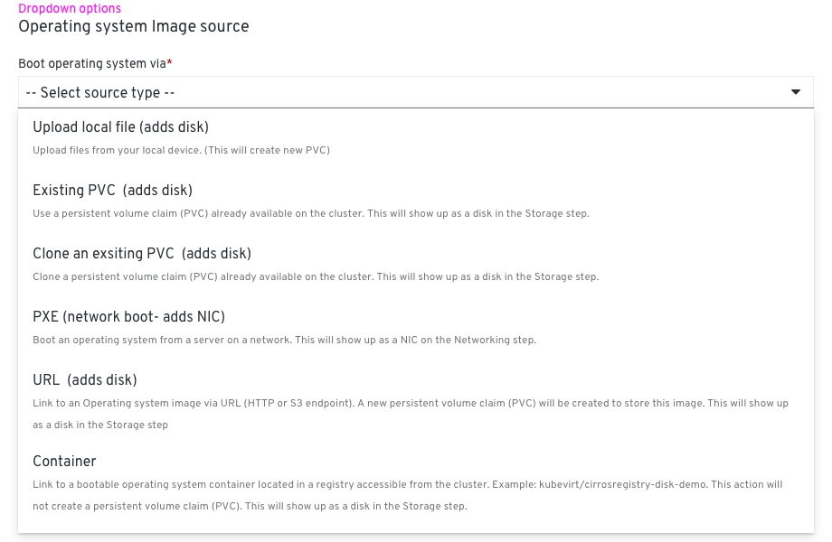
'Boot operating system via' field options

Selecting an option form the 'Boot operating system via' field will expose below all the fields required to connect the VM to an OS image source.
For example: on selecting the 'Existing PVC' option, additional fields will appear below, required to select a PVC available on the cluster.
The disk name should be added here as well to establish a better link between this step and the Storage step.
An infobox will notify the user that a disk will be added to to the disks list on the Storage step.

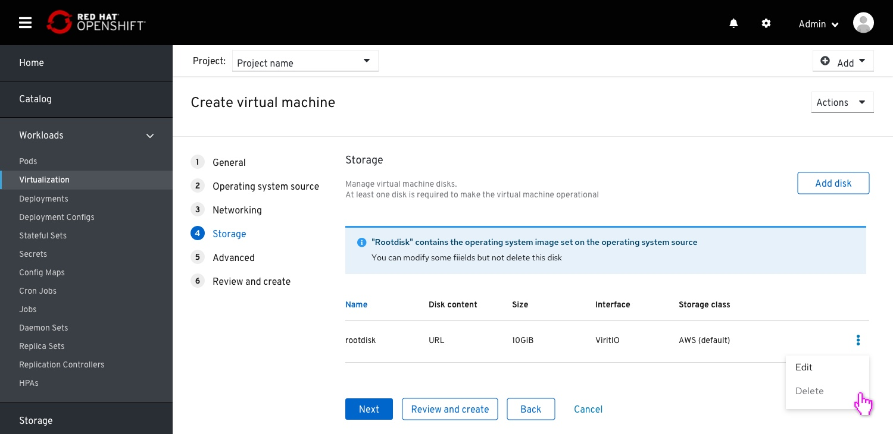
Within the storage step, the disk added on the general step will appear as the first item on the list.
This disk cannot be deleted but can be modified.

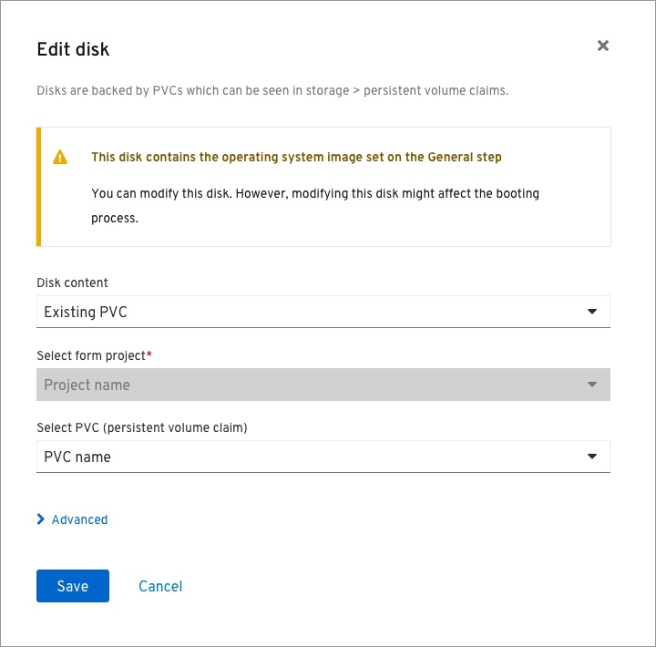
Editing that disk will display a warning notification within the edit modal.

## Netwroking step

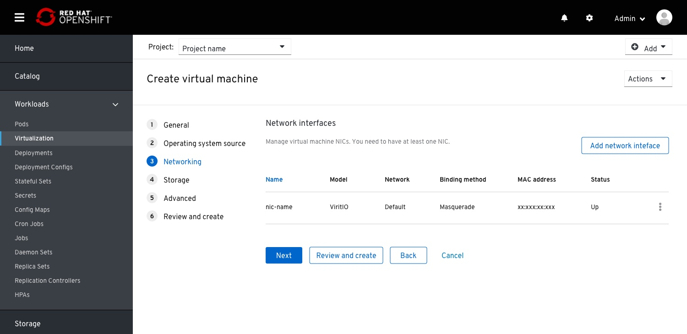
NIC list.
In case no PXE boot the OS image selected on the General step, a default NIC will be added.
This NIC  exposes the VM to the cluster.

On editing this default NIC, a warning message will remind the user that modifying this NIC might break that 'expoing to cluster' configuration.

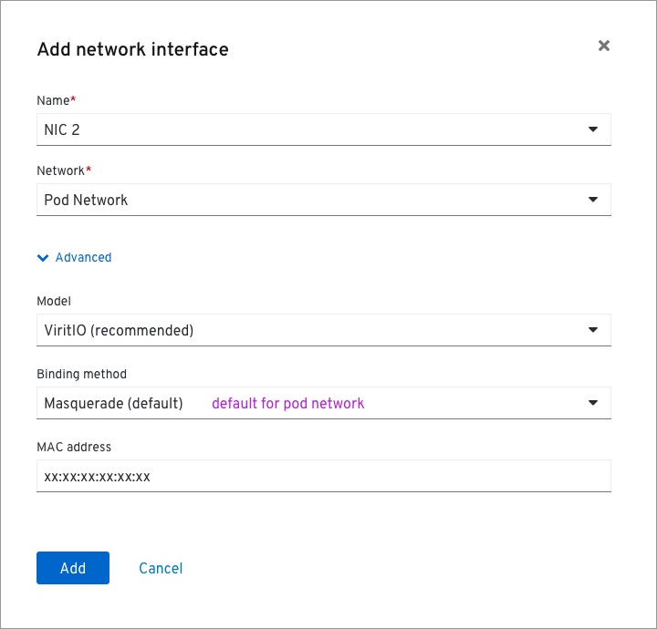
Add NIC modal.
The Advanced drawer is closed by default, as seen in the previous image.
All fields had moved into the advanced drawer, except the Name and Network fields.
Network field does not require description for each option since these options are created and managed by the user.

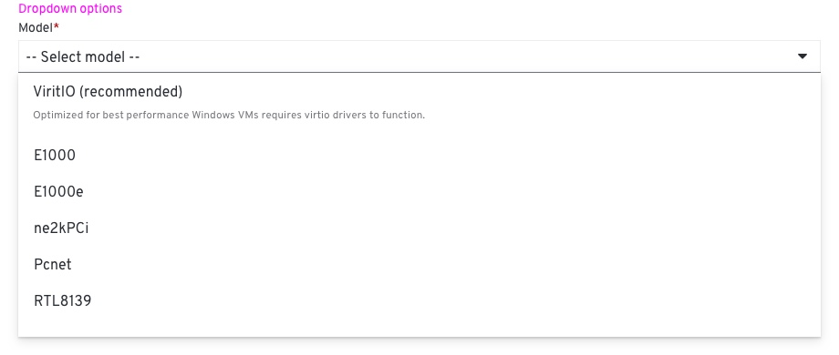
'Model' dropdown options

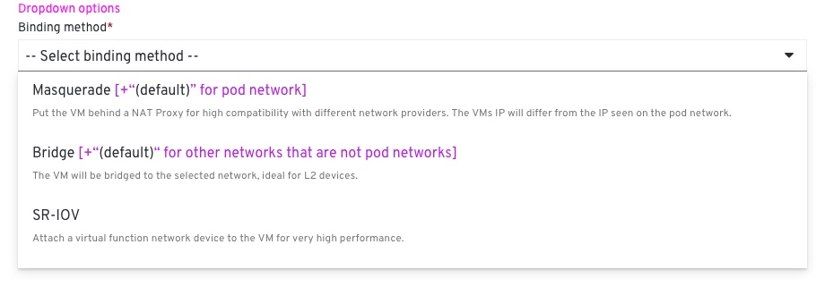
'Binding method' dropdown options (previously 'Type')

## Storage

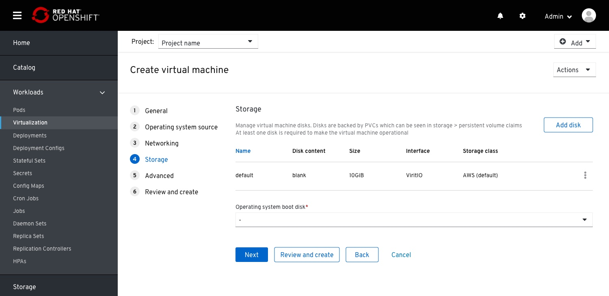
Disks list.
In case no disk type OS image source selected in the General step, a default disk will be created in order to make the VM operational.

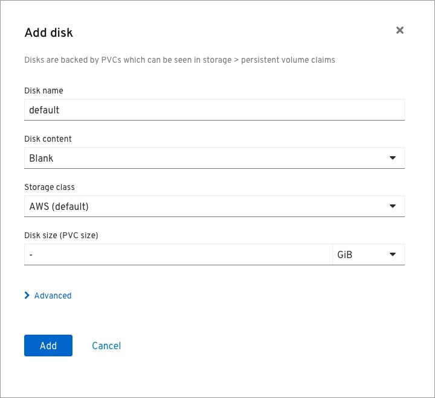
Editing the default disk will present an info box notification.

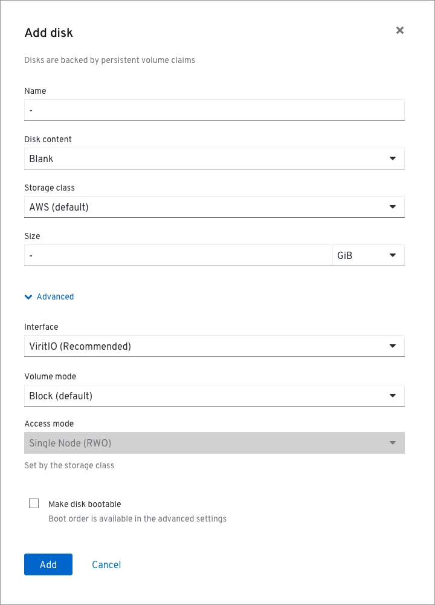
The Add/Edit modal has been modified.
- Name
- Type changed to 'Disk content'. This will change the configuration below
- Advanced drawer added containing: 
    - Inteface
    - Volume mode
    - Access mode (should be automatically selected and locked to the Storage class default)
    - Make disk bootbale checkbox (new)

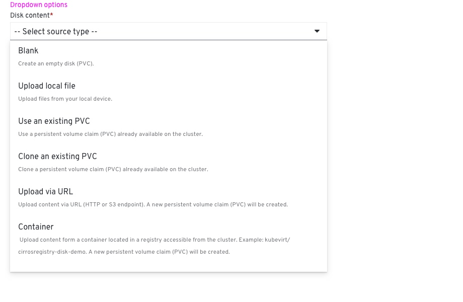
Disk content dropdwon options.

## Advanced

 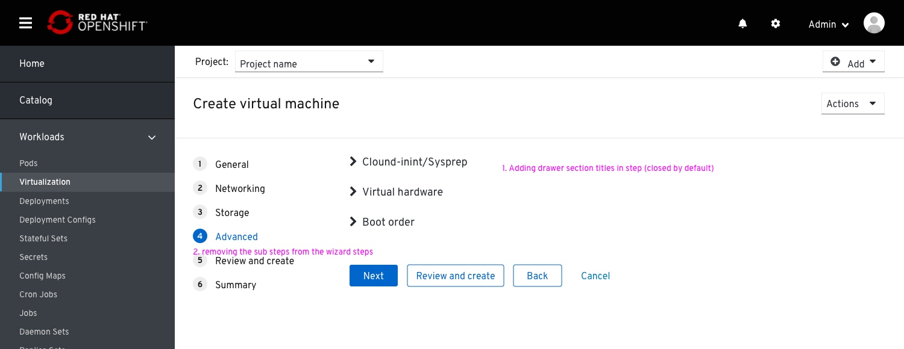
The advanced step drops the sub-steps from the wizard navigation in favor for section drawers within the step body.
This is done to save users the trouble to go through stuff that does not concern or intimidate them.

## Review & create

 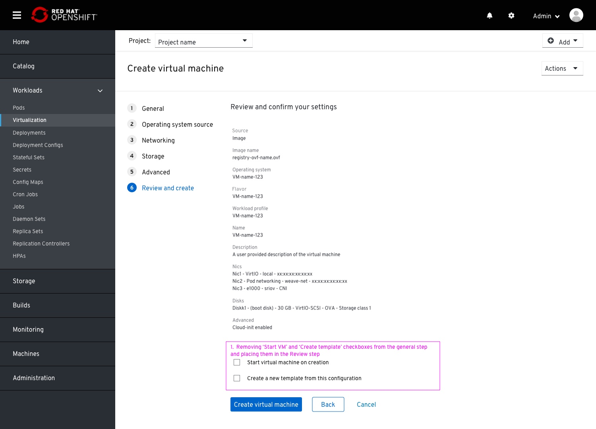
The name of this step has changed to correlate better with the 'Create and review action that is available along previous steps.

The 'Start VM on creation' and 'Create template from this VM' checkboxes had been removed from the General step and placed in this step at the bottom of the page.