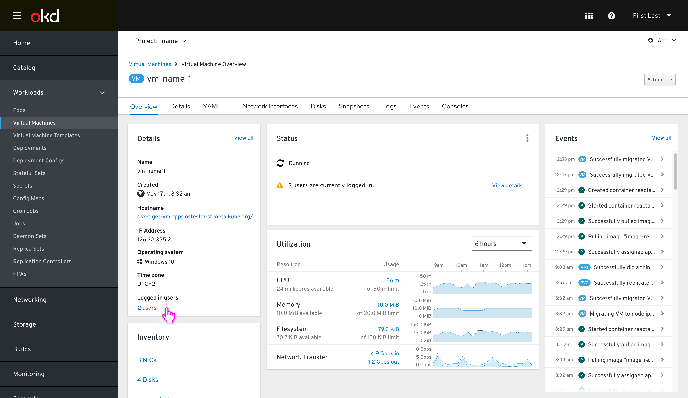
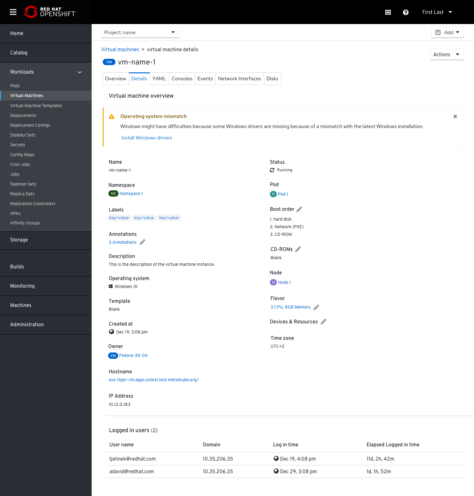
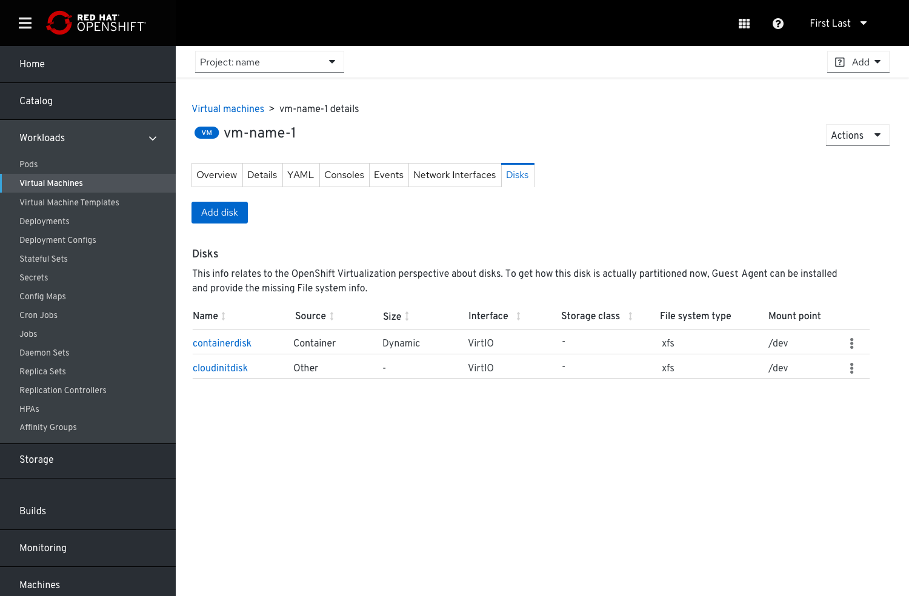
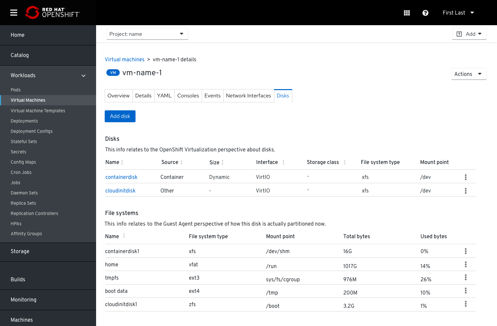

# Expose Guest Agent Data

When the Guest Agent is installed on a VM some additional valuable data can be collected then surfaced in the UI.
When the Guest Agent isn’t installed we will inform the users about that.

We can report that in the VM’s Overview tab under the Status card and provide a message: “This virtual machine does not have a Guest Agent installed. Some metrics, and management features will not be available or inaccurate” and add an external link to view the details about the installation procedure of the Guest Agent, if the users are interested to do so. The link will lead the users to the instructions on how to install the Guest Agent.

## After installing the Guest Agent

Some of the data that is collected via the Guest Agent can be surfaced in the VM’s Overview tab under the Details card, as well as on the Details tab:

- Hostname
- Guest Agent OS version - the actual OS version that is installed on the VM
- Time zone
- Users list - active users that are currently logged in to the VM

### VM’s Overview tab > Details card

Clicking the number of logged in users will lead to a table with all the relevant information about these logged in users. This information is required so that users will be aware when they're about to take an action that will affect those logged in users (f.e.) powering the VM off or restarting it. In case a user decides to power off a vm when there is/are active user/s logged into it, they will be notified about that.  

### Details tab

To simplify the information about OS versions (the Guest Agent and what was suggested by the admin while creating the VM), we can surface only the current OS version that’s installed (the Guest Agent OS).
In case we have a mismatch between the suggested Operating System version (the OS that the admin originally suggested) and the installed Operating System version, we can show an alert that indicates that mismatch.

## Disks

### File system type info will be surfaced under the VM’s Disks tab in cases the Guest Agent is installed

Some additional data related to File systems can be surfaced in the VM’s Disks tab:

- File system type/Disk mapping

- Disk mounts with usage - mount point - where the disk is mounted in the tree

Since there is no 1:1 mapping between the way the disks are seen from the OpenShift virtualization point of view and the way they are seen from the Guest Agent point of view, we’ll show the 2 sets of information in 2 separate tables.
The 'Disks' table will always be shown and the ‘File systems’ table (partitions) will be shown only if the Guest Agent is installed.

In the case the Guest Agent isn't installed and we can provide only the disk table, we will suggest that the Guest Agent can be installed to provide the File system information.

#### Disks table (when Guest Agent isn't installed)

#### Disks and File Systems tables (when Guest Agent is installed)

