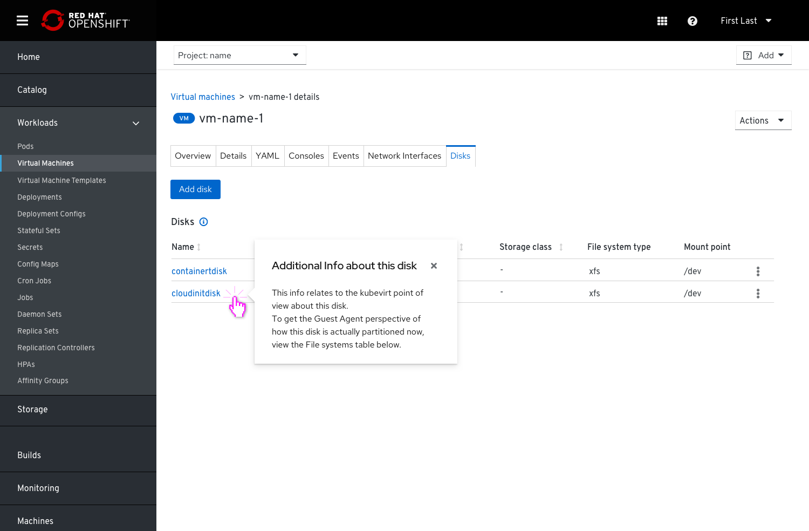
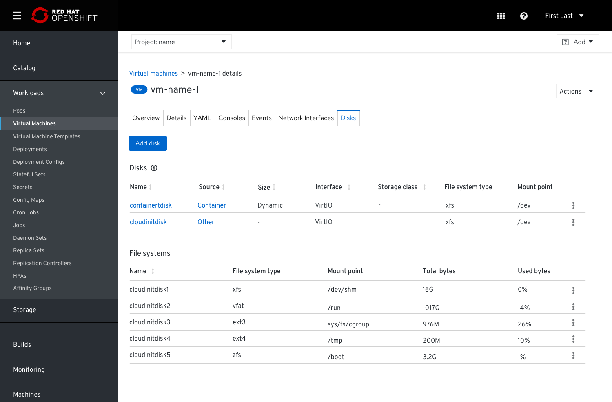

# Expose Guest Data

When the Guest agent is installed on a VM some additional valuable data can be collected then surfaced in the UI.
When the Guest agent isn’t installed we will inform the users about that.

We can report that in the VM’s Overview tab under the Status card and provide a message: “This virtual machine does not have a guest agent installed. Some metrics,and management features will not be available or accurate” and add an external link to view the details about the installation procedure of the Guest agent, if the users are interested to do so. The link will lead the users to the instructions on how to install the GA. Linux users will need to download and install the GA online, while Windows users will get the installation on a CD ROM.
After the installation they will need to restart the VM.

## After installing the Guest agent

Some of the data that is collected via the Guest agent can be surfaced in the VM’s Overview tab under the Details card, as well as on the Details tab:

- Hostname
- Guest OS version - what is the actual OS version that is installed on the VM
- Time zone
- Users list - active users that are currently logged in to the VM

Host name, Guest OS version and time zone will be added to the details card in the Overview tab.

### VM’s Overview tab > Details card

Clicking the number of logged in users will lead to a table with all the relevant info about these logged in users.

### Details tab

To simplify the information about OS versions (the GA and what was installed by the admin while creating the VM), we can surface only the current OS version that’s installed (the GA one). In case we have a mismatch with the OS that the admin originally installed, we can show an alert that indicates that mismatch and offers a way to solution.

## Disks

### File system type info will be surfaced under the VM’s Disks tab in cases the GA is installed

Some additional data related to File system can be surfaced in the VM’s Disks tab:

- File system type/Disk mapping

- Disk mounts with usage - mount point - where the disk is mounted in the tree

Clicking on the disk name will open a popover with an explanation about the 2 different views of the disks: the K8s view and the GA view.

Since there is no 1:1 mapping between the way the disks are seen from the kubevirt point of view and the way they are seen from the guest agent point of view, we’ll show the 2 sets of info in 2 separate tables.
The disks table will be be shown constantly and the ‘File systems’ table (partitions) will be shown only if the GA is installed.

