# VM snapshots

This item will cover updates to vm-snapshots
- Creating a VM snapshot
- Snapshots on the VM details page
- Virtualization snapshot list
- Restoring a VM from snapshot

## Creating a snapshot

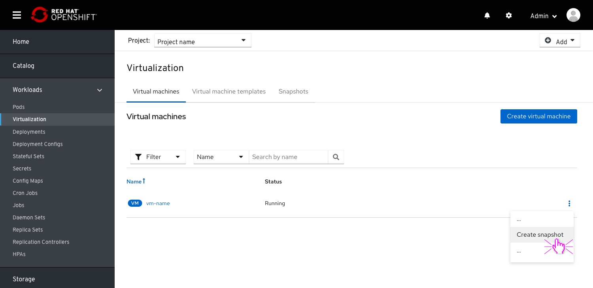
From the virtual machines menu item, the user selects “Create Snapshot” from a VM item’s kebab dropdown.
The same action can be taken from a VM details Action dropdown.

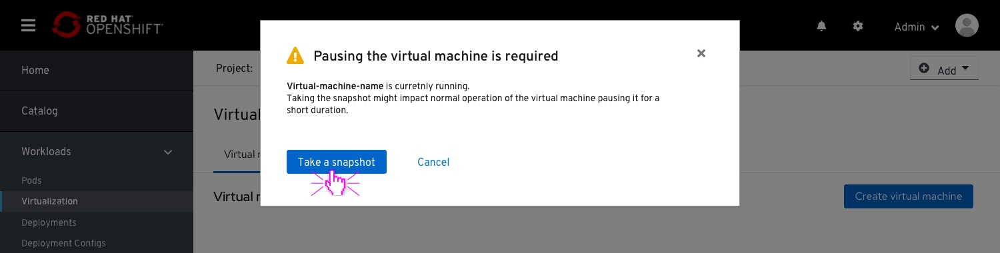
In case the VM is running, the user will be asked to turn it off to make a snapshot

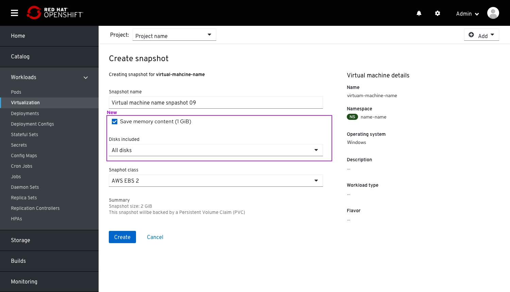
The user enters the Create snapshot screen.
This screen includes:
- Snapshot name field
- Save memory content (future implementation)
- Disks included multi-select drop-down (future implementation)
- Dropdown to selecting Snapshot Class
- A summary of the VM details on the right-side column
- A summary of the size of the snapshot (above the primary action)

### Selecting disks (future implementation)

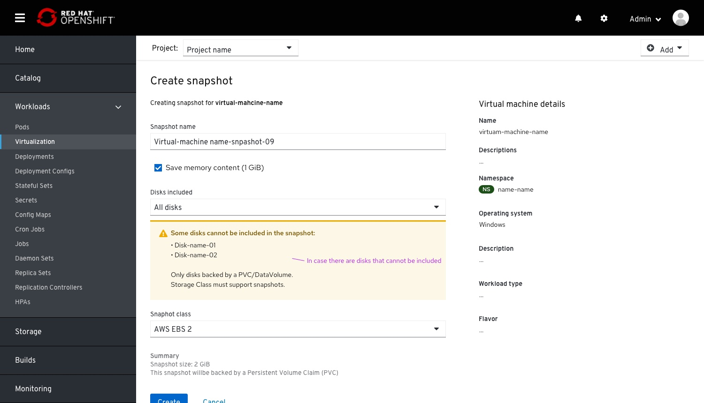
In case there are some disks who cannot be "snapshotted" an in-line notification will notify that and specify those disks.

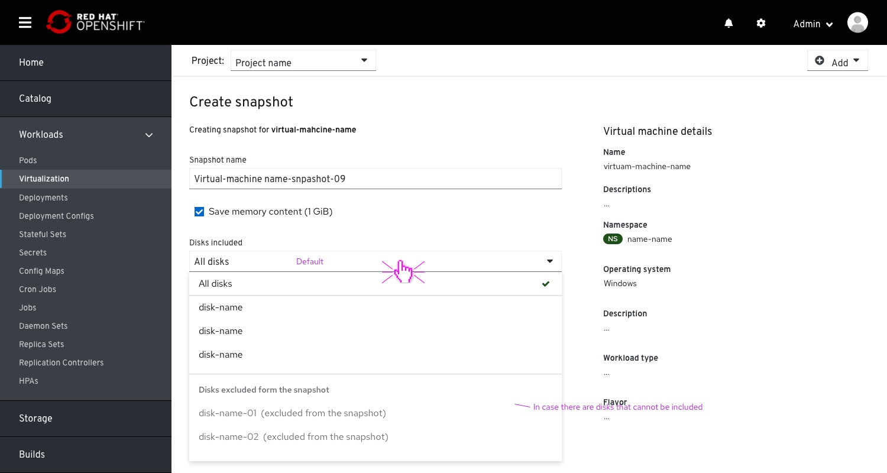
Selecting a disk. All disks are selected by default.
The "Un-snapshotable" disks will also be previewed within the disk multi-select drop-down, at a separate section at the bottom of the dropdown as a read only.

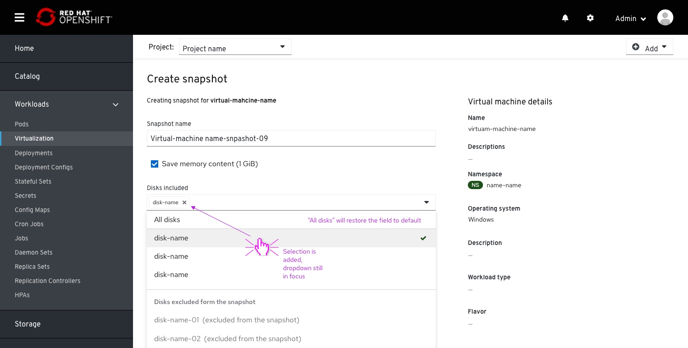
Selecting a specific disk will add that disk to a multi-select preview within the field.

### Creating screen

After clicking the Create button, the user goes to a transition page, in “Creating mode”.
While the snapshot is being created the user can navigate external to this flow. A text below will mention that, with a link to going back.

## VM details > Snapshots

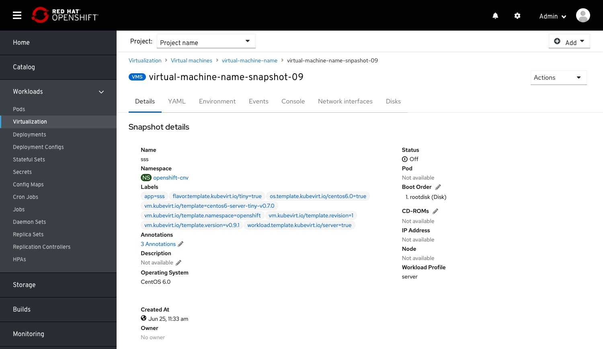
In case creation succeeded, the user will land on the snapshot details page.
The snapshot details page should contain all the data relevant to the VM.
Overview tab is not available.

All the columns are sortable within the snapshot table.

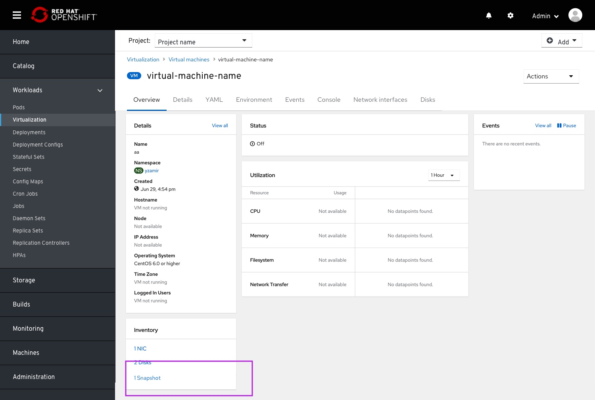
Snapshots will also be surfaced on the VM details > Overview > Inventory

## Virtualization > Snapshots list

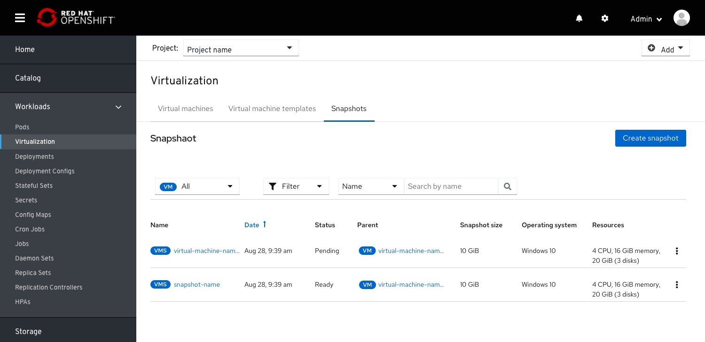
This list will include Parent (VMs).

Multi-select filter (like we have on the search page)

# Restoring VM from snapshot

The user selects the restore action.

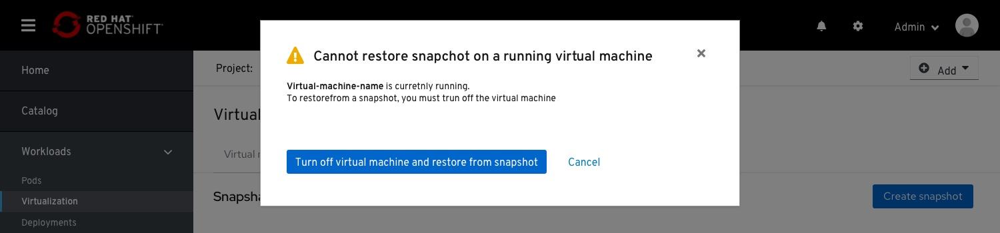
In case the VM is running, a warning message will mention that restoring for a running VM is not possible and that VM should be stopped first.

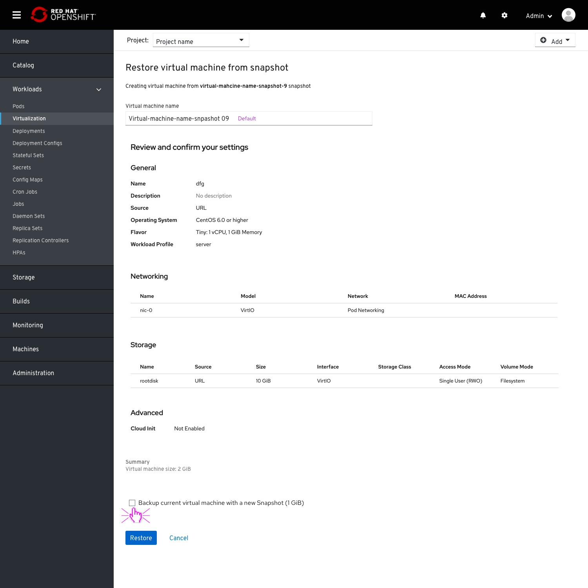
The user enters a “Review and Restore” screen.

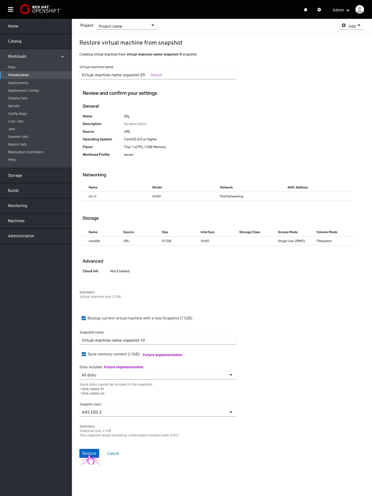
The user can choose to backup the current VM with an additional snapshot. This will open the rest of the fields below.
