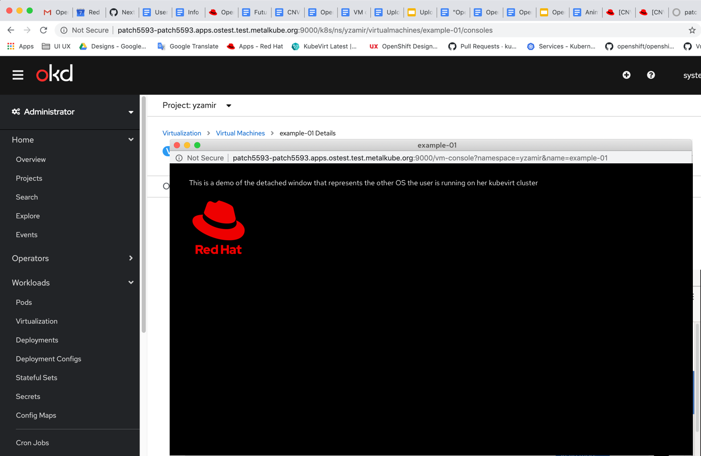

# VNC in new window

## In the Administrator console

In order to add an option to open the VNC console in a new window, we’ll add a new button ‘Open Console in new window’ to the existing ‘VNC console’ dropdown with the ‘Disconnect before switching’ checkbox option and ‘Send key’ button.

Another way to open the VNC Console in a new window can be done via the kebab dropdown menu.

## In the Developer console

In the developer console we’ll have the same option to open the console in new window of the topology view.

As well as from the Actions dropdown menu.

# Design a VNC detached console

When users click on the ‘Open Console in new window’ button, they will get a detached window that represents another OS (no toolbar).
If they want to go back to their original Kubevirt cluster they will simply close that window and get back.

