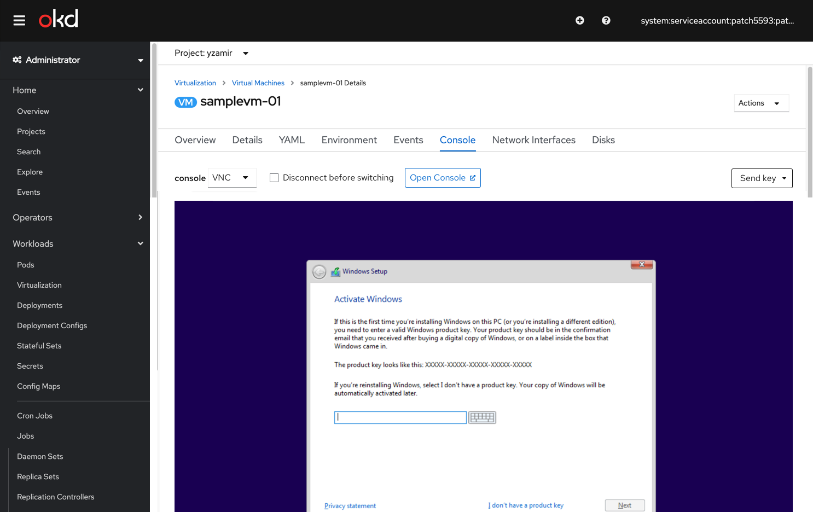
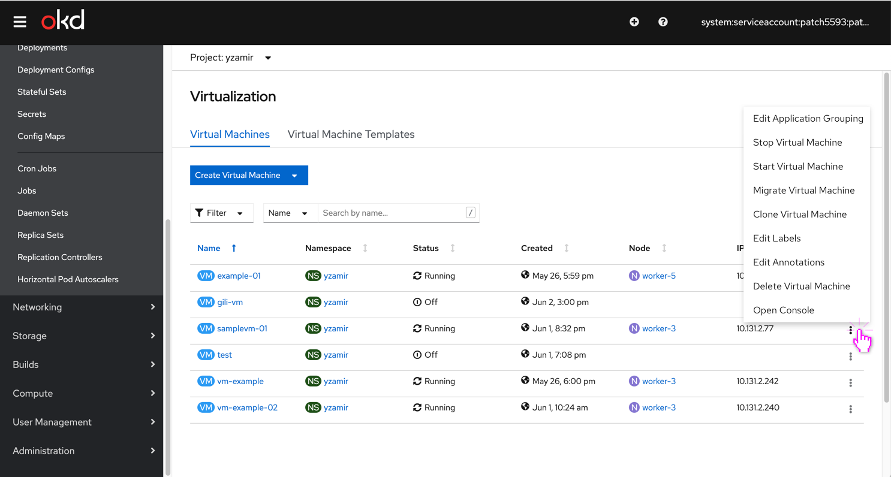
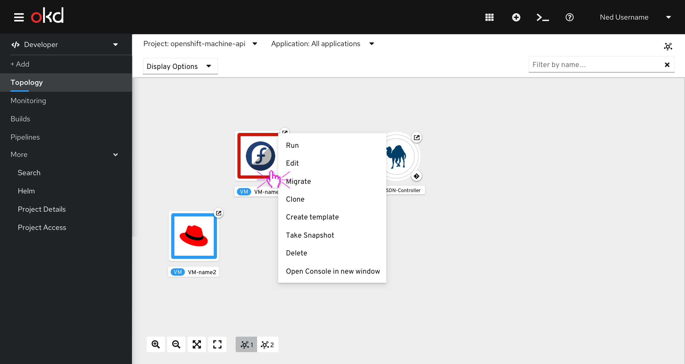
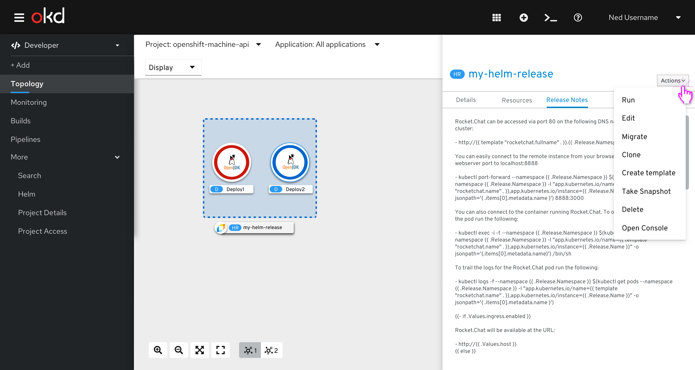
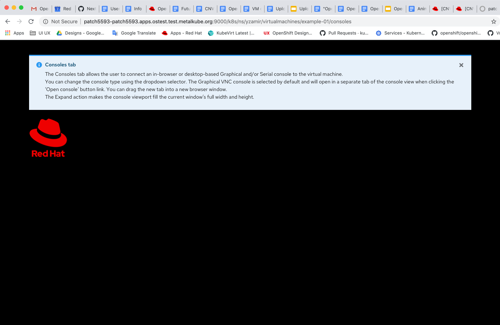

# VNC in a new window (tab)

## In the Administrator console

The Consoles tab allows the user to connect an in-browser or desktop-based Graphical and/or Serial console to the virtual machine.
We’ll add a new button link ‘Open Console’.
Users will be able to change the console type using the dropdown selector. The Graphical VNC console is selected by default and will open in a separate tab of the console view when clicking the ‘Open console’ button link. The default will be set to open the console in a new tab. Users will be able to drag the tab to be a new window.
The Expand action makes the console viewport fill the current window’s full width and height.

Another way to open the VNC Console can be done via the kebab dropdown menu.

## In the Developer console

In the developer console we’ll have the same option to open the console of the topology view.

As well as from the Actions dropdown menu.

# Design a VNC new tab console

When users click the ‘Open Console’ button, they will get a new tab that represents another OS (no toolbar) with a dismissble inline info notification about the consoles tab features.
They will be able to toggle between the 2 tabs: their original OpenShift cluster and the other OS tab they have opened.

