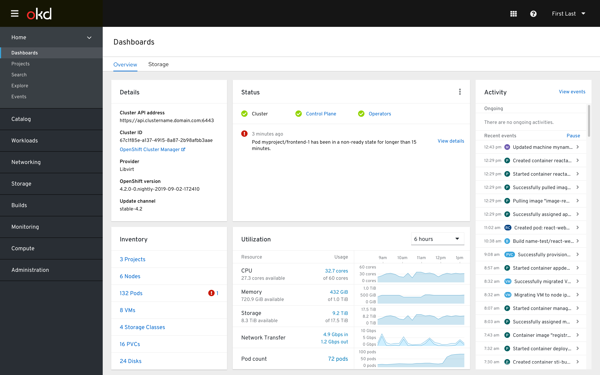
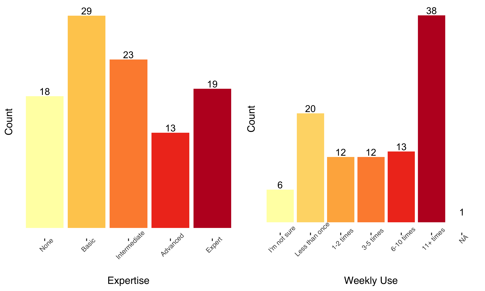
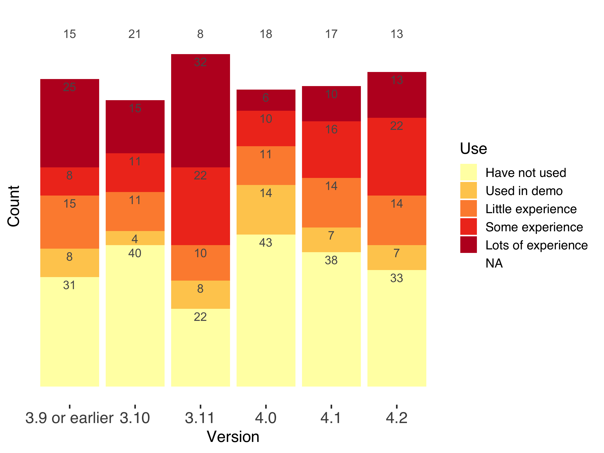
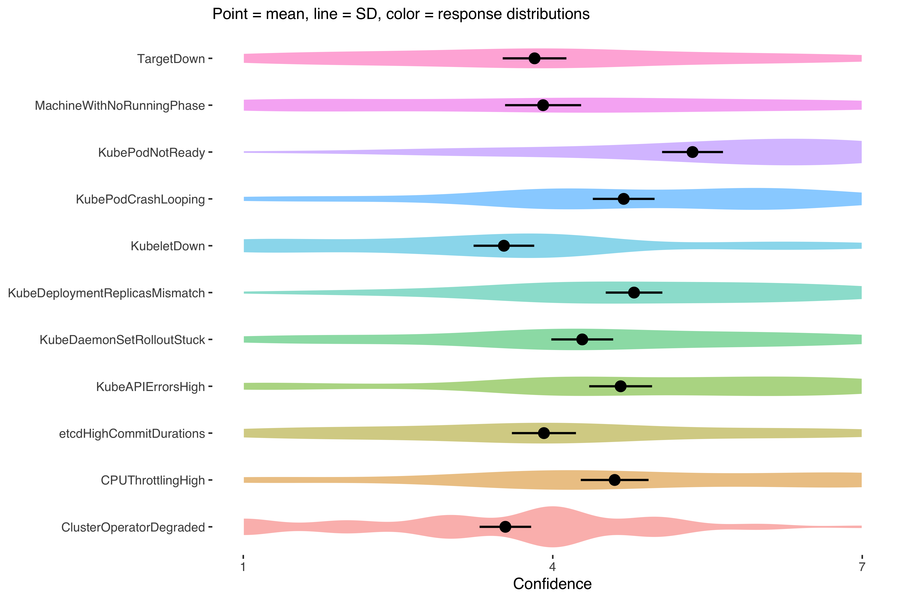
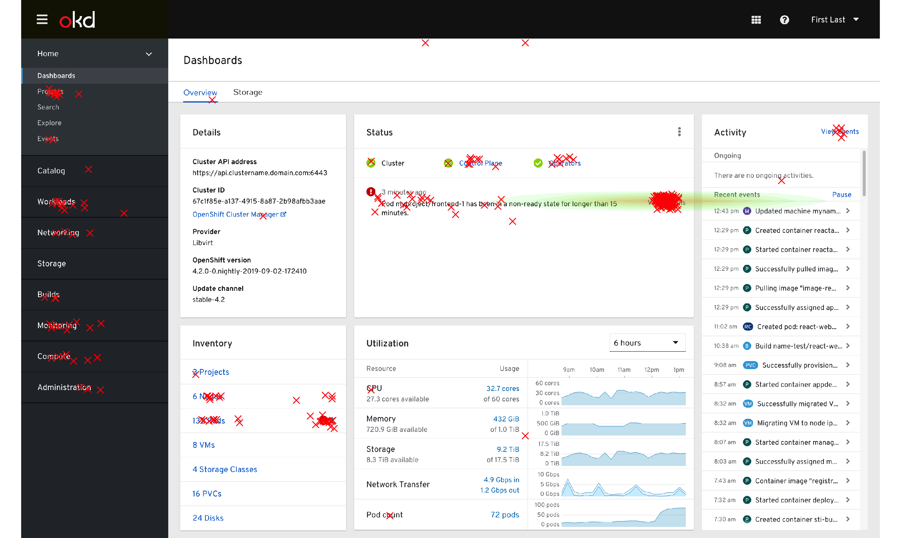
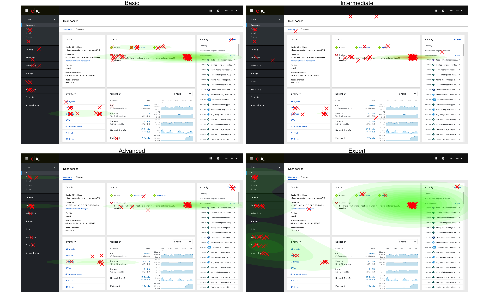
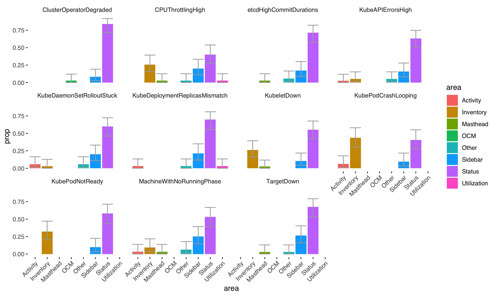
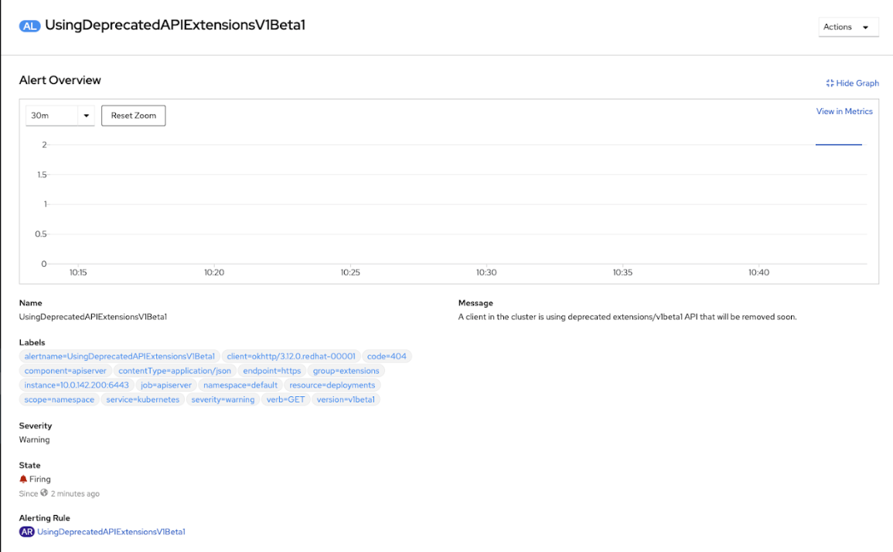

--
parent: Research

--
# Investigating OpenShift Alerts

*Note: this is an article about a research activity on how users interact with Alertmanager alerts within OpenShift. If you're looking for documentation about Alertmanager alerts, please go to [this link.](https://prometheus.io/docs/alerting/alertmanager/)*

## Introduction

Monitoring is a critical aspect of architecting and maintaining a successful OpenShift environment. One of the most common ways a user interacts with monitoring is through an alert, which can help direct the user's attention to the problem and, hopefully, how to resolve it. Our user experience design research team conducted a mixed-methods, online study with 89 internal OpenShift users and 14 OpenShift customers to explore (a) **what makes an alert useful** and (b) **what a user typically does after seeing an alert**. This information helped evaluate the current state of OpenShift alerts and guide what design changes in the web console could better support our users.

## Research Plan

 We found 11 especially frequent alerts by querying existing engineering data on active OpenShift clusters. These alerts served as the examples we used across our study.

We used an online survey platform, *Qualtrics*, to implement our study. The survey began with background questions about the participants' experience levels and typical usage patterns. After, we displayed 5 of 11 alerts (randomly) to each user. After viewing an alert and its accompanying alert description, we asked users how confident they felt in their ability to resolve the alert on a scale from 1-7, 1 being the least confidence and 7 being the most confident. We also allowed them to write in why they gave the numerical score they chose.

Unlike many applications and software, OpenShift is often deployed 'on-premise' so that standard product analytics are not possible to collect. This poses a unique challenge to assessing user behavior in OpenShift. To get around this, we implemented a [first-click test](https://www.usability.gov/how-to-and-tools/methods/first-click-testing.html) where users clicked on a web console overview dashboard screenshot. This allowed us to have some behavioral assessment on their strategy for resolving each alert. This first-click component occurred after each confidence rating with the same alert and allowed for an open response to describe why they clicked the area they did.

## Participants

Participants varied a lot in experience levels, but tended to be intermediate users with a high level of daily use. A fair proportion of users reported no experience, and these responses were excluded from some analyses.

The bulk of participants' version experience was with 3.x versions, but there were reports of experience with 4.x versions. 

27 users did not typically receive alerts, but others received OpenShift alerts across a variety of channels in which they had to respond to the alert in some capacity. The most common was within the web console itself, followed by email, and word-of-mouth. Pagerduty and service tickets were also present but less common.

## Results

Our study, being mixed-methods, often identified problematic alerts and interesting click behaviors through numerical analysis. However, the context and *why* of these observations is gathered through qualitative data and thematic analysis. We collected 246 comments and thematically coded the responses to uncover any patterns that were present. These qualitative and quantitative components are interspersed below to reach our conclusions.

### Confidence

The confidence ratings separated the alerts into *high confidence* alerts and *low confidence* alerts in general. However, through a linear-mixed model, some statistics indicated that the scores in any particular alert varied quite a lot depending on who the individual was (the intraclass correlation is near 50%). So while in aggregate some alerts leave users feeling more confident, this will heavily depend on user characteristics, such as expertise. You can see below that every alert had scores than ranged across the spectrum of 1-7.

Because of the high variation within ratings, it was difficult to point to a certain alert as 'good' or 'bad'. Our qualitative data helped provide more insight here.

#### Confidence explanations and what makes an alert (not) useful

It was unclear what was driving some alerts to be statistically higher while also demonstrating a large amount of variation based on the individual's experience. The "*lack of experience*"  theme helped elucidate this variance in confidence ratings. The *lack of experience* theme showed that many users felt less confidence because of a lack of experience with kubernetes, or, even for experts, a lack of experience with certain resources (like `Machine`).

*Quotes from participants*

**"Haven't worked with machines much, so not confident I could resolve this on my own."**

**"[In "View Details"] I would hope to find info on what a job distributor is."**

This is corraborated by statistically lower alerts for some resource types (generally non-`pod` resources). While the OpenShift team does not have control over vanilla Alertmanager alerts, we could take special care in our web console for a specific subset of resources and set our users up for faster success in resolving an alert.

Outside of general OpenShift or resource-related experience levels, many comments indicated what makes an alert *not* useful. The *root cause* theme came up when participant indicated they wanted to be taken to the root cause of the issue or that it was unclear what is causing the issue.

*Quote from participant*

**"I would hope to find info on why it was stuck:  not enough nodes with the correct nodeselector, no available nodes with appropriate resources etc."**

While easier said than done, participants wanted to be taken right to the fix rather than the alert itself.

### Click Maps

The behaviors were similar to confidence ratings: responses depended heavily on the user. However, one obvious case was that the 'View Details' link was often the first click.

*Click map of all clicks recorded*, *green-to-red shading indicates lower-higher click density*

This changed somewhat when split out by experience levels, where expert users tended to use the sidebar (navigation menu) slightly more often, as seen by the expanded and multiple green-shaded areas of the dashboard click patterns. This difference was not statistically significant.

*Click map of clicks by experience level*

While interesting to investigate, click maps are imprecise for parsing out statistical patterns in the click data. The data below split out the major sections of the web console interface to compare proportions of click behaviors. The alerts `CPUThrottlingHigh`, `KubeletDown`, `KubePodCrashLooping`, `KubePodNotReady`, and `MachineRunningWithNoPhase` do not have Status (where the 'View Details' button is located) as the most significantly clicked area. This is inferred where the confidence intervals (gray bars) of the purple Status bar overlap with the confidence intervals of another area.

*Proportions of clicks on web console regions by each alert*

What is it about these alerts where some users are statistically less likely to click 'View Details'?

####  Explaining differences in click locations and what experts do in the web console

In one major theme, "*knowing where to go*", participants indicated that they knew what resource they were looking for or problem they were trying to solve.

*Quotes from participants*

**"I want to see the deployment/deploymentConfig spec to see what the cpu quota setting is set at."**

**"I don't need further details, I want to see more info on the specific pods"**

After mapping out where the comments came from that fit with this theme, every single comment came from one of these alerts where 'View Details' was significantly less likely to be clicked. These data give some evidence that 'View Details' is the default place to go, *unless* the user already knows what they want to do. The user that goes to 'View Details' is likely to be someone who does not know where they want to go next to resolve the alert. This novel insight gave next steps to consider in our design the of 'View Details' page. What does the 'View Details' page currently looks like?

*'View Details' page*

Does this support a user who does not know where to go next? If not, how can we make the page more informative for those that use it most? The theme, "*resolution strategies*", gave evidence that logs or events were key to those who had a plan to resolve the alert.

*Quote from participant*

"**although i have not debugged this issue from the web console, i would probably try to locate the api server pods and then inspect their logs as a first step.**"

This could be a hint at what experts do and what information novices need to see on the 'View Details' page. Finally, the theme, "*information gathering*" indicated that users who didn't have enough information would resort to web searches, documentation searches, or support. Perhaps this is where a user who doesn't have the 'View Details' page meeting their needs would end up.

*Quote from participant*

**"I have not experienced this yet.  However, I generally can find answers through access.redhat.com, generally speaking"**

If we could create a more robust path for users to resolve alerts within the interface, this could reduce the amount of support cases related to certain problematic alerts.

## Conclusions

Alert confidence varies widely among users, but it's often related to lack of experience with a certain resource. Providing more description or information around alerts related to less well-known resources could aid the user when troubleshooting.

'View Details' is the most likely place someone will click when resolving an alert. This is typically motivated when the user does not know where they need to go already to resolve the issue. The 'View Details' page should support a type of user who is seeking out background information and troubleshooting strategies related to possible root causes.

## Appendix

### Alerts used in this study

- **KubePodNotReady** Pod myproject/frontend-1 has been in a non-ready state for longer than 15 minutes.
- **KubeDeploymentReplicasMismatch Deployment** myproject/frontend-1 has not matched the expected number of replicas for longer than 15 minutes. 
- **KubeAPIErrorsHigh** API server is returning errors for 90% of requests.
- **MachineWithNoRunningPhase**  machine worker-us-east-1a is in unknown phase
- **TargetDown** 50% of the job distributor targets in myproject namespace are down.
- **KubeDaemonSetRolloutStuck** Only 25% of the desired Pods of DaemonSet myproject/frontend are scheduled and ready.
- **KubePodCrashLooping** Pod myproject/python-1 container python is restarting 36 times / 5 minutes.
- **KubeletDown** Kubelet has disappeared from Prometheus target discovery.
- **CPUThrottlingHigh**  50% throttling of CPU in namespace myproject for container nodejs in pod nodejs-2.
- **etcdHighCommitDurations** etcd cluster "etcd": 99th percentile commit durations 100s on etcd instance cluster-health.
- **ClusterOperatorDegraded** Cluster operator insights has been degraded for 10 mins. Operator is degraded because Unable to report: gateway server reported unexpected error code: 415, and cluster upgrades will be unstable.

### Analysis

Plots and quanititative analyses were conducted in R using `tidyverse` and `lmerTest`. The repository for those analyses can be found [here](https://github.com/carljpearson/openshift_alerting), alongside more detailed plots.
