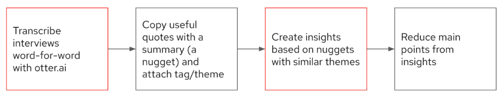

# Operator Author Interviews

*Date: August 2020*

*Internal link: [Slide deck](https://docs.google.com/presentation/d/1EwBw_i2npeN5og_Hz7IPQbLhShF_R_6P6jrtzLPVyDQ/edit?usp=sharing)*

## Background

The user experience design team helped out the Operator Lifecycle Manager (OLM) team to learn more about the experience of authoring or developing an operator with OLM. In particular we wanted to explore:

- How did authors get started developing operators?
Resources used?
Learning paths?
- What are the current challenges of developing an operator?
Do authors use the SDK?
How do authors test operators?
- What do authors think of the Operator Capability Model?
Why do authors develop some aspects from the model but not others?

### Participants

We initially interviewed 7 internal authors and 2 external authors. After coding our results, we noticed a gap around the certification process (only required for external authors). We then conducted 3 additional interviews with external authors.

### Method

We used a semi-structured interview approach. Many of our topics were predetermined, but we left room to go in unexpected directions and spend more time on topics that participants found important. As the lead researcher, I used a thematic coding process to analyze our findings.

## Findings

### Getting started: why do operator authors start developing an operator?
The most common reasons internally were that orders simply came down from the top. Others noted that it is a key path to integration with OpenShift.

*“The order came from our management. Well, we need this operator thing, and we need it in six weeks, and it has to work”*

External authors noted that product-related improvements were key drivers. These included the ability to have a polished visual interface without needing to develop one from scratch, and to hide feature complexity while keeping operator users in control of the product.

*“With the Operator we can just put all the logic inside the Operator and just give them one small CR, which is what most users care, they don't care about bunch of Kubernetes specs.”*

*The reason we were more interested in OpenShift OLM Operator was because of the UI… It will provide all the functionalities that we are looking for.”*

### Learning

All authors needed to learn more about kubernetes, even if they were already experts. This could take months to get a team up to speed enough to begin operator development in earnest. Some specific areas mentioned were: the declarative nature of k8s, conditions and statuses, how conditions relate to statuses, the event model, stateful sets, state changes, and reconciliation loops.

*“[I] had to take a lot around to understand how things work inside Kubernetes”*

*“[My k8s expertise] has changed in the sense that I'm more familiar with the inner workings.”*

The learning process itself was very hands-on, focused on trial and error, as well as drawing from existing examples of real code.

*“It was also lots of trial and error. Basically try this in the code and see what happens. You fail so you repeat them till it works.”*

*“Look at the code also, like open source code for most Operators to see what they were doing. But it's true. But it's not trivial. I mean, there's some stuff that's, that, that is not straightforward when you look at the documentation only.”*

There was a large variety of content that authors used to learn about operator development. Some critical sources were Kubernetes documentation, published books (O’Reilly, Kube Builder), Go documentation, OLM documentation, real code examples, and community chat rooms. Users struggled to find end-to-end information in general and to locate a single source that clearly directed them to the information they needed.

*“I was just looking through the docs in the Operator SDK repository and found it eventually, but there's quite a few docs in there and, and like several directories within it. So yeah, I think I just stumbled across it. Like by chance.”*

### Development
Most authors used the SDK to get started. Almost all found it a simple way to jumpstart their process.

*“And ultimately, we wanted to get up and running as quickly as possible and get you know, the basic install there, we used it pretty much right out of the gate.“*

Some teams felt the SDK didn’t meet their needs so they added additional code to extend the SDK. In particular testing was seen as simplistic and many weren’t aware of any end-to-end testing features.

*“So over time, we created like, separate utils library that other projects have started to use. And, you know, we had to we had to add quite a bit to our code because of the complexities of the [product]”*

*“I'm not too sure what kind of testing functionality the SDK provides itself.”*

Upgrades were not extremely common, authors avoided upgrading to new SDK versions because of concerns around bugs and the manual effort required to resolve them.

*“At the point in time that we were doing development, updating the SDK had the potential to break you”*

The operator capability model served as a guiding star for some, while others ended up following it because it aligned with what goals they already had. For those that did not meet all the phases, they noted that some aspects would not apply to their verticals and that it wasn’t necessarily a linear path of development. Some components were not clear to authors.

*“We have actually have a to do item to go out and create additional Jira to get us to a higher level.“*

*“What was nice about the router is it's stateless. So the idea of having to do backup and restoration and those kind of things doesn't apply to us.“*

*“Actually, I don't get what scaling and tuning is. Yeah. Can you explain what that is?”*

### Certification

Certification is a moment when partners are pushing to meet a deadline for an operator release. The way that certification works right now is fundamentally a pain point because it requires the publishing of a live image in order to test if it’s working. This leaves little time to resolve issues if it does not pass, because it has to be tested in nearly the same moment that it would be released.

## Conclusions

Authors from all backgrounds need to build up Kubernetes and Go knowledge to build operators. They find useful information from many disparate sources that can be hard to track down. Real code examples often provide the most help to authors.

When creating the operator, the SDK is a quick and easy way to get started. Authors start to rely on tools outside the SDK when it comes to testing, whether to integrate with other 3rd party tools or because of a lack of awareness around SDK testing capabilities. Upgrading with the SDK is also a pain point due to the potential for breaking changes and manual fixes to resolve those issues.

The certification process is a big challenge for partners because it essentially comes at crunch time. Multiple interviewees suggested that the testing process be separated from the publishing process.

With these findings from 12 author teams, we’re going to create questions in a broader survey that will be able to quantitatively validate how the findings generalize to all operator authors.
