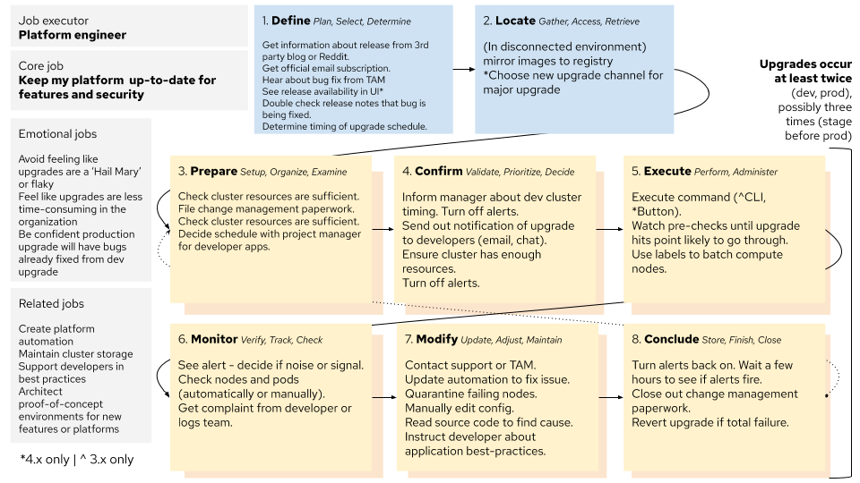

# Upgrade Interviews

*Date: July 2020*

*Note: this is an article about a research activity on how users upgrade OpenShift. If you're looking for documentation about how to upgrade OpenShift, please go to [this link.](https://docs.openshift.com/container-platform/4.4/welcome/index.html)*

## Background

When considering major design changes to how users can upgrade their clusters in OpenShift 4, we wanted to be sure we understood when, why, and how our users upgrade. We interviewed 1 internal team and 5 customers. We had a mix of those running 4.x in production and still running 3.11 with 4.x in testing clusters. We used a semi-structured interview approach to allow room for us to explore important issues to our users we weren’t already aware of. Here are a few example questions from our interview guide.

- How often have you upgraded in the past year or two?
- Is this the same for different environments, e.g. dev and prod?
- Do you want to upgrade more or less or the same?
- What was the reason you last upgraded your cluster?
- Is there any internal process that needs to happen before upgrading clusters?
- How do you track the progress of an upgrade?

## Findings

### The upgrade ‘job map’
Our interviews uncovered fundamental aspects of the upgrade process for a computing platform. There are some OpenShift 4 and 3 details, but these are good aspects to keep in mind when designing around the upgrade process for any platform. We borrowed the idea of a job map from the jobs-to-be-done framework to explain the process.

We found a few particular job map aspects worth writing out.

In steps 3-8, all components are repeated in some form because all upgrades are multi-cluster: they move from development towards production environments. This means upgrades take place at least twice, if not more than that, to fully upgrade a company’s platform infrastructure.

In step 3 (prepare), almost all customers we talked to have to approve upgrades via a change management board (for version 3 and 4). This manual process is something not likely to be waved away because of new technological abilities because it’s often formally written into contracts or company policy.

In step 4 (conclude), alerts are turned off manually. Alerts tend to fire off at a very high rate and overload existing alert channels. The alerting state during the upgrade was often seen as overwhelming and not useful.

In step 5 (execute), this is the step, the upgrade! It’s interesting that we almost spent little time on this moment. In v4, it’s a button click and in v3 it’s beginning an Ansible playbook. This was fairly simple and a reminder that the context around a singular feature is often critical.

After beginning the upgrade, step 6 (monitor) begins. When checking out alerts manually, it was a challenging process to assess which alerts needed action and which would heal on their own. If something did break, the operator would often hear of this from a developer or another platform reliant group, like the logging team.

### General findings

One of the biggest desired emotions to avoid is the feeling of ‘flakiness’ or like upgrading is a ‘Hail Mary’. This is complicated by the fact that success in an upgrade isn’t purely defined by what an operator controls in the platform. Even if the cluster itself upgrades without a problem, any application downtime is a problem. A key gap is how Administrators could check beforehand if developer applications are not sufficiently resilient and may go down in the upgrade. This process is manual right now and often only discovered after something goes wrong. The platform exists as a means to an end - the critical function is to support developer applications.  To quote a user, "my experience depends on what applications are running on OpenShift. And their application might not be able to handle the restart or handle a restart as gracefully as they would like."

Administrators can't upgrade on a whim. In the high security contexts of most of our customers, all upgrades (often even the developer environment) must go through formal change advisory processes and ticket approvals. Of the handful of customers we spoke with, most were satisfied with a 3-month cadence and couldn't see faster than 1 month as a possibility, given the current organizational context around upgrades.

All upgrades in a customer context progress through several clusters. The upgrade process, in practice, is at least 2 upgrades. Customers upgrade their dev environment to work out any bugs, and they automate or fix those bugs for production upgrades. A jump right to a production upgrade would seem very unlikely or unusual.

Most customers we talked to are in the test phase of OpenShift 4. There is excitement about newfound ease with upgrades, but alerts remain noisey and many have to turn them off manually before the upgrade begins. To quote another user, “you need to be a bit cold blooded ... and hope that the status [goes] away.”

Conclusions
Our upgrades need to fit into the organizational contexts they’re deployed in, mainly the change management processes that govern upgrades.

We should support operators to assess and ensure developer applications will be resilient to upgrades. Operators spend some or a lot of time (but want to spend next to no time) helping developers resolve container-related issues in their application designs.

Users expect to be alert only when action is required. We should surface alerts on critical issues that require action and obfuscate everything else.
