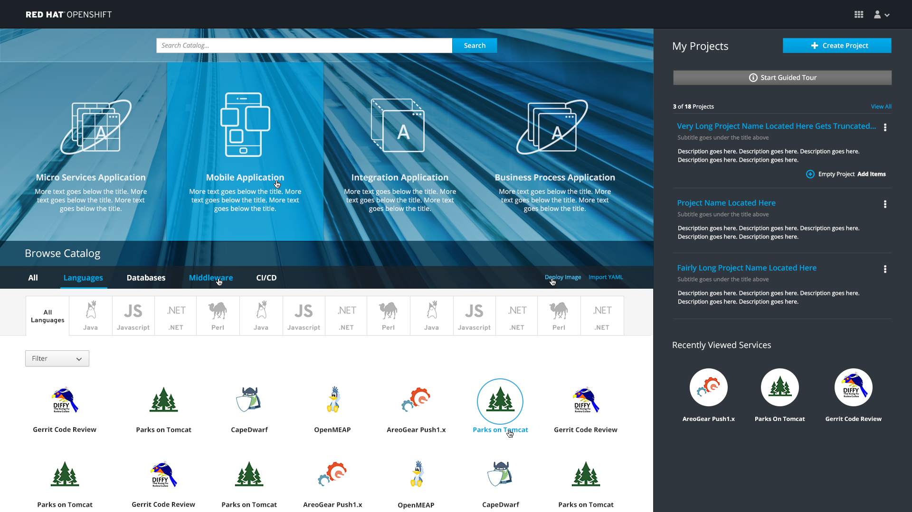
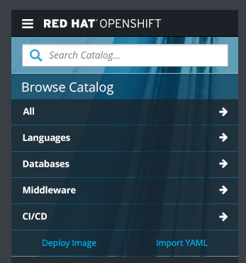
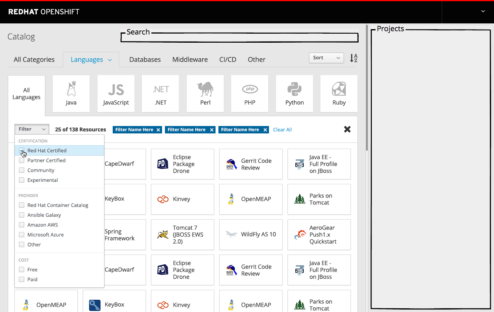

# Catalog

- The Catalog section is found at the bottom of the web console homepage.
- The Catalog contains catalog items and provides the means to browse, sort, and filter them.

## Browse Catalog

- Initially, upon arriving on the page, the `All` section is highlighted, underlined and expanded, with the catalog items sorted alphabetically by name.
- Deploy Image and Import YAML/JSON links are available on the right side of the catalog primary categories bar.
- Clicking either link will trigger the relevant [overlay panel actions](http://openshift.github.io/openshift-origin-design/web-console/4-patterns/overlay-panel).

- Any tabs that have subcategories of catalog items will have those subcategories displayed as tiles.
- These tabs should also contain an a `All` tile for catalog items from all subcategories.

### Hover States

- Primary categories are highlighted in a lighter blue on hover.
- Deploy Image and Import YAML are highlighted in a lighter blue on hover.
- Hovering over a catalog item will highlighted the item in a circle and change the item name to blue.

### Responsive State
On smaller viewport sizes, the catalog tabs should stack. 

### Implementation Details
- Administrators should have the ability to determine which catalog items are available to users.      
- Disabled catalog items should not appear.    
- The `All` category should be the first primary category and it should always be displayed.
- For remaining primary category tabs, if no catalog items exist, the tab should be hidden.
- Initially, category tabs will be limited to the defined list shown, with the addition of an `Other` category for customers to place resources that don’t fit in an existing category.
    - **Note:** Eventually, customers will have the capability to add their own custom category tabs.
- Some primary categories will have a secondary level of categorization available.
- For secondary levels of categorization, there should again be an `Other` category if there are items to display (not shown in mockup).
- Clicking on a subcategory will open a scrollable panel that contains the catalog items.

**********

# Future Use Cases

## Filter Catalog Items

- Opening the filter dropdown enables the user to select a number of filters to apply to the current set of catalog items

#### Implementation Details
  - Filters between categories are combined with an AND relationship
  - Selecting a second filter within a category will replace the previous value for that category.
    -Filter values within each filter category should be selected with radio buttons
  - The available filters may be different for each tab

-

#### Customer Feedback (if applicable)
- TBD
