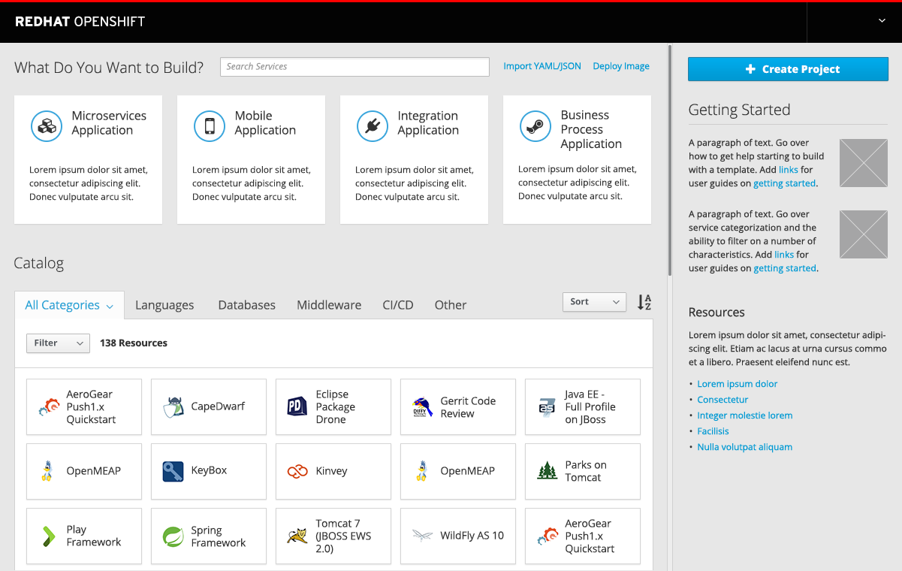

# Catalog

- The Catalog section is found at the bottom of the web console homepage.
- The Catalog contains provisionable items and provides the means to browse, sort, and filter them.

## Browse Catalog

- Initially, upon arriving on the page, the `All Categories` section is expanded and the resources are sorted alphabetically by name.

#### Implementation Details
  - Administrators should have the ability to determine which items are available to users;      
    - Disabled items should not appear.
    - Any tabs that do not contain any items should not be displayed.
  - Initially, category labels will be limited to those that we define, potentially including an “Other category” for customers to place resources that don’t fit in an existing category. Eventually, customers should have the capability to add their own category headers.

- Any tabs that have subcategories of items will have those subcategories displayed as tiles.
- These tabs should also contain an a `All <category>` tile that contains items from all subcategories.

#### Implementation Details
  - Any subcategories that do not contain items should not be displayed.
  - If a tab has subcategory tiles, they should not be mixed with regular service/items. Loose items should be placed in an `Other` tile.

- Clicking on a subcategory will open a scrollable panel that contains the services or other items
-

## Filter Catalog Items

- Opening the filter dropdown enables the user to select a number of filters to apply to the current set of items

#### Implementation Details
  - Filters between categories are combined with an AND relationship
  - Filters within a category are combined with an OR relationship
  - The available filters may be different for each tab

-

#### Implementation Details
  - Note PatternFly design patterns
  - Note icon references

#### Customer Feedback (if applicable)
- Customer Feedback Received
  - Overview of customer feedback received
- Necessary Customer Feedback
  - Questions to follow up with customers
