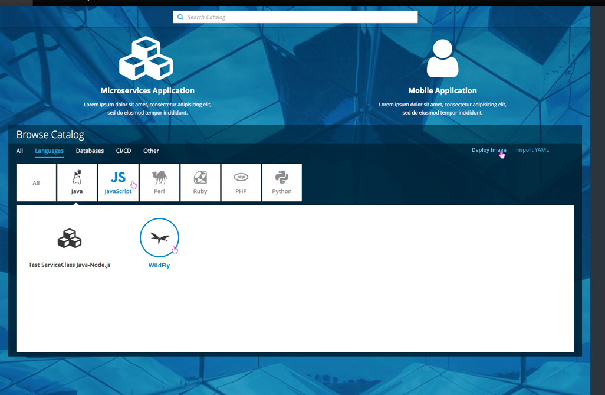
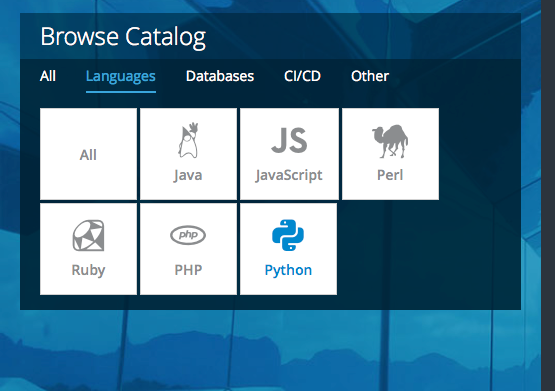
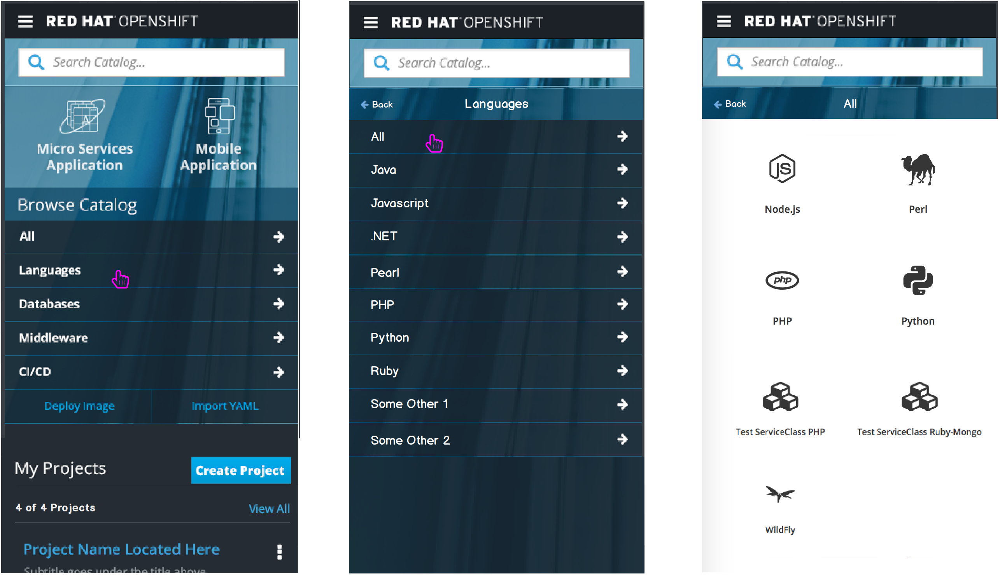

# Catalog

- The Catalog section is found at the bottom of the web console homepage.
- The Catalog contains catalog items and provides the means to browse, sort, and filter them.

## Browse Catalog

- Initially, upon arriving on the page, the `All` section is highlighted, underlined and expanded, with the catalog items sorted alphabetically by name.
- Deploy Image and Import YAML/JSON links are available on the right side of the catalog primary categories bar.
- Clicking either link will trigger the relevant [overlay panel actions](http://openshift.github.io/openshift-origin-design/web-console/4-patterns/overlay-panel).

- Any tabs that have subcategories of catalog items will have those subcategories displayed as tiles.
- These tabs should also contain an a `All` tile for catalog items from all subcategories.
- Clicking on a subcategory tile will open a panel that contains the catalog items.
- By default, the `All` tile should be collapsed.
- If a category contains only a single subcategory
	- The subcategory should be expanded by default
	- No `All` tile should exist for that category

- Clicking on an expanded tile should collapse that tile.

### Selection and Hover States

- The selected primary category will be blue with an underline.
- On hover, the primary categories are highlighted in a lighter blue.
- The selected subcategory icon will be a darker shade of the remaining unselected icons (light grey).
- On hover, the subcategory text and icon will be blue.
- Deploy Image and Import YAML are highlighted in a lighter blue on hover.
- On hover, catalog items will have a blue circle around the icon and  blue text.

### Implementation Details
- Administrators should have the ability to determine which catalog items are available to users.
- Disabled catalog items should not appear.    
- The `All` category should be the first primary category and it should always be displayed.
- For remaining primary category tabs, if no catalog items exist, the tab should be hidden.
- Initially, category tabs will be limited to the defined list shown, with the addition of an `Other` category for customers to place resources that don’t fit in an existing category.
	- **Note:** Eventually, customers will have the capability to add their own custom category tabs.
- Some primary categories will have a secondary level of categorization available.
- For secondary levels of categorization, there should again be an `Other` category if there are items to display (not shown in mockup).

### Responsive States

- On smaller viewports the tiles may need to wrap.
- Expanding a tile will always display the white caret with the catalog contents below the tile.

#### Mobile
- On mobile, the catalog tabs should stack with arrows to the right.
- Deploy Image and Import YAML should be displayed below all primary categories and should have a different visual treatment from the tabs.
- If subcategories exist, selecting the primary category will bring users to another screen to view subcategories.
- On mobile, the subcategories will have the same visual representation as the primary categories.
- Clicking back will bring users back to the home page with all primary tabs listed.
- Selecting a subcategory will bring users to another screen to view catalog items by scrolling.
- **Note:** When subcategories do not exist for a tab, selecting a primary category will bring the user directly to scroll through the catalog items.

