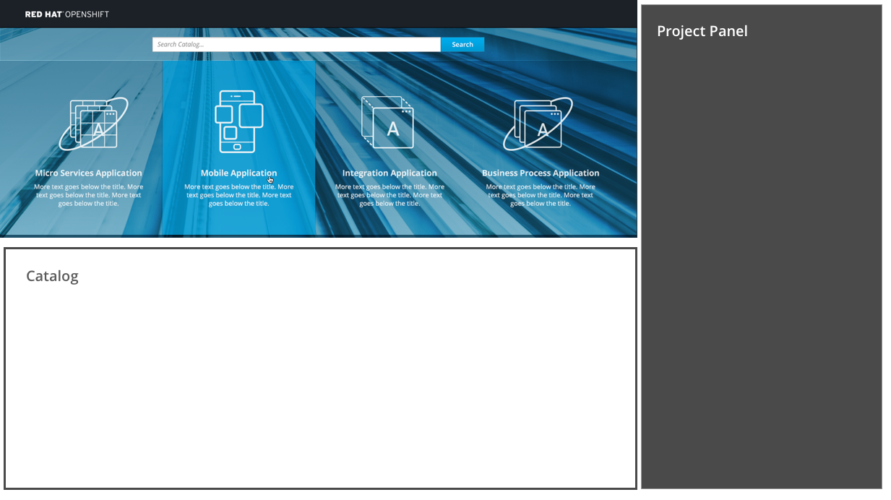

# SaaS Offerings

- SaaS Offerings are found at the top of the web console homepage on top of the blue background image.
- The SaaS Offerings section enables users to quickly launch services to help them build specific types of applications.

## Launch an offering

- Users may click on an offering to launch the associated service in another tab.

#### Implementation Details
- To account for any issues with the background image loading, there should be a default background color for the SaaS offerings area. The default background is: #3ca2c9
- It is possible that this section may be disabled for a given user, or have entries added/removed as determined by administrators.
- **Note:** The mockup shows four items but for MVP, there may only be one or two offerings available. The offerings should be centered on the page.
- For MVP, offerings do not appear as search results.
- Offering descriptions will be hidden in the mobile view of this section.

## Responsive designs
- As the screen narrows, Saas Offering tiles may shift to take up a second row.

- On mobile devices, SaaS Offering tiles should have the descriptions removed and be stacked vertically in a list.
