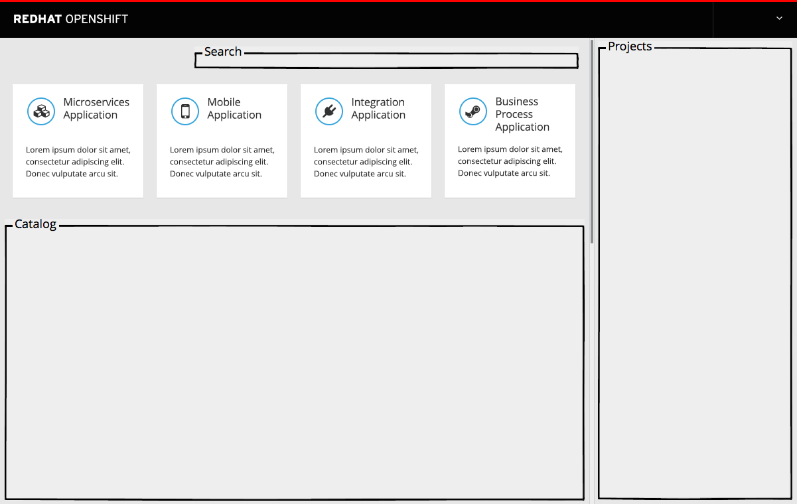
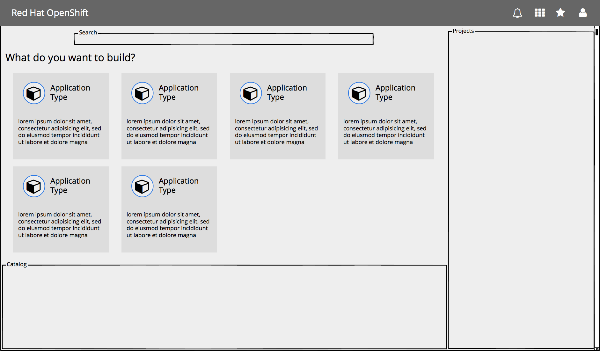

# SaaS Offerings

- SaaS Offerings are found at the top of the web console homepage
- The SaaS Offerings section enables users to quickly launch services to help them build specific types of applications.

## Launch an offering

- Users may click on an offering to launch the associated service in another tab.

#### Implementation Details
  - It is possible that this section may be disabled for a given user, or have entries added/removed as determined by administrators.
  - Offerings do not appear as search results.
  - Offering descriptions will likely be hidden in the mobile view of this section.

## Responsive designs

- As the screen narrows, Saas Offering tiles may shift to take up a second row.

- On mobile devices, SaaS Offering tiles should have the descriptions removed and be stacked vertically in a list.
