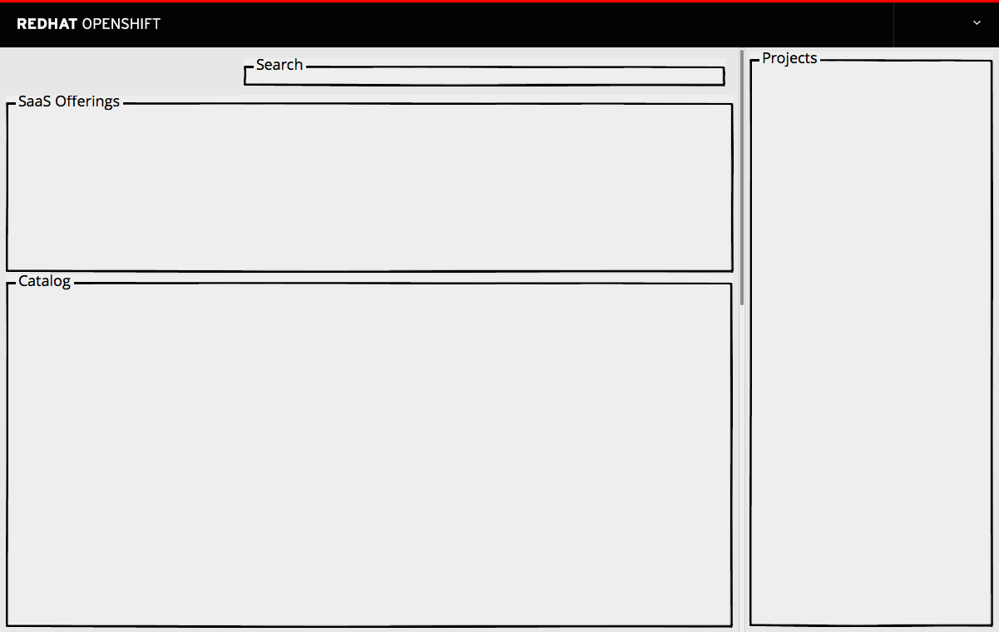
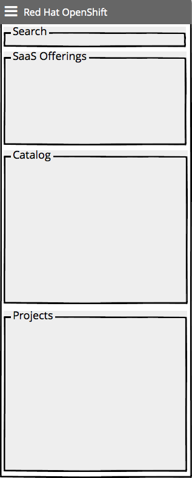

# Homepage

- This page is the first thing that a user encounters after signing in to the web console.
- It provides quick access to the various sections of the web console and serves as a landing page for users.

- The Web Console home page has four major sections
  - [Search](http://openshift.github.io/openshift-origin-design/web-console/1-homepage/search)
  - [SaaS Offerings](http://openshift.github.io/openshift-origin-design/web-console/1-homepage/offerings)
  - [Catalog](http://openshift.github.io/openshift-origin-design/web-console/1-homepage/catalog)
  - [Project Panel](http://openshift.github.io/openshift-origin-design/web-console/1-homepage/project-panel)

## Responsive Designs

- As the page gets narrower, the projects column should remain the same width.
- The SaaS Offerings and Catalog sections may change size to fit the screen.

- On very small screens, the Projects sections should move below the other two sections.
