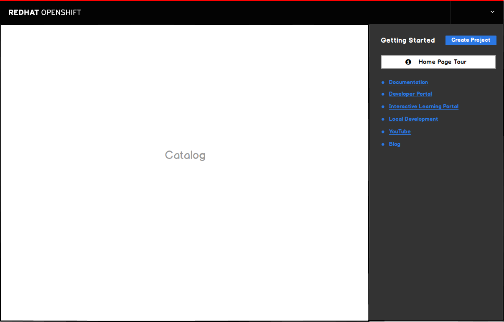
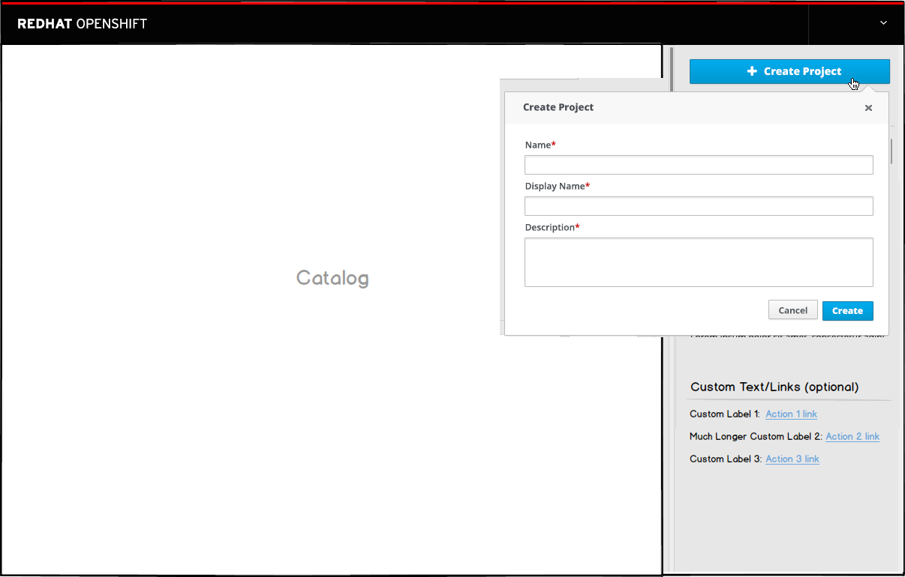
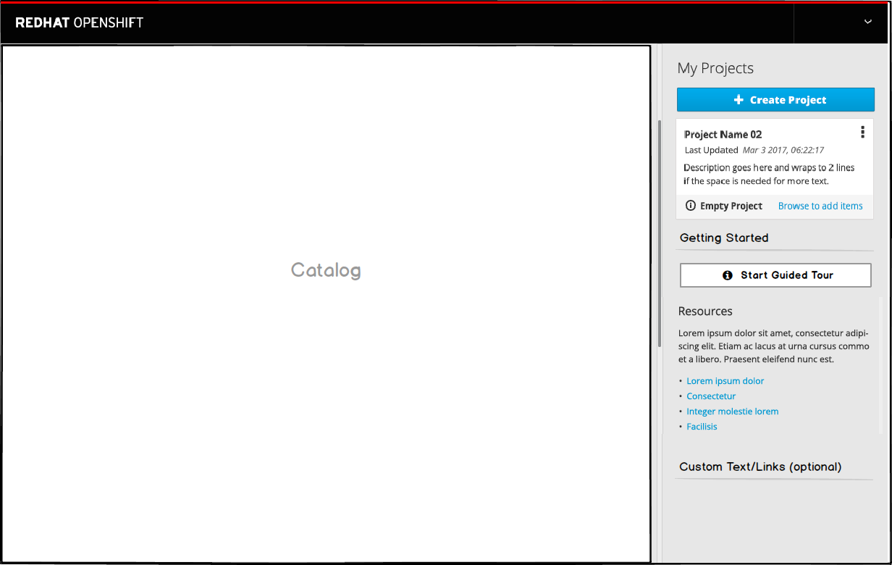
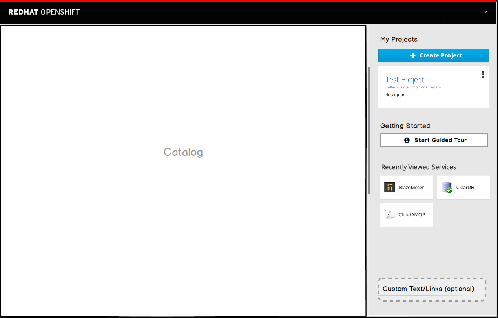
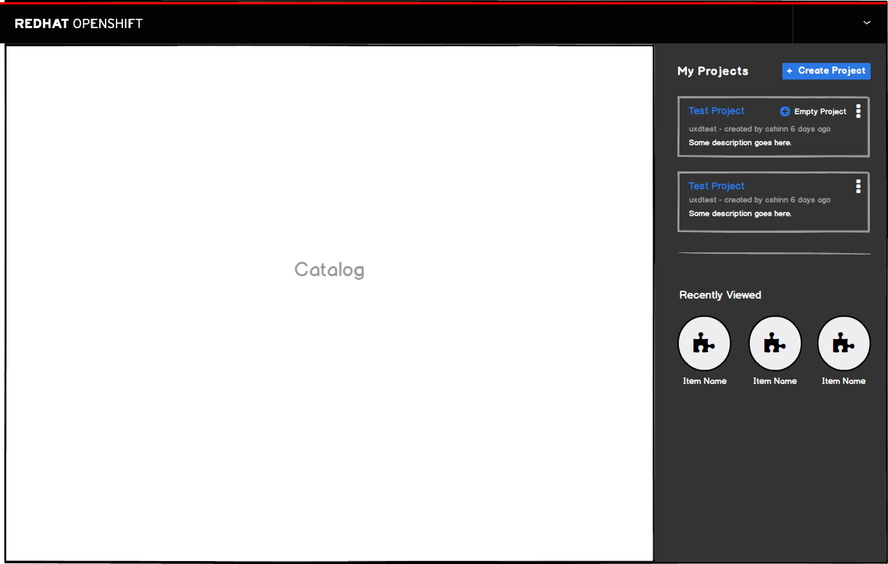
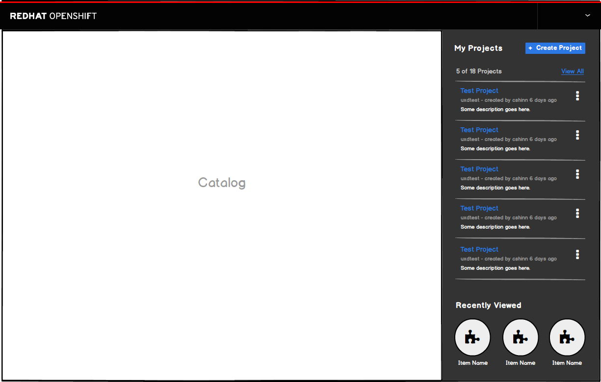
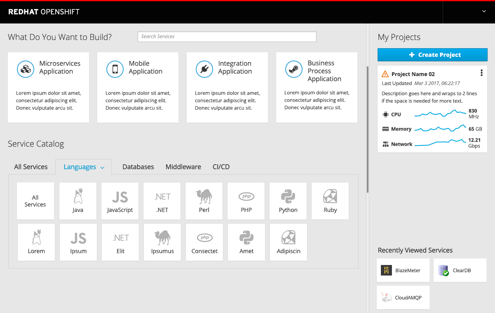

# Project Panel
- The project panel should cover 1/3 of the homepage when viewing on a standard desktop screen.
- The panel is on the far right-hand side for launch.
- **Note:** In the future the panel size and location may be configurable by the user.

## Day 1 Experience

- Brand new users will not have any projects upon initial login.
- On day 1, the projects panel includes the following sections in this order:
  1. **Create Project Button** (optional): The create project button is displayed by default, but admin users may choose to hide this button if desired.
  2. **Guided Tour:** Action button that launches a quick tutorial to identify key sections of the interface.
    * DO NOT DEVELOP: Details are TBD.
  3. **Resources:** Additional links that may help user learn more about the product will be listed here.
  4. **Custom Text/Links** (optional): This section is optional and configurable by the admin user. It allows admin users to provide additional content for their day-to-day users.
    * DO NOT DEVELOP: Details are TBD.

### Implementation Details
- DO NOT DEVELOP the following yet: Details are TBD.
  - The **Custom Text/Links** are configurable by an admin user with full DOM access to this section only.
  - The **Guided Tour** will use the [Hopscotch framework](http://linkedin.github.io/hopscotch/)
  - Low Fidelity Prototype: https://redhat.invisionapp.com/share/6ZAVH8RHW

### Customer Feedback
- TBD

## Day 2 Experience

### Create Project

- The create project button will open an overlay panel with a three-field form inside. See implementation details for more info.
- Once the user has at least one project created, the "My Projects" section will appear at the top of the panel. The Create Project button (if being used) will move down under "My Projects".
- The Getting Started section should move below the first project until items are added to the project.

- Once created, the project will be listed as a card at the top of the projects list, in an "empty state."
- The empty state is defined as a new project which does not have any items and only has a name, date, and description.
- **Kebab Actions:** There are three actions under the kebab menu for projects: edit details, edit membership, and delete.
  - These actions should function as they currently behave today.
  - The delete action opens a confirmation modal and edit will function similar to the create function.
  - The membership action will navigate to another page.

### Single Project

- Once a project has at least one resource, the card is not longer in the empty state.
- Once the user has viewed at least one item in the catalog, a "Recently Viewed" section will appear at the bottom of the panel.
  - **NOTE:** This section should be called "Recently Viewed" and should not say "Recently Viewed Services"
- Additional Resource links should be removed at this point and the content should be  accessible through the help menu in the masthead. The Guided Tour button will stay until more than one project exits.

### Multiple Projects

- Any new projects will be added to the top of the project list and will remain in the empty state until items are added.
- The Guided Tour button will be removed once more than one project exits.
- Clicking a project will bring the user directly to the project overview page for the particular project.

- Once there are more than two projects, a summary card should be added to the top of the list.
- This card will be placed underneath the Create Project button (if shown) and will display the number of total projects.
  - **NOTE:** In the FUTURE, alerts/status will be added to this summary card as well as onto the individual projects.
- Show as many projects as space permits on this page.
- Include a count (the number shown out of the total) along with a "view all" link to navigate to the full projects page.
- Users can navigate to a full projects page via the "View All" link on the homepage or by clicking on the summary tile (when displayed).

### Recently Viewed
- Once the user has viewed at least one item in the catalog by clicking on it and loading the ordering panel, this section should appear.
- Recently Viewed items should appear visually identical to the way they are represented in the catalog.

### Implementation Details
- There is an existing controller and form for the **create project** action already.  We should refactor into a component and move to the common repo so it is available to both console and catalog.
- **Kebab Actions** The edit membership action currently exist today for projects and take the user to a new page. For the initial release, this functionality should remain the same. For the delete and edit, these actions will be implemented to function in context as described in the documentation above.
- **Scrolling** TBD per discussion with Jeff

### Customer Feedback (if applicable)
- TBD

## Responsive Behavior/ Mobile View
- On a mobile device, the right panel should disappear and move to the bottom of the screen, below the catalog content.
  

## Future Work - NOT MVP
- Add a "last updated" date to the project cards and sort by most recently updated, not by created date

### Single Project

- Once a project has at least one resource, utilization metrics (CPU, Memory and Network) should be added to the project card along with the corresponding trendlines.

### Multiple Projects

- The utilization metrics should be shown on the project cards as space permits (2 projects max).

### Kebab Actions
- TBD

### Project Summary
- TBD
