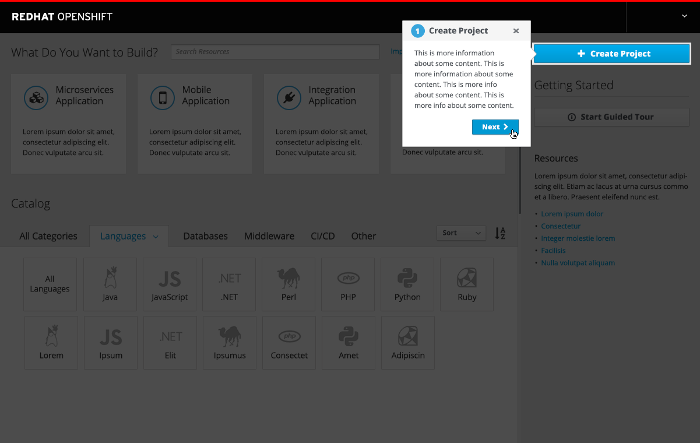
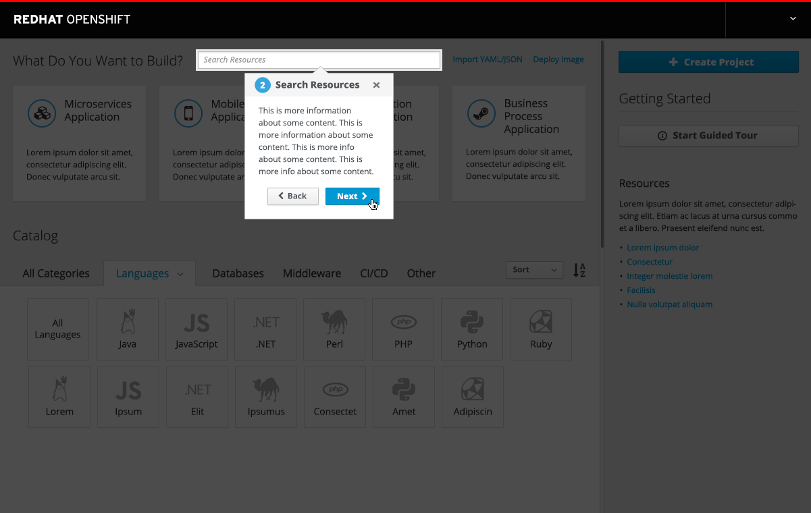
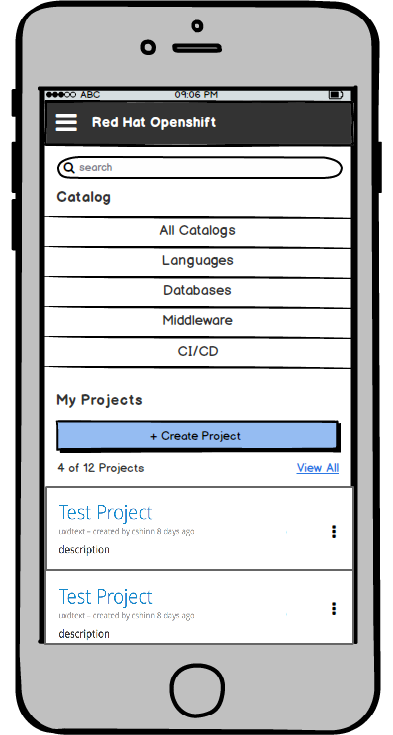

# Project Panel
- The project panel should cover 1/3 of the homepage when viewing on a standard desktop screen.
- The panel is on the far right-hand side for launch.
- **NOTE:** In the future the panel size and location may be configurable by the user.

- Brand new users will not have any projects upon initial login so the "My Projects" label should be hidden and Resources will be displayed here.

## My Projects

### Create Project

- **Primary Action Button** (optional): The Create project button is displayed by default and will open the new project panel. This button can be optionally hidden or customized. Admin users can provide a custom label and URL to open a new browser instead of the default project panel.
- The default create project button will open an overlay panel with a three-field form inside. See implementation details for more info.
- Once the user has at least one project created, the "My Projects" section will appear at the top of the panel. The Create Project button (if being used) will move down under "My Projects".

### Project Empty State

- Once created, the project will be listed as a card at the top of the projects list, in an "empty state."
- The empty state is defined as a new project which does not have any items and only has a name, date, and description.
- **Kebab Actions:** There are three actions under the kebab menu for projects: edit details, edit membership, and delete.
  - These actions should function as they currently behave today.
  - The delete action opens a confirmation modal and edit will function similar to the create function.
  - The membership action will navigate to another page.
- Once a project has at least one resource, the card is not longer in the empty state.

- Any new projects will be added to the top of the project list and will remain in the empty state until items are added.
- Clicking a project will bring the user directly to the project overview page for the particular project.

### Getting Started - Guided Tour
- A button labeled "Start Guided Tour" should be displayed under the Getting Started heading. The button launches a quick tutorial to identify key sections of the interface. This button can be optionally hidden.
- The guided tour should automatically begin when a new user logs into Openshift for the first time.
- Users should be able to manually start the guided tour by clicking the button on the right panel.
- Once users have more than one project created, the guided tour button will be hidden from the right panel, but should still be accessible under the help menu in the masthead.
- Admin users can customize the guided tour by overwriting the title and description for any of the steps included.

- All steps should include a cancel button.
- All steps, except for the final one, should include a next button. On the final step, the next button should turn into a "Done" button and will end the tour.
- All steps, except for the first one, should include a back button.
- The current step should point to the corresponding area of the interface.
- Clicking on the dark background will cancel the tour.
- If any of the items are hidden from the UI (such as the create project button), the tour should bypass that step and the numbers should update accordingly.
- The default steps include the following:
  1. **Create Project:** Highlight the action button on the right panel.
  2. **Search Resources:** Highlight the search bar.
  3. **Build Applications:** Highlight the Red Hat Experience catalog including the "What do you want to build" heading.
  4. **Browse Catalog:** Be sure the "All" category is selected and highlight the entire catalog.
  5. **Browse by Category:** Open the Languages section and select a subcatagory. Highlight the entire catalog.
  6. **Filter Resources:** Open the filter panel and highlight this dropdown.
  7. **Configure a Resource:** Open the ordering panel for a particular catalog item and highlight this panel.
  8. **Additional Help:** Point to the Resources section on the right panel and highlight the botton potion of the right panel.
- Descriptions for each step are TBD.
- Low Fidelity Prototype: https://redhat.invisionapp.com/share/6ZAVH8RHW

### Recently Viewed
- Once the user has viewed at least one item in the catalog, a "Recently Viewed" section will appear at the bottom of the panel.
- **NOTE:** This section should be called "Recently Viewed" and should not say "Recently Viewed Services" as it does in the mockups
- The Resources section should be removed at this point and the content should be accessible through the help menu in the masthead.
- Once the user has viewed at least one item in the catalog by clicking on it and loading the ordering panel, this section should appear.
- Recently Viewed items should appear visually identical to the way they are represented in the catalog.

### Projects List (More than 2)

- Once there are more than two projects, a summary card should be added to the top of the list and projects are displayed in a list view to save vertical space.
- This card will be placed underneath the Create Project button (if shown) and will display the number of total projects.
- **NOTE:** In the FUTURE, alerts/status will be added to this summary card as well as onto the individual projects.
- Show as many projects as space permits on this page.
- Include a count (the number shown out of the total) along with a "view all" link to navigate to the full projects page.
- Users can navigate to a full projects page via the "View All" link on the homepage or by clicking on the summary tile (when displayed).

### Implementation Details
- The **Guided Tour** will use the [Hopscotch framework](http://linkedin.github.io/hopscotch/)
- There is an existing controller and form for the **create project** action already.  We should refactor into a component and move to the common repo so it is available to both console and catalog.
- **Kebab Actions** The edit membership action currently exist today for projects and take the user to a new page. For the initial release, this functionality should remain the same. For the delete and edit, these actions will be implemented to function in context as described in the documentation above.
- **Scrolling** TBD per discussion with Jeff

## Responsive Behavior/ Mobile View
- On a mobile device, the right panel should disappear and move to the bottom of the screen, below the catalog content.

- Selecting View All will display the full projects lists on a new screen with the back button available.
- Selecting create project will show a full screen with the form and two action buttons, cancel and create at the bottom.

### Customer Feedback (if applicable)
- TBD

## Future Work - NOT MVP
- Add a "last updated" date to the project cards and sort by most recently updated, not by created date

### Projects - Card View

- Once a project has at least one resource, utilization metrics (CPU, Memory and Network) should be added to the project card along with the corresponding trendlines.

- The utilization metrics should be shown on the project cards as space permits (2 projects max).

### Projects - List View

- The Projects view should change to a list to conserve vertical space once there are more than two projects.
- The summary panel should include a summary of warnings and allow direct link access to a filtered list on the projects page.

### Kebab Actions
- TBD

### Project Summary
- TBD
