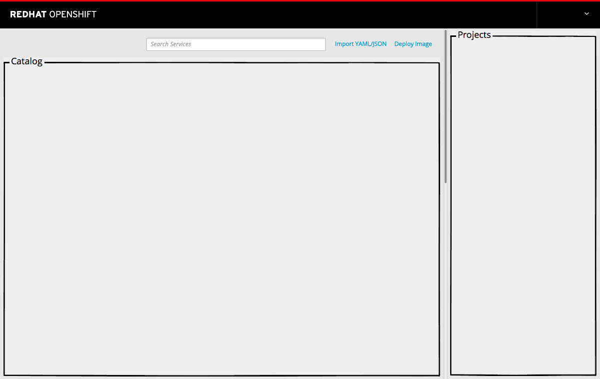
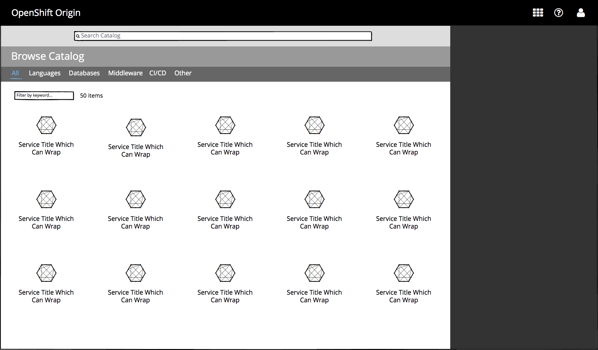
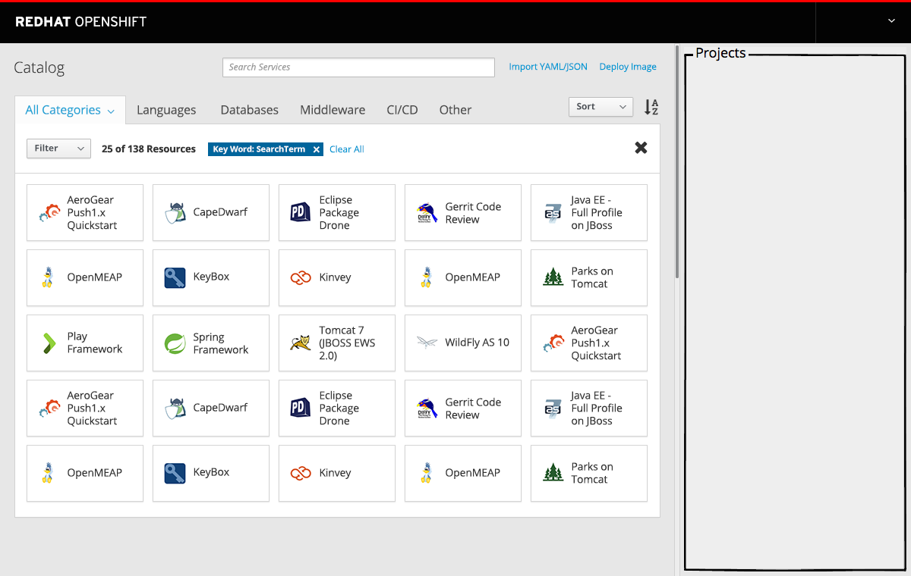
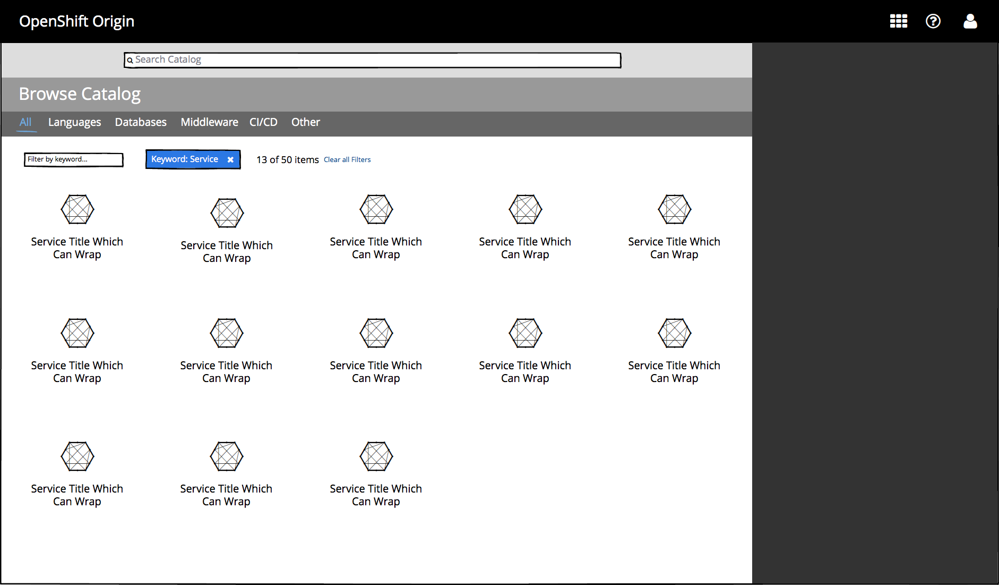
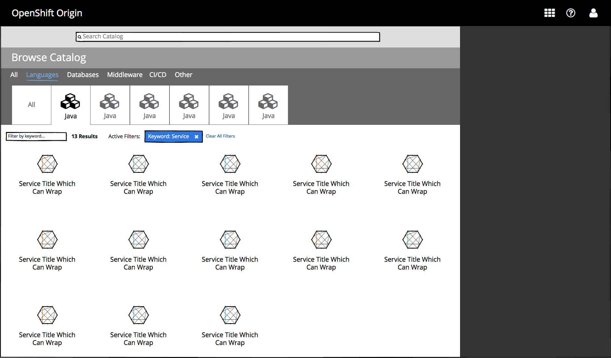
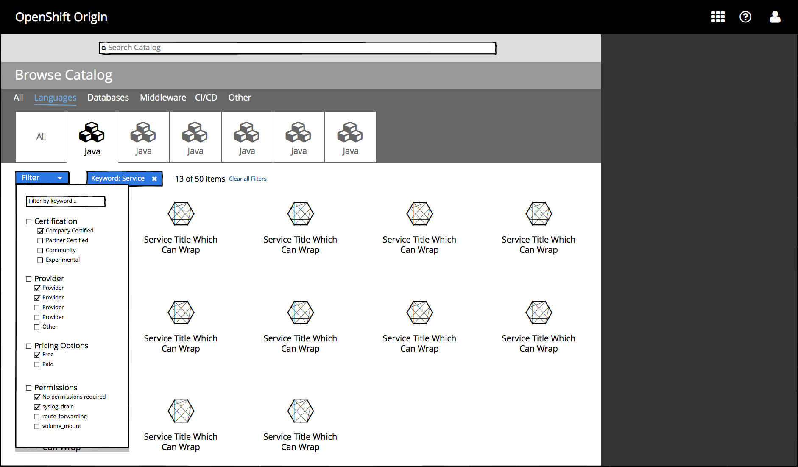
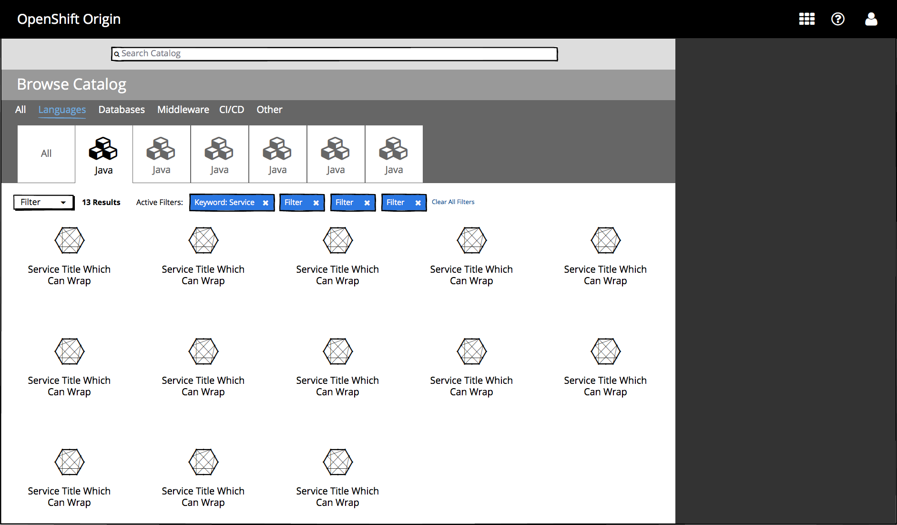
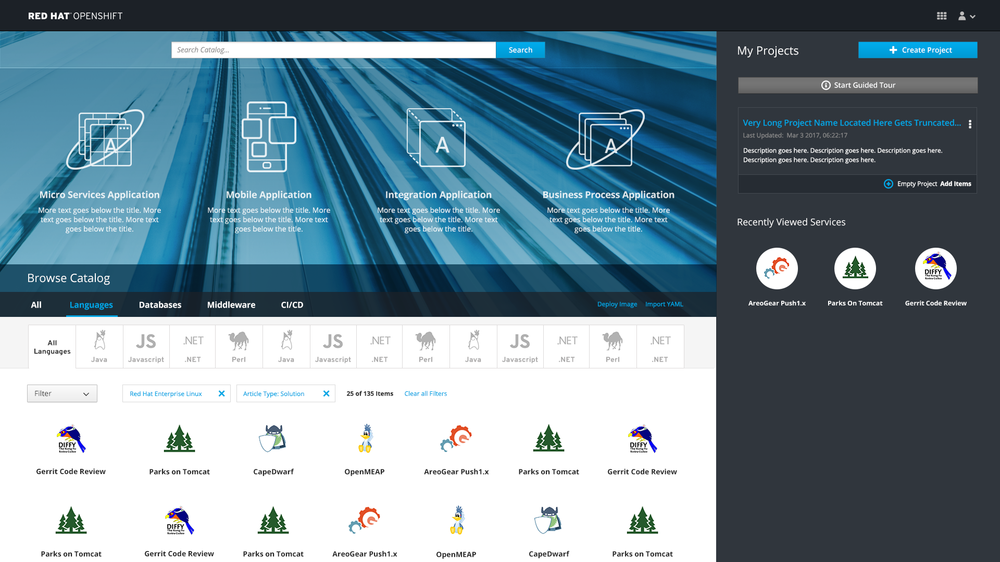

# Search and Filter

- The search bar is located at the very top of the web console homepage
- This component enables users to enter a query and receive a list of results.

- The search bar is sticky at the top of the page.

- As the user scrolls, the search will remain at the top with a portion of the background image still visible.

## Search Catalog

- Entering a search term brings up a list of the first five matches.
- The matches display the catalog item icon, name and any relevant tags.
	- Clicking on a match will trigger the order flow for that catalog item on the [overlay panel](http://openshift.github.io/openshift-origin-design/web-console/4-patterns/overlay-panel).

#### Implementation Details
- Catalog items will be able to be searched by name, tag, and description
- Catalog items with a matching name should be prioritized over those with a matching tag, which are higher priority than those with a matching description.
- Elements with more matches should be prioritized over those with fewer.
- No results will be highlighted until the up or down arrow key is pressed.
- Pressing the `Enter` key while no results are selected will trigger the `View all results` action (see below for details)
- If possible and practical, the search results panel should be updated as the user enters their search term.

## View All Results

- Clicking on the `View All [n] Results for Keyword:[searchterm]` link scrolls the user down to the [catalog](http://openshift.github.io/openshift-origin-design/web-console/1-homepage/catalog) on the `All Categories` tab with an active "Keyword" filter for the search term.

#### Implementation Details
- All active filters are cleared when the main search box is used so that it always produces a "fresh" page of results.
- Additional keyword filters may be added by using the keyword filter box (see below for details).
- Navigating to a different tab will clear the active keyword filter.

#### Customer Feedback (if applicable)
- Necessary Customer Feedback
- Is it clear that the keyword filter is a direct result of entering a search term?

## Filtering within a page

- Users may narrow the items displayed on a catalog page by using the keyword filter box.
- The filter box creates or edits an active keyword filter which displays only items with a name, tag, or description that matches the keyword
- Differences from main search bar
	- Filters are applied to the currently active page rather than taking the user to the `All` category page.
	- Typing a new term into this box will add a new keyword filter to the current page with an AND relationship to the previous keyword filter

## Rules for active filters
- Filters exist only within the scope of the currently selected category and subcategory and their behavior reflects this:
	- Filters do not persist when a different category or subcategory tab is selected.
	- Filters are not saved on the page for when the user navigates back to a category or subcategory tab (Using the browser's back button should restore the state of the previous page including filters, however).
	- An active filter that yields 0 results in a given category or subcategory must not cause the tab to disappear. This is true for the currently selected tab as well as other tabs.

**********

# Future Use Cases

## Additional Filters

- When additional filters become available, the keyword filter box will be moved into a filter dropdown along with the rest of the filters.

- Additional filters may be added as normal and stack with the keyword filter in an OR relationship
- Filters within the same section are combined with an AND relationship (e.g. free AND paid options are available)

#### Implementation Details
- Filters available on this page will be the same ones that would be available from the All Categories tab under normal circumstances
- If it is possible to determine that the current keyword filter constrains the page's contents to a single other category or subcategory, filters for that category should be shown instead.
- In the short term, standard PatternFly filter token styling may be used.
	- Ultimately, these tokens should be updated to match the below mockup

#### Filterable Data
- Certification/support level
- Provider
- Pricing options
	- Free
	- Paid
- Permissions
	- No Permissions Required
	- Syslog Drain
	- Route Forwarding
	- Volume Mount
