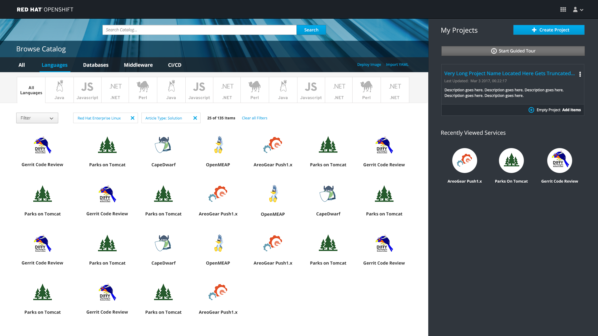
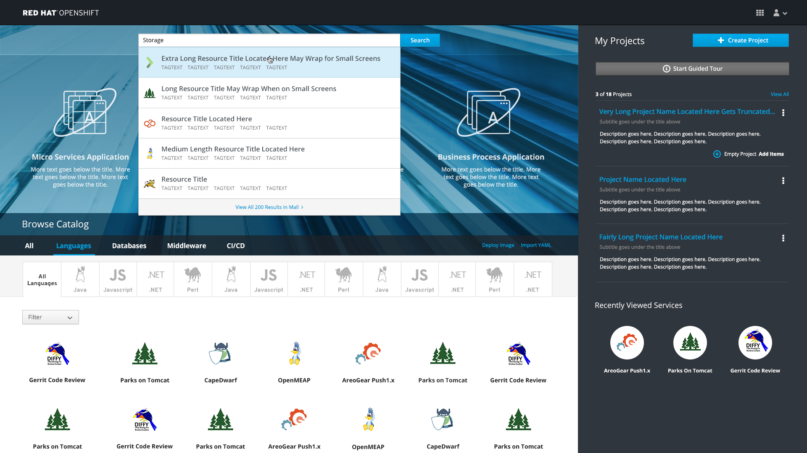
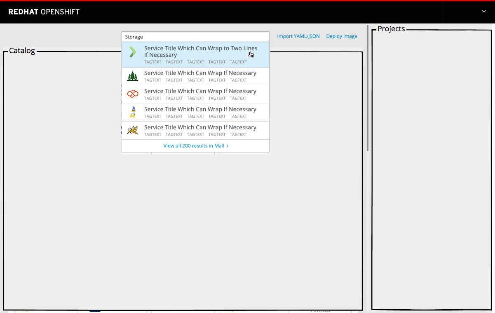
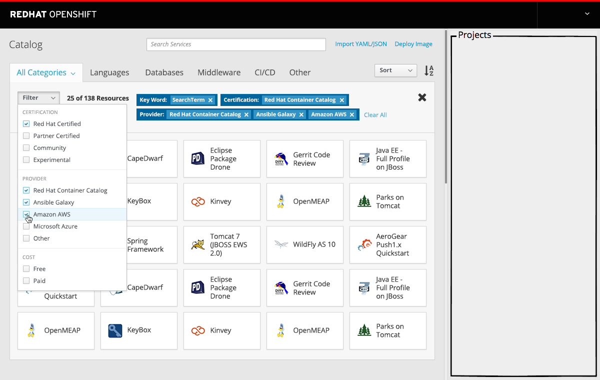

# Search

- The search bar is located at the very top of the web console homepage
- This component enables users to enter a query and receive a list of results.

## Search Catalog

- The search bar is sticky at the top of the page.
- As the user scrolls, the search will remain at the top with a portion of the background image still visible.

#### Implementation Details

- Entering a search term brings up a list of the first five matches.
- The matches display the catalog item icon, name and any relevant tags.
  - Clicking on a match will trigger the order flow for that catalog item on the [overlay panel](http://openshift.github.io/openshift-origin-design/web-console/4-patterns/overlay-panel).
  - The link at the bottom titled "View All x Results" will not be implemented for MVP.

#### Implementation Details
  - Catalog items will initially be able to be searched only by name and description
  - Catalog items with a matching name should be prioritized over those with a matching description
  - If possible and practical, the search results panel should be updated as the user enters their search term.

**********

# Future Use Cases

- Entering a search term brings up a list of the first five matches along with an option to view the entire set of matches.
  - Clicking on a match will trigger the order flow for that catalog item on the [overlay panel](http://openshift.github.io/openshift-origin-design/web-console/4-patterns/overlay-panel).

#### Implementation Details
  - Catalog items should be searchable by name, tag, and description
  - Catalog items with a matching name or description should be prioritized over those with a matching tag
  - If possible and practical, the search results panel should be updated as the user enters their search term.

- Clicking on the `View all results` link takes the user to a fully expanded view of the [catalog](http://openshift.github.io/openshift-origin-design/web-console/1-homepage/catalog) on the `All Categories` tab with an active "Keyword" filter for the search term.

#### Implementation Details
  - Keyword filter cannot be applied through any other means and can only hold a single value at a time.
  - Clearing the keyword filter returns the user to the regular list of all resources.
  - Entering another search query and then viewing all results on that query will replace the current keyword filter.

#### Customer Feedback (if applicable)
- Necessary Customer Feedback
  - Is it clear that the keyword filter is a direct result of entering a search term?

## Filter Search Results

- Additional filters may be added as normal and stack with the keyword filter in an AND relationship

#### Implementation Details
  - Filters available on this page will be the same ones that would be available from the All Categories tab under normal circumstances
  - If it is possible to determine that the current keyword filter constrains the page's contents to a single other category or subcategory, filters for that category should be shown instead.
