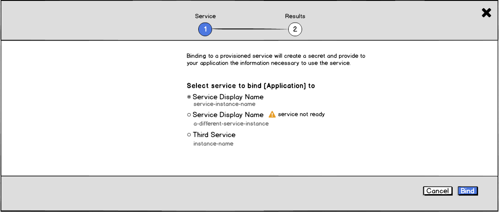
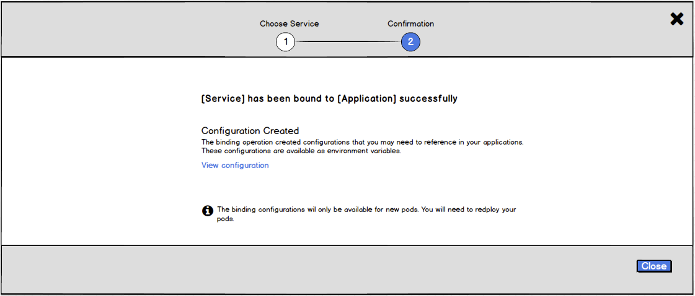

# Binding in Context

- Users may bind Provisioned Services to other applications in their project and vice versa.
- The binding flow will use the [Overlay Panel Pattern](http://openshift.github.io/openshift-origin-design/web-console/4-patterns/overlay-panel) and employ a similar wizard experience to the [ordering experience](http://openshift.github.io/openshift-origin-design/web-console/5-components/order-from-catalog).

## Initiating the bind flow

- A user can initiate a binding from the kebab menus of provisioned services, or from other resources in the overview that can be bound to (anything with pods).

- For provisioned services that do not have any bindings, there is a "Create binding" action in the collapsed state.

- The "Create binding" action is always available for Provisioned Services in the expanded state.

- A binding can also be initiated from a deployment config (or similar) in the expanded view IF that deployment is already bound to another service. The “Service Bindings” section does not appear in the overview if there are no bindings.

## Bind flow

### General -- MVP

  - The wizard is two steps regardless whether you start from a provisioned service or from an application:
    1. Choose service (or application)
    2. Confirmation

### Step 1 -- MVP

  - For MVP, it is only possible to select one resource to bind to, regardless whether you're binding from a deployment or from a service.
  - Available resources should be listed with radio buttons. The first resource should be selected by a default.
  - The primary action is "Bind" and "cancel" should be available as a secondary action.

#### Implementation Details
  - Step one should be labeled "Choose Service" or "Choose Application" depending on the type of resource the user is choosing.
  - Likewise, the text in the main body of the wizard should indicate the type of resource (service or application) the user is choosing.

### Step 2 -- MVP

  - The success message should name both the application and the provisioned service that were bound.
  - There is a note indicating that the binding operation created a configuration.
  - Include an action to "View configuration" which would take the user to the page for that secret.
  - There should be a note alerting users that changes will not take effect until they redeploy their pods.
  - The only action button is "Close."

#### Implementation Details
  - Following the "View configuration" link would dismiss the overlay panel.

## Unbinding
  - Unbinding would work similarly to binding, following the same two-step process:
    1. Choose the thing to unbind from
    2. Confirmation

- Available resources should be listed with radio buttons. The first resource should be selected by a default.
- The primary action is "Un-bind" and "cancel" should be available as a secondary action.

- The success message should name both the application and the provisioned service that were bound.
- There should be a note alerting users that changes will not take effect until they redeploy their pods.
- The only action button is "Close."

#### Community Feedback (if applicable)
- Community Feedback Received
  - Overview of customer feedback received
- Necessary Community Feedback
  - Questions to follow up with community
