# Binding in Context

- Users may bind Provisioned Services to other applications in their project and vice versa.
- The binding flow will use the [Overlay Panel Pattern](http://openshift.github.io/openshift-origin-design/web-console/4-patterns/overlay-panel) and employ a similar wizard experience to the [ordering experience](http://openshift.github.io/openshift-origin-design/web-console/5-components/order-from-catalog).

## Initiating the bind flow

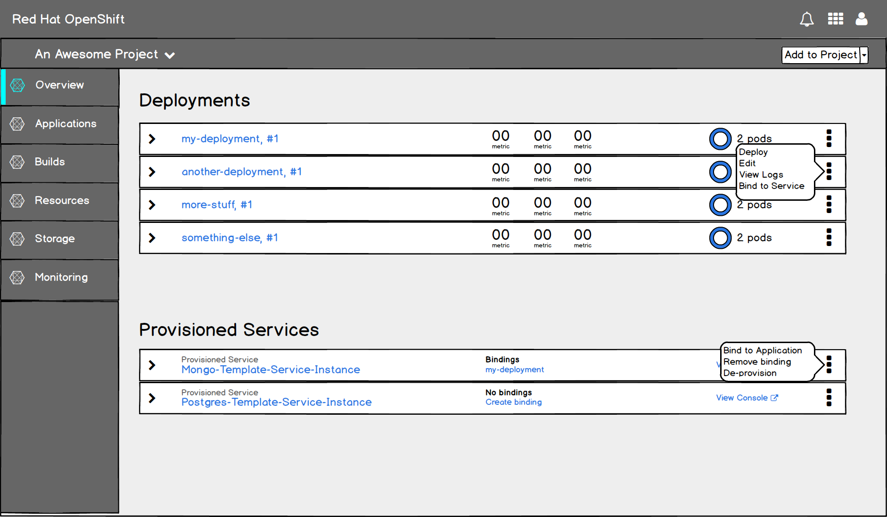
- A user can initiate a binding from the kebab menus of provisioned services, or from other resources in the overview that can be bound to (anything with pods).

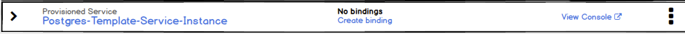
- For provisioned services that do not have any bindings, there is a "Create binding" action in the collapsed state.

- The "Create binding" action is always available for Provisioned Services in the expanded state.

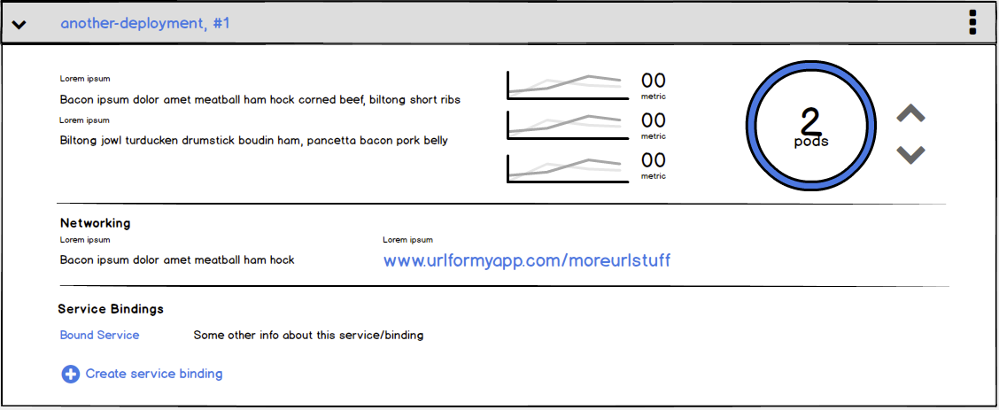
- A binding can also be initiated from a deployment config (or similar) in the expanded view IF that deployment is already bound to another service. The “Service Bindings” section does not appear in the overview if there are no bindings.

## Bind flow

### General -- MVP

  - The wizard is two steps regardless whether you start from a provisioned service or from an application:
    1. Service or application (depending on what the user is choosing)
    2. Results

### Step 1 -- MVP
#### Binding an Application to a Service
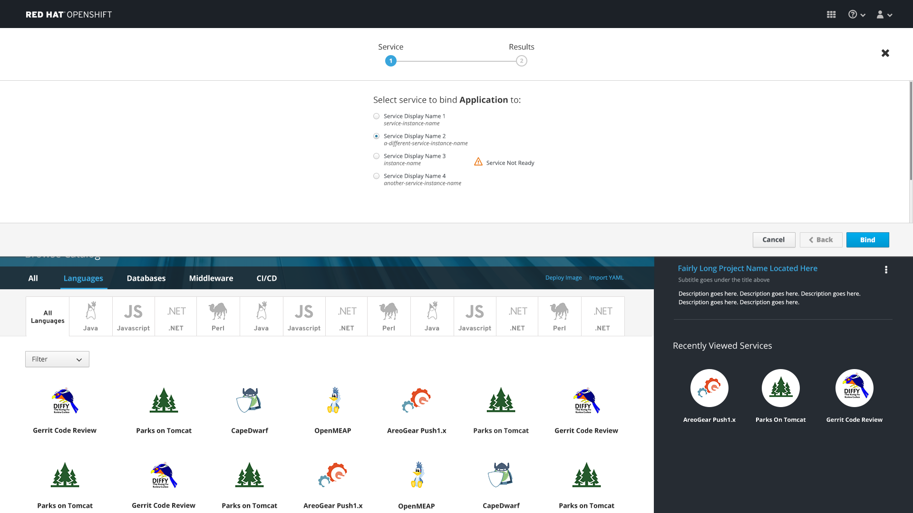
  - The initial step should include some text to describe to the user what it means to create a binding.
  - For MVP, it is only possible to select one resource to bind to, regardless whether you're binding from a deployment or from a service.
  - Available resources should be listed with radio buttons. The first resource should be selected by a default.
  - The primary action is "Bind" and "Cancel" should be available as a secondary action.

##### Implementation Details
  - Services are listed using the service class display name, with the service instance name in lighter text underneath.
  - If a provisioned service is not yet available, a warning triangle with the text "service not ready" should appear inline with the service name.

#### Binding a Service to an Application
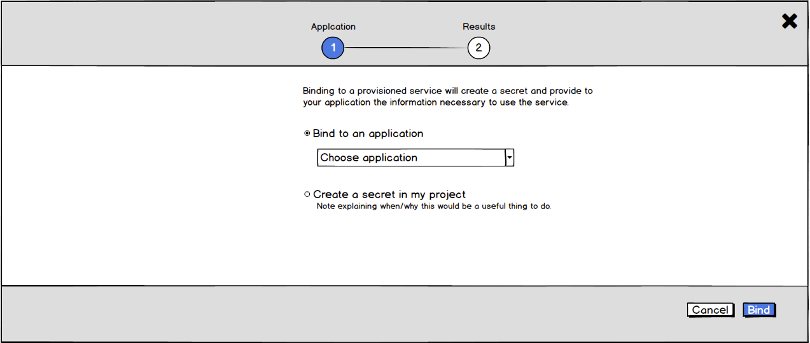
  - User may select from two different binding options:
    1. Bind to an application
    2. Create a secret in my project
  - Binding options are selected via radio buttons. "Bind to an application" is selected by default.
  - User may select the application to bind to using a ui-select control. Search should be enabled if there are more than 10 choices in the dropdown.

##### Implementation Details
  - The "Bind" button should be disabled until a valid selection has been made--either choosing an application, or selecting the "Create a secret..." radio button.
  - Users should get a warning if they try to bind to an application that is already bound to the same service.

  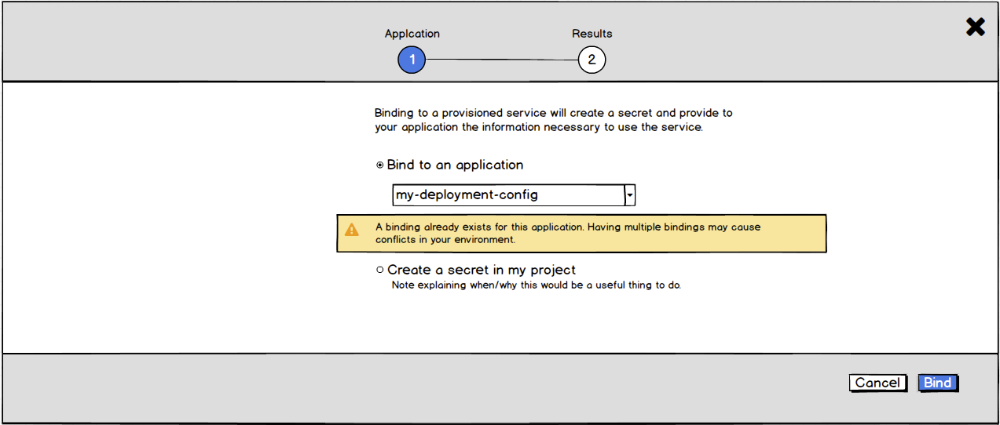

### Step 2 -- MVP

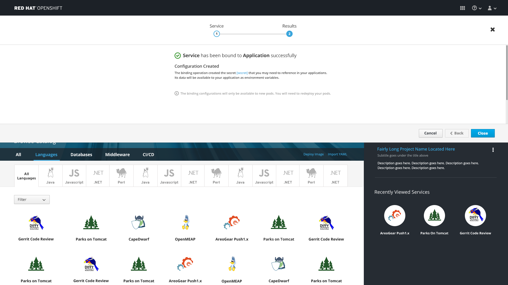
  - The success message should name both the application and the provisioned service that were bound.
    - The success message for the "Create a secret in my project" option should say "Binding created successfully"
  - There is a note indicating that the binding operation created a configuration.
  - Include an action to "View configuration" which would take the user to the page for that secret.
  - There should be a note alerting users that changes will not take effect until they redeploy their pods.
  - The only action button is "Close."

#### Implementation Details
  - Following the "View configuration" link would dismiss the overlay panel.

## Unbinding
  - Unbinding would work similarly to binding, following the same two-step process:
    1. Choose the thing to unbind from
    2. Confirmation

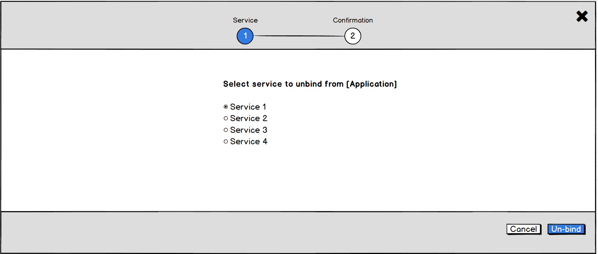
- Available resources should be listed with radio buttons. The first resource should be selected by a default.
- The primary action is "Unbind" and "Cancel" should be available as a secondary action.

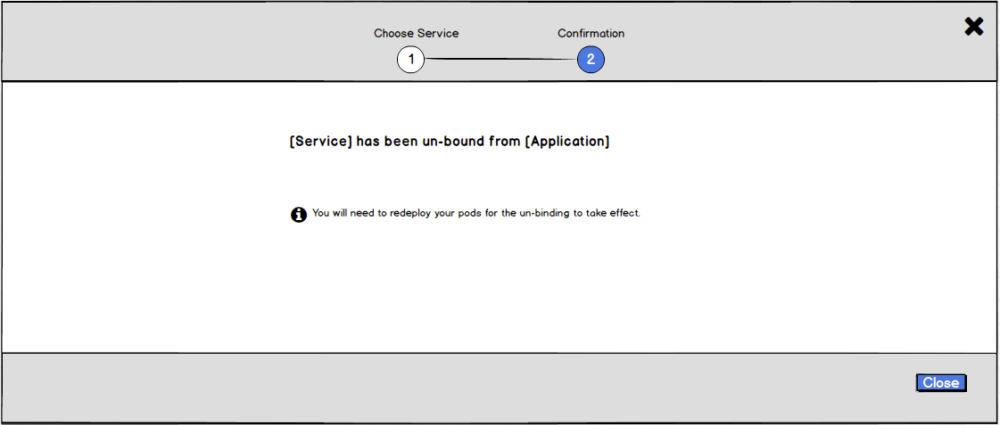
- The success message should name both the application and the provisioned service that were bound.
- There should be a note alerting users that changes will not take effect until they redeploy their pods.
- The only action button is "Close."

## Deprovisioning
  - The "Deprovision" action is available in the kebab regardless whether or not a service has any bindings.
  - Clicking the "Deprovision" action brings up a strong warning.

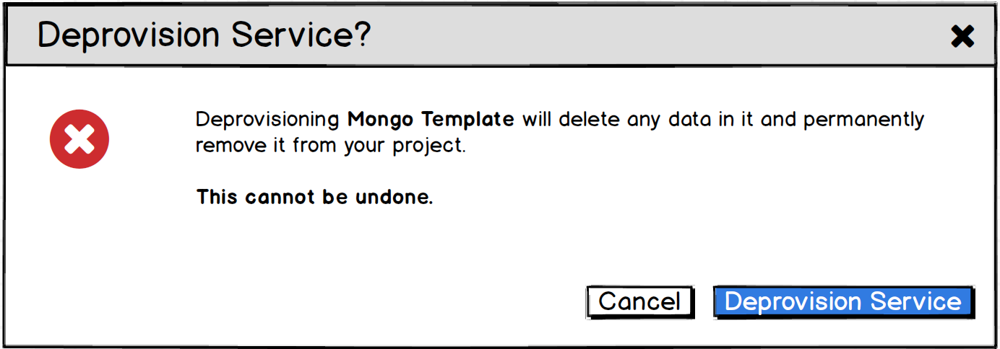

  - If a service has bindings, alert user that s/he will have to delete bindings before deprovisioning.

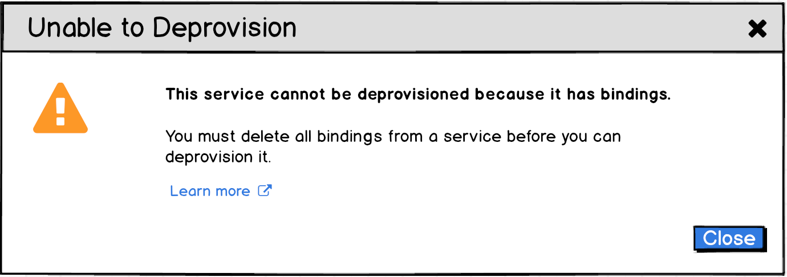

#### Community Feedback (if applicable)
- Community Feedback Received
  - Overview of customer feedback received
- Necessary Community Feedback
  - Questions to follow up with community
