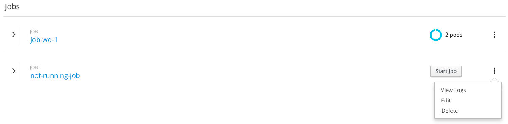
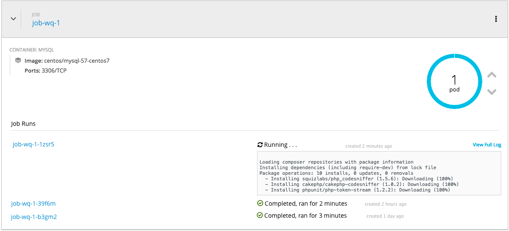
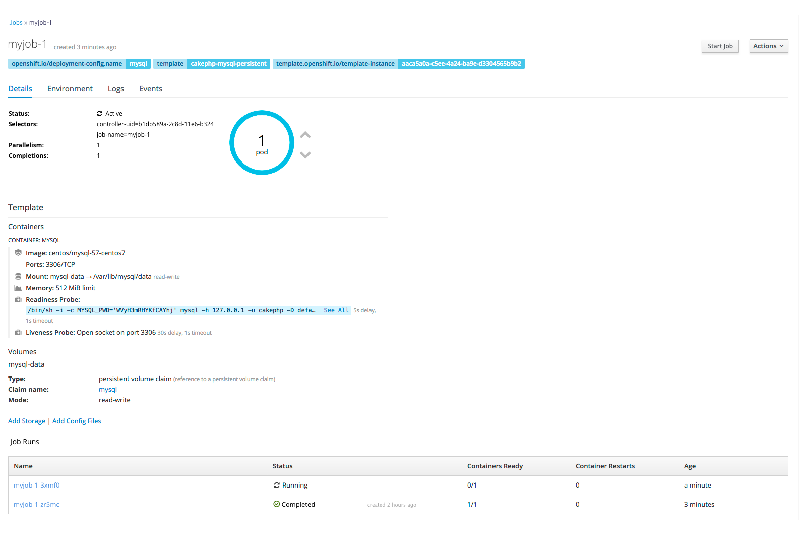

# Jobs

- A Job creates one or more pods which run to completion, i.e. they don't run continuously like deployments.
- A Cron Job extends a regular Job by allowing users to schedule when a job will run.
- This documentation uses "Job" to refer to both Jobs and Cron Jobs, except when Cron Jobs are called out specifically.

## Open Questions
- Does it make sense to create a notion of "job run" which would somehow group pods when the template specifies a number of completions or parallelism greater than 1?
- If no, is a time stamp sufficient to show which pods belong to a run?
- How many completed pods/runs should be shown in the overview?
- Should jobs remain in the overview after they run, if so should they disappear after some period of inactivity?
- If I start a Cron Job before its next scheduled run, would the next run's start time be relative to the new start time? I.e. does the schedule reset if a user runs it earlier?
- If parallelism > 1 should we just pick a pod to show logs for?

## Overview
- Jobs and Cron Jobs would be listed under a "Jobs" heading in the Application and Resource views of the Overview.
- The heading over individual Job names would specify if it is a Job or Cron Job.
- Jobs (and Cron Jobs) that have an app label should be grouped with that application in the Application view.

### Collapsed State

- Jobs are listed on the Overview page similarly to deployments.
- Currently running jobs have the pod donut donut.
- For Jobs that are not running, the pod donut is replaced by a "Start Job" button which would initiate a job run.
- The kebab includes the following actions: "View Logs", "Edit" and "Delete".

### Expanded State

#### Running

- In the expanded state information about the container would be shown, as with deployments.
- The pod donut is shown and the user is able to scale up and down.
- There is a separate section for "Job Runs"
- Pod names are shown on the left, with pod status on the right.
- Pod status for completed pods includes the duration.
- The logs for a running pod are shown in this view similar to builds, with a link to the full logs.
- Clicking on a pod name takes the user to the details page for that pod.

#### Not Running

- For jobs that are not running, the pod donut is replaced by an action button to "Start Job"
- The last N completed pods should be shown in the Job Runs area.

#### Cron Jobs

- Cron Jobs add an indication of how often they run, eg. every hour in top section.
- When a Cron Job is not running, the Job Runs section includes an entry for "Next run" with the time that the job is scheduled to run.

## Details Pages

- A link to a top-level Jobs page is found in the Applications menu.

- Details pages for Jobs should be very similar to details pages for replication controllers.
- A Job Runs section includes a table listing pods and their statuses for active or completed runs (analagous to "Pods" table for replication controllers).
- "Start Job" is the main action for this page.
- If a job is not running the pod donut does not appear.  
