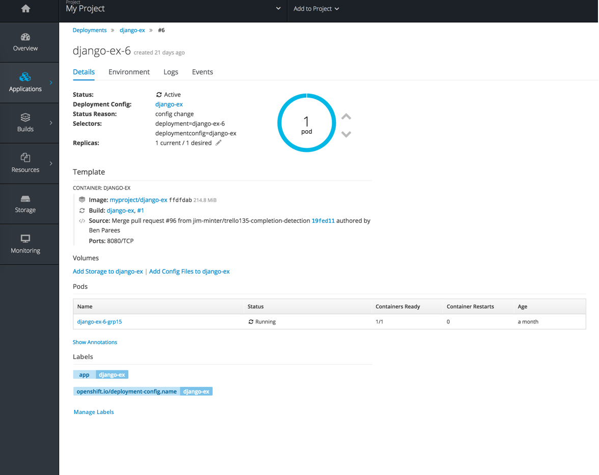
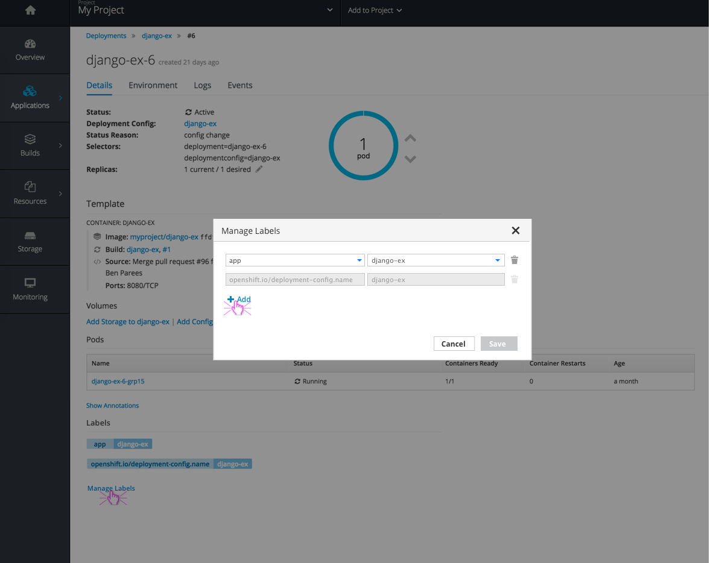
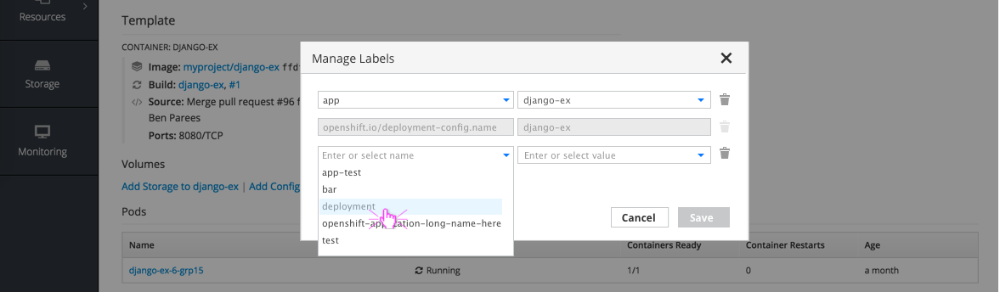
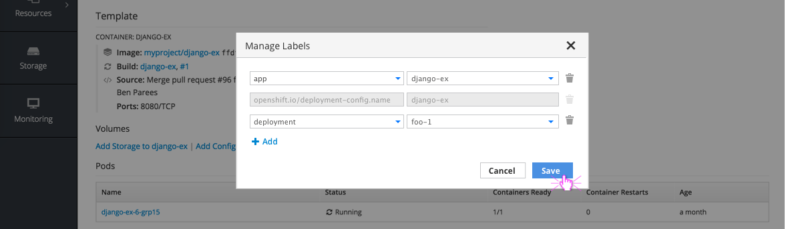
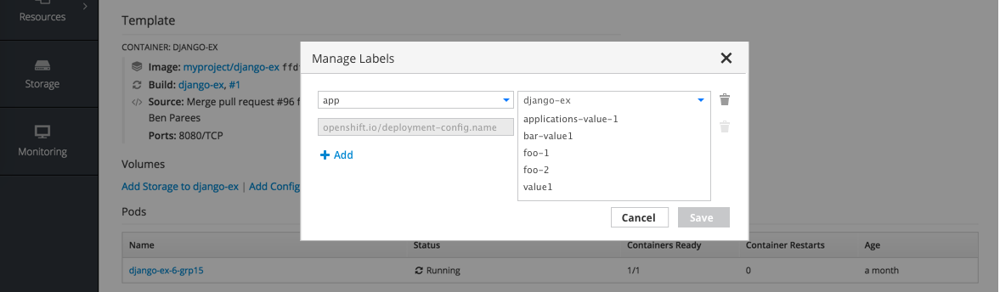
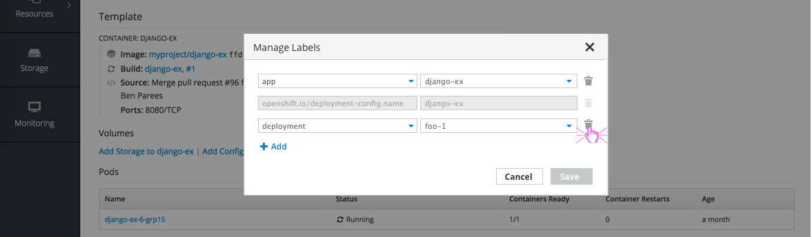
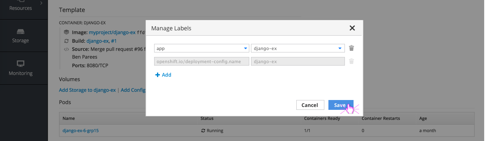
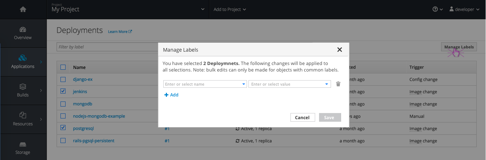
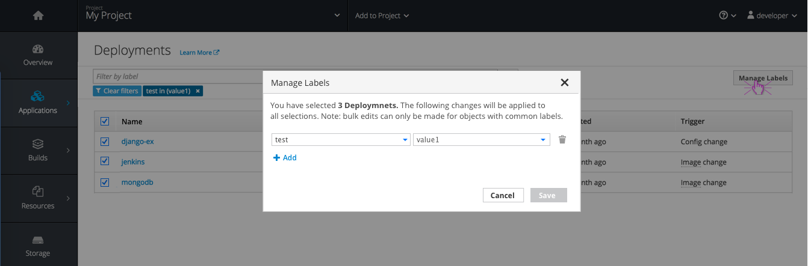
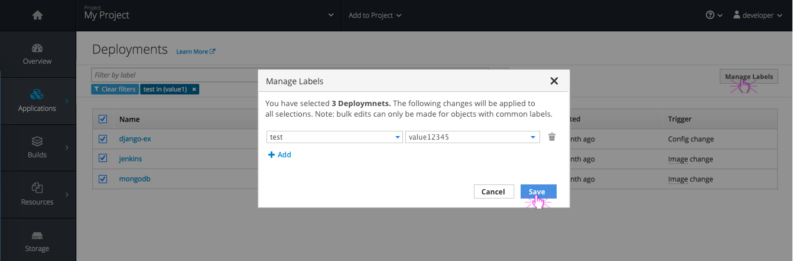

# Labels on Detail Pages

## View Labels
- Labels are currently displayed at the top of most detail pages (Deployments, Pods, Builds, Images, Storage, etc)
- A new `Labels` section should be added to the bottom of the `Details` tab on all of these pages to allow for a more comprehensive labels area

## Add Labels

- A `Manage Labels` link should be displayed below the applied labels
- Clicking the link will open a modal, displaying the labels that are already applied, as well as an option to add new labels.
- Clicking `Add` will display a new row with two empty fields for label Name and label Value.

- Both empty fields should use the combobox component as users can either select an existing label or enter a new one.
- The save button should not be enabled until selections are made.

- The dropdown list should display all existing labels that have been applied elsewhere throughout the current project.

#### Implementation Details
- Label Names that have already been applied to the current object will not appear in the dropdown list as there cannot be duplicate values associated.
  - For example, "app" and "openshift.io/deployment-config.name" are already applied and are not in the dropdown list.
  - Users would need to edit the existing rows for those labels if desired.  

- Once the user clicks `Save` the new label should appear at the bottom of the list of labels on the Details tab.

## Edit Labels

- The same `Manage Labels` link will be used for editing existing labels.
- Users can change a name or value as desired. All existing values for the current project will be listed in the dropdown.

#### Implementation Details
- Values can be edited in this view, but only the current object will receive the label change. In order to bulk change labels for multiple items (Deployments in this case), users must go to the summary page and multi-select items.
- If there are specific system defined or restricted labels that users are unable to change, the entire row should be disabled.

## Remove Labels

- The same `Manage Labels` link will be used for removing existing labels.
- Clicking the trash icon next to a label will remove that row and enable the save button.
- Applying these changes will only remove the label from this specific object, not from the system entirely.

# Labels on Summary Pages

- Summary lists are provided for each major section such as Deployments, Pods, Builds, Images, Storage, etc.
- Currently users can filter those lists based on their applied labels, in order to narrow the results.
- Filtering by label should remain, but checkboxes should be added to the left side of each row to allow for multi-select and bulk actions from the summary page.

## Manage Labels
- Users can multi-select using the checkboxes provided and a `Manage Labels` button should be available in the top right corner of the page.
- The `Manage Labels` button will open a modal for any add, edit, or remove actions to take place.
  - The top of the modal should summarize the selections to reiterate the number of objects that will be affected by the label changes. Intro text detailed below:
  - "You have selected 'x' 'Object-Type.' The following changes will be applied to all selections. Note: bulk edits can only be made for objects with common labels."

### Add

- Users can add a single label or multiple labels to all selected objects.
- If the selected objects have any labels in common, the labels would be listed in rows above the empty one. If not, an empty row will be presented alone, with the option to add more labels.
- Adding the new label and clicking `Save` will close the modal and initiate a toast notification to confirm the changes have been applied to all objects.

### Edit

- The same `Manage Labels` button will be used for bulk editing any existing labels.
- Users can filter by label before using the multi-select to ensure selections do have common labels because if the items selected do not have any labels in common, edit actions will not be available.

- In this case, changing `value1` to `value12345` will change the applied label for all three deployments selected.

- A toast notification should be displayed once changes have been made to a label.
- If there is a filter applied, it should be updated to reflect the label changes.

### Remove
- The same `Manage Labels` button will be used for removing existing labels.
- Clicking the trash icon next to a label will remove that row and enable the save button.
- Applying these changes will only remove the label from the selected objects, not from the system entirely and a toast notification should confirm the changes.

### Notifications
  - Toast notifications should be displayed following any manage label action (Add, edit, or remove) to confirm the change and the number of objects affected.
  - Toast notifications are not displayed for label changes made on detail pages because those changes appear immediately and are visible in the UI following the change.
