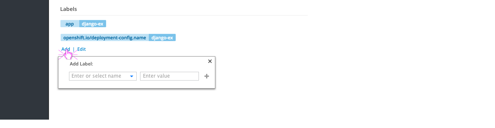
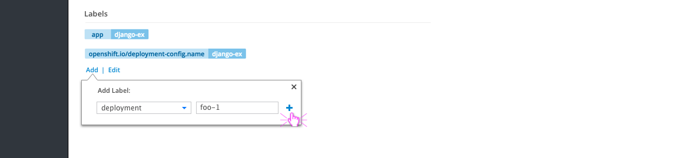
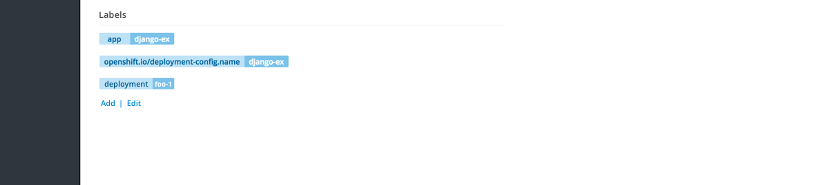
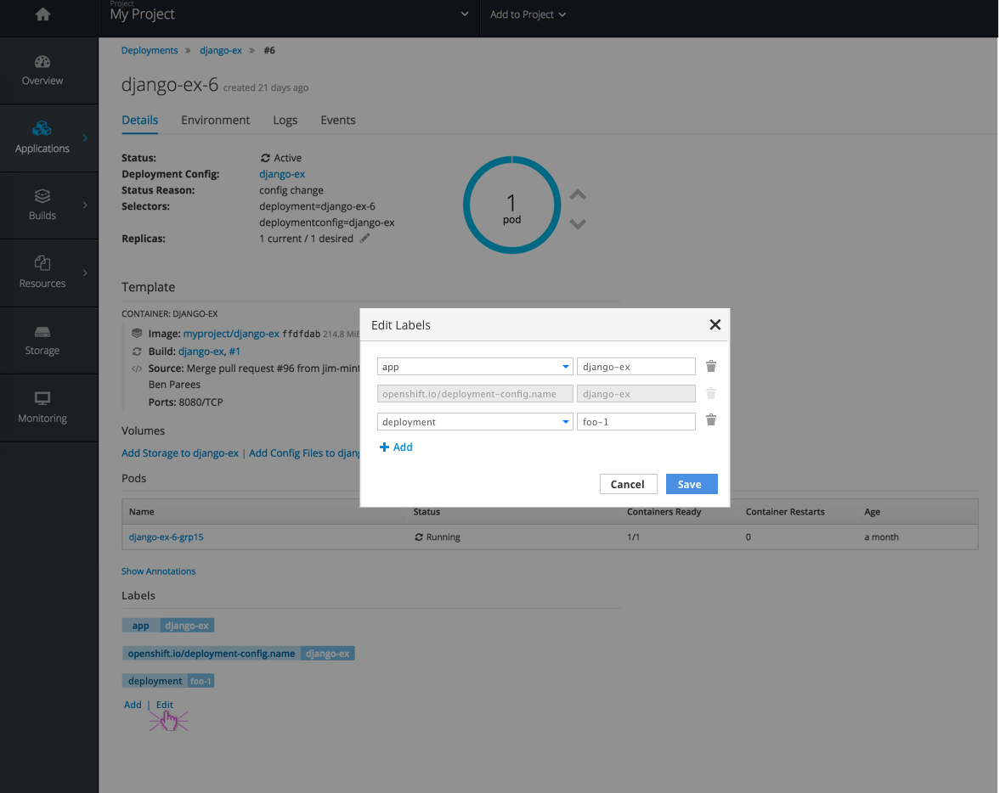
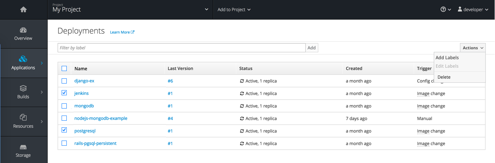
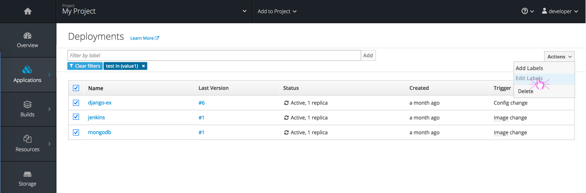
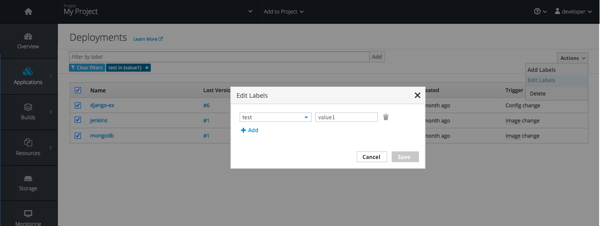
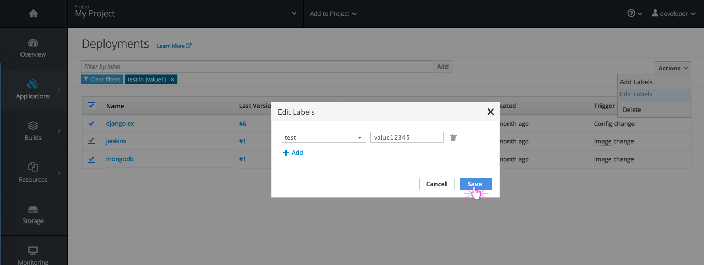
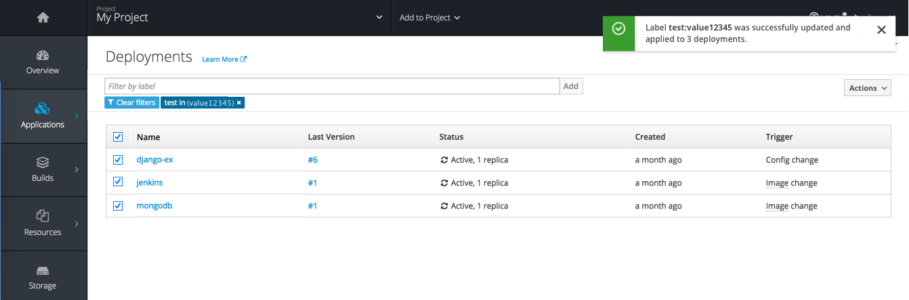

# Labels on Detail Pages

## View Labels
- Labels are currently displayed at the top of most detail pages (Deployments, Pods, Builds, Images, Storage, etc)
- A new `Labels` section should be added to the bottom of the `Details` tab on all of these pages to allow for a more comprehensive labels area

## Add Labels

- An `Add` link should be displayed below the applied labels
- Clicking the link will open an overlay panel with a combo box and a text field for entering label Name and Value.

- Once Name and Value exist, the Add icon should change from the disabled state to a primary button color.
- Clicking the Add icon will display the new label above the links.
- The Add panel should remain open for adding more labels if desired.
- Clicking away from the panel will automatically close it, as will the x in the top right corner.

## Edit Labels

- An `Edit` link should be displayed next to the `Add` link with a separator between
- Clicking the link will open a modal displaying existing labels.
- A trash icon will be shown to the right of each label with an option for removing.
- The add icon will be shown below the list with an option to add a new row.
#### Implementation Details
- Values can be edited in this view, but only the current object will receive the label change. In order to bulk change labels for multiple items (Deployments in this case), users must go to the summary page and multi-select items.
- Some labels may be system defined and created so users are unable to change these names and values. When that is the case, the row entire row should be disabled.

# Labels on Summary Pages

## View Labels

- Summary lists are provided for each major section such as Deployments, Pods, Builds, Images, Storage, etc.
- Currently users can filter those lists based on their applied labels, in order to narrow the results
- Filtering by label should remain, but checkboxes should be added to the left side of each row to allow for multi-select and bulk actions from the summary page.

## Add Labels

- Users can multi-select using the checkboxes provided
- An `Add Labels` action should be available in an actions dropdown in the top right corner
- Clicking `Add Labels` will pop a dialog allowing users to add a single label or multiple labels to all selected items.

## Edit Labels

- An `Edit Labels` action should be available in the actions dropdown in the top right corner as well
- This action should be disabled when users select multiple items with different labels applied

- Users can filter by label before using the multi-select to take an action
- When the item(s) selected have the same labels, `Edit Labels` will be available from the actions menu.

- Clicking `Edit Label` will open a modal with options for editing, removing, or adding to the applied label(s)
- In this case, changing `value1` to `value12345` will change the applied label for all three deployments selected.

- A toast notification should be displayed once changes have been made to a label.
- If there is a filter applied, it should be updated to reflect the label changes.
