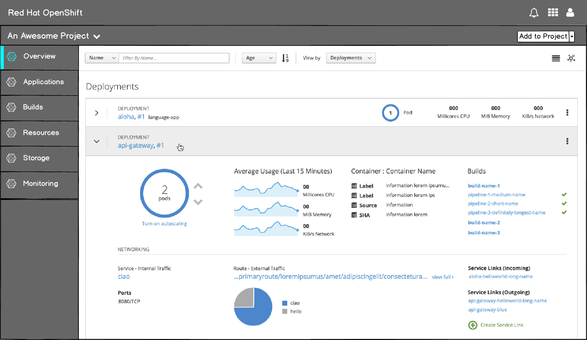
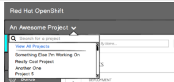
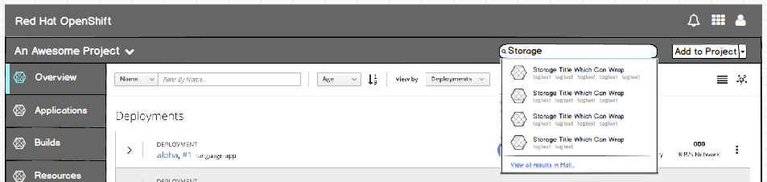

# Project Details

- The project details view is where users inspect or take action on individual projects.

## MVP

- For MVP the current project details is maintained with minor tweaks to the project selection dropdown and the Add to Project action.

#### Implementation Details
  - A link to the projects list page is added to the project selection dropdown

- The Add to project action is changed to a dropdown

#### Implementation Details
  - Dropdown options are: Browse Catalog, Deploy Image and Import YAML/JSON
  - For MVP, "Browse catalog" directs users to the landing page.
  - "Deploy image" and "Import YAML/JSON" direct users to dedicated pages within the project.

## Future

### Secondary Masthead

  - The "crawl" phase will introduce a secondary masthead underneath the main masthead for project-related items.
  - The top [masthead](https://github.com/openshift/openshift-origin-design/blob/master/web-console/4-patterns/masthead.md) will be consistent between the landing page and project details page.

#### Implementation Details
  - The secondary masthead includes the project selection dropdown and the add to project dropdown.

  - The project selection dropdown should include a search/filter function when the user has ten or more projects.

### Quick Add Search

- In the "walk" phase, a "quick add" search box will be added to the secondary masthead.

#### Implementation Details
  - The "quick add" feature will behave like [search](https://github.com/openshift/openshift-origin-design/blob/master/web-console/1-homepage/search.m) on the landing page.

  
  - In the "walk" phase, a "quick add" search box will be added to the secondary masthead.

#### Implementation Details
  - Selecting an item from the "quick add" search will initiate the ordering flow on the [overlay panel](http://openshift.github.io/openshift-origin-design/web-console/4-patterns/overlay-panel) on the projects detail page.

#### Customer Feedback (if applicable)
- Customer Feedback Received
  - Overview of customer feedback received
- Necessary Customer Feedback
  - Questions to follow up with customers
