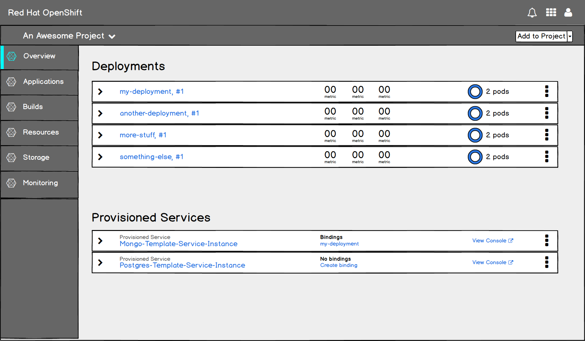
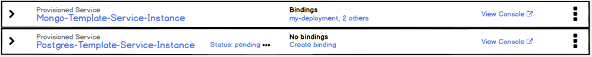
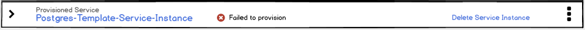
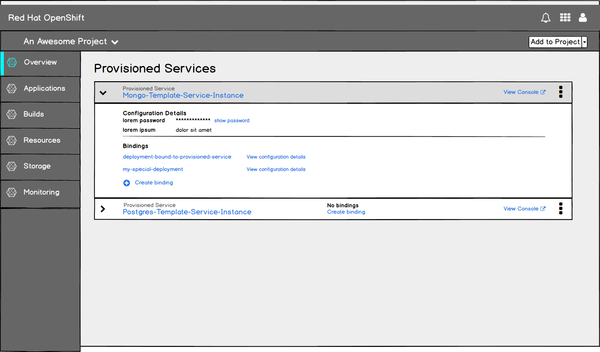
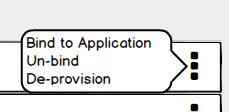

# Provisioned Services in the Overview

- Provisioned Services are those services provisioned from the Service Catalog.
- Provisioned Services need to be shown in the Project Details Overview along with other project resources and would use the same expandable list as the rest of the Overview.

## Collapsed State

- In the collapsed state, show the name of the provisioned service, what that service is bound to, and a link to an external console if one exists.
- If the service has nothing bound to it, indicate that and include an action to create a binding.

#### Implementation Details
  - In the Application view of the overview, Provisioned Services will have their own category heading.
  - In other views in the overview, for example Pipeline view, provisioned services would be lumped in with other resources that do not have their own category.

  - If a provisioned service has more than one thing bound to it, show the first item by name followed by “n others,” which links to the detail page for that service.
  - If a service has been provisioned, but is not yet available, that should be indicated between the name and bindings area on desktop. Other warnings or alerts would be placed similarly.
  - The View Console action should open the link in a new browser window/tab.
  - The indication that a service is not yet available should be followed by an animated ellipsis.

  - If the provisioning is in a permanently failed state, we should include an action to delete it.
  - The placement of warnings on Provisioned Services should be similar to that of other resources in the Overview.

## Expanded State

  - In the expanded view there may be two sections: Configuration details and Bindings.
  - The Configuration Details section shows details for the service instance.
  - The Bindings section includes the option to create a binding.
  - Configuration details for individual bindings are not shown in this view, but should be available from a details page.

#### Implementation Details
  - Sensitive data are hidden by default in the Configuration section, with the option to show them.
  - The Configuration section is not displayed if there are no data to show.

  - If the service is not available yet, show an inline alert message in the expanded state. Other warnings/alerts from the service would be shown inline as well.
  - Include a link to more information, if any is available.
  - In the event that the provisioning of a service instance is in a failed state, include an action to delete that service from the project.

## Kebab Actions

  - The kebab menu should include actions for binding, unbinding and de-provisioning.
  - Are there other actions to include here?

#### Customer Feedback (if applicable)
- Customer Feedback Received
  - Overview of customer feedback received
- Necessary Customer Feedback
  - Questions to follow up with customers
