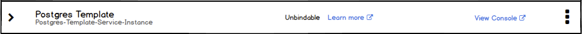
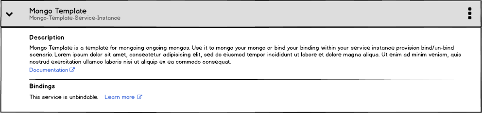
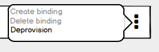

## Unbindable Services

- In the collapsed state there should be an indication that the service is unbindable with a link to documentation that explains what that means.

- The expanded state maintains the "Bindings" section, but that section includes a message that the service is unbindable,Why as well as a link to relevant documentation.

- The "Create binding" and "Delete binding" actions are disabled in the kebab menu.
