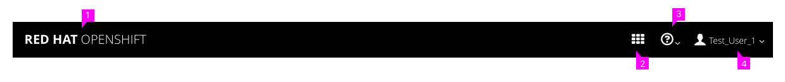
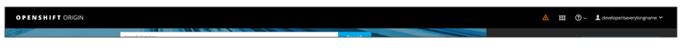

# Masthead

  

The [Masthead](http://www.patternfly.org/pattern-library/application-framework/masthead/#/design) should follow PatternFly standards on masthead designs and in this case should include the following from left to right:
  1. **Name and Branding** Red Hat Openshift or OpenShift Online
  2. **Launcher:** Follow the PF [Launcher](http://www.patternfly.org/pattern-library/application-framework/launcher/#/design) pattern, allowing users to switch to another application.
  3. **Help:** This menu should include documentation, about, and command line tools, and guided tours.
  4. **User:** The username should be listed to the right of the icon. The "Log Out" option should be available in this dropdown menu, as well as any other user settings available (depending on the version) such as "My Account".

## Implementation Details

### System Alerts
- If system alerts exist, a warning icon will appear in the masthead as the left-most icon in the group (OpenShift Online ONLY)

- System alerts pertain to the infrastructure on which OpenShift is running. They are used to communicate system status to online users. (https://status.openshift.com/)
- System alerts are implemented via a javascript config extension point, so users are able to customize their OpenShift instance to override the warning icon and use the space as desired.

### Notification Drawer

- **NOTE:** The [Notification Drawer](http://www.patternfly.org/pattern-library/communication/notification-drawer/#/design) is not yet implemented for MVP, but once it is implemented, a bell icon should be added to the masthead, directly to the left of the Launcher.
- When system alerts exist, they may still show up in the masthead, to the left of the notification drawer.

## Responsive Designs
- For the MVP, the responsive design will not change. On smaller viewports, all masthead actions/options will drop into the hamburger menu located in the top left corner.
