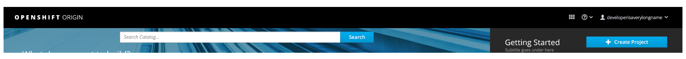

# Masthead

  

The [Masthead](http://www.patternfly.org/pattern-library/application-framework/masthead/#/design) should follow PatternFly standards on masthead designs and in this case should include the following from left to right:
  1. **Name and Branding** Red Hat Openshift or OpenShift Online
  2. **Launcher:** Follow the PF [Launcher](http://www.patternfly.org/pattern-library/application-framework/launcher/#/design) pattern, allowing users to switch to another application.
  3. **Help:** This menu should include documentation, about, and command line tools, and guided tours.
  4. **User:** The username should be listed to the right of the icon. The "Log Out" option should be available in this dropdown menu, as well as any other user settings available (depending on the version) such as "My Account".

## Implementation Details

**NOTE:** For the MVP, the notification drawer is not yet implemented. When the notification drawer is implemented in the future, it should be added to the masthead to the left of the Launcher.

## Responsive Designs
- For the MVP, the responsive design will not change. On smaller viewports, all masthead actions/options will drop into the hamburger menu located in the top left corner.
