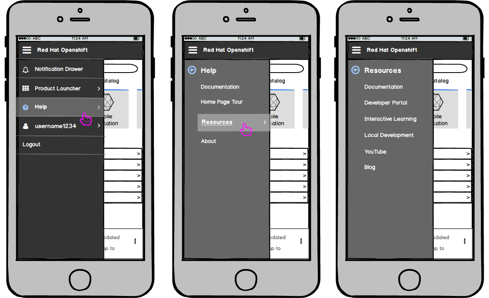
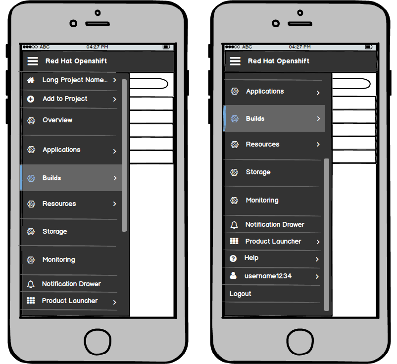
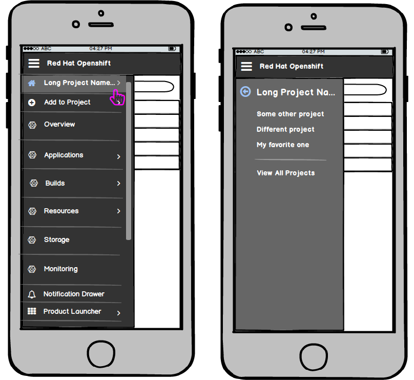

# Navigation

### Landing Page
  

- On the landing page, the only navigation available is the [Masthead](http://openshift.github.io/openshift-origin-design/web-console/4-patterns/masthead).

### Inside the Console

- Once a user navigates to a specific project inside the console, the hamburger menu will show up in the top left corner of the masthead and a second horizontal bar will appear below the masthead.
  - This bar will hold (1) the project switcher, and (2) the "quick add" feature that allows users to navigate back to the catalog or quickly add a catalog item to their project.
  - Visit the [Project Details](http://openshift.github.io/openshift-origin-design/web-console/3-project-details/overview) page for details on these features.
- Below the two horizontal bars, a vertical navigation will display the primary menu options.
- The active page will be indicated visually by highlighting that primary navigation item.

- At this level, the hamburger menu remains shown so that the user can toggle the primary navigation to become just icons to get more horizontal real estate.
- Clicking the hamburger icon again would bring the navigation back to full size.

- If the user wants to navigate to the builds section, they can hover or click on the primary nav item to expose the secondary navigation.
- The hover state (Builds) is similar to the selected state (Overview) aside from the blue line on the far left side of the item.
- The navigation menus will follow the new “secondary navigation with flyout” pattern being added to PatternFly.

## Responsive States

### Landing Page
- On smaller viewports, the icons shown from left to right in the masthead should be placed in the hamburger menu from top to bottom.
- The labels are as follows: (with icons to the left of the labels)
  - Notification Drawer
  - Product Launcher
  - Help
  - [username]
  - Logout (no icon)
- **Note:** the logout option is pulled out from the user menu in this case.
- For secondary and tertiary levels of navigation, the left navigation panel should be replaced, as described in the Responsive State section of the [Vertical Navigation](http://www.patternfly.org/pattern-library/navigation/vertical-navigation/#/design) pattern.

- Selecting the Product Launcher option will load the secondary navigation with all product options that are available.

- Selecting the Help option will load the secondary navigation with all available resources and help links.
- The resource links that are initially shown on the landing page project panel should be included in this help menu and would load a tertiary level of navigation.

- Selecting the username should show the account options as well as the region selector.
- The Region selector should be included in this user menu and would load a tertiary level of navigation, allowing a user to change the Region they are viewing.
- The Logout option should be pulled from this area and placed as a standalone option from the left nav.

### Inside the Console

- Inside the console, the primary navigation options display in a vertical nav so the order of items inside the hamburger menu will change here.
- The hamburger menu will scroll if needed.
- On smaller viewports, the masthead icons shown from left to right should still be placed in the hamburger menu from top to bottom, but they will be placed after all primary navigation items.
- Because there is also a secondary "masthead" or horizontal bar, those options will be considered part of the primary nav and should be displayed first in the manburger menu.
- The labels are as follows from top to bottom: (with icons to the left of the labels)
  - [Project Name] (ability to change projects
  - Add to Project
  - **All Primary Navigation Items**
  - Notification Drawer
  - Product Launcher
  - Help
  - [username]
  - Logout (no icon)

- The project name option will allow users to navigate to a different project or go back to the full projects page.

- The add to project option will allow users to go back to the catalog, import YAML, or Deploy images directly into this project.
