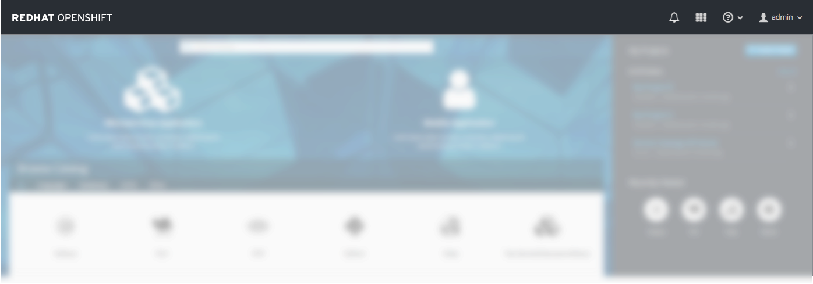
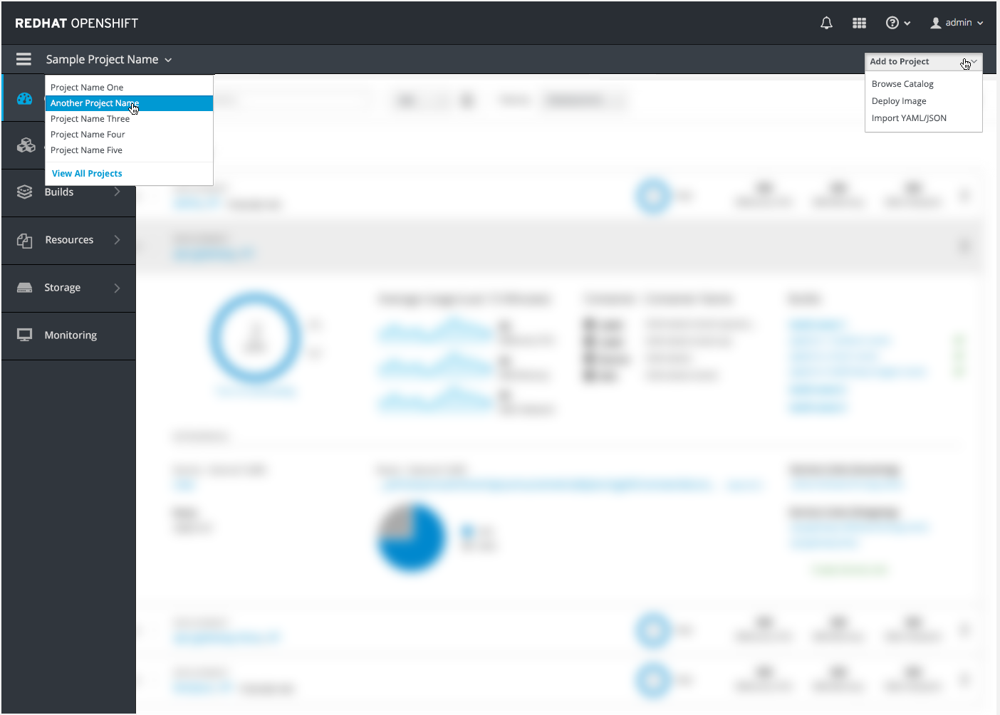
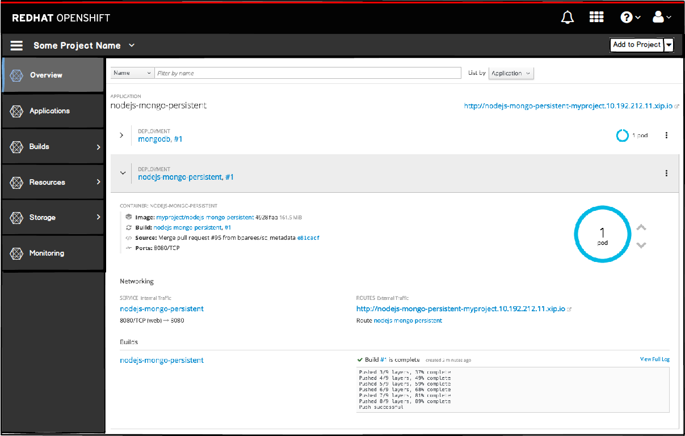
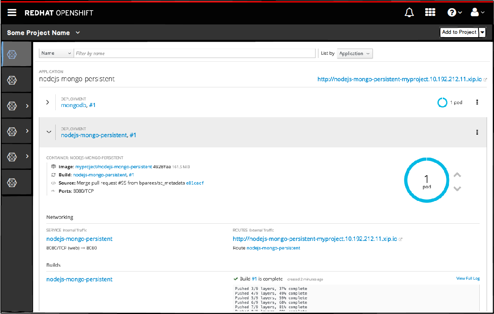
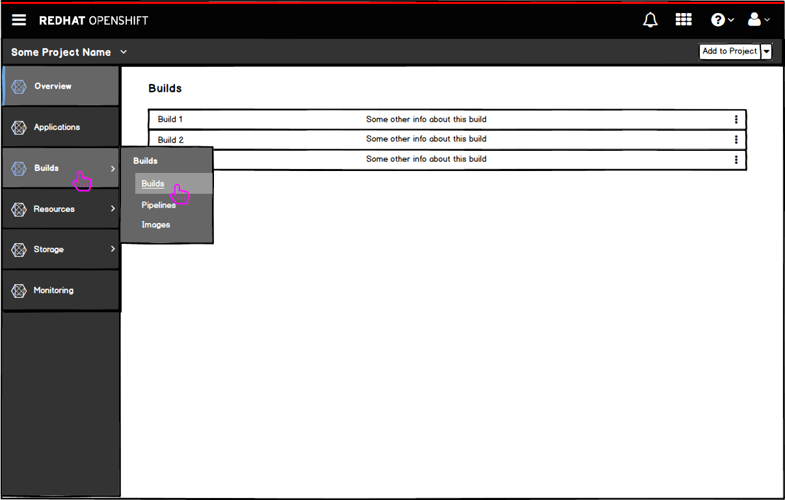
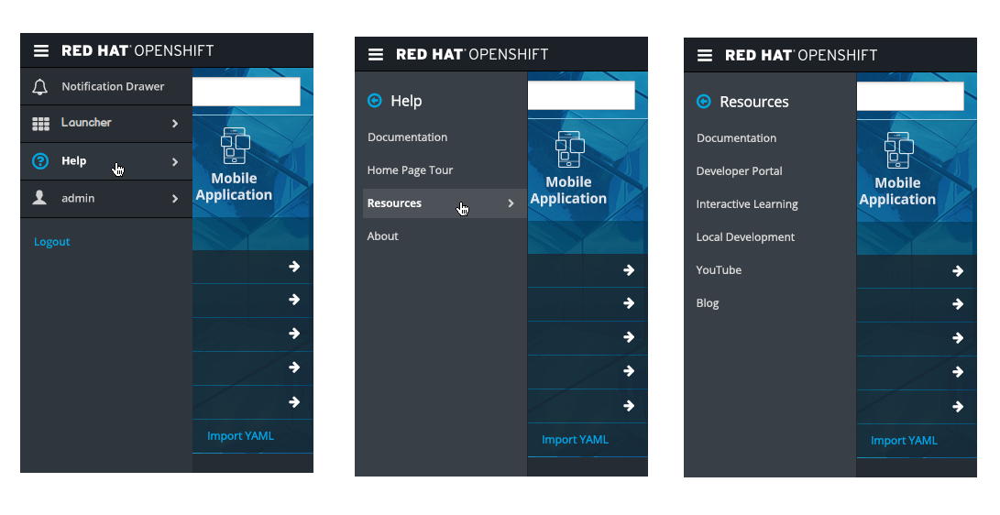
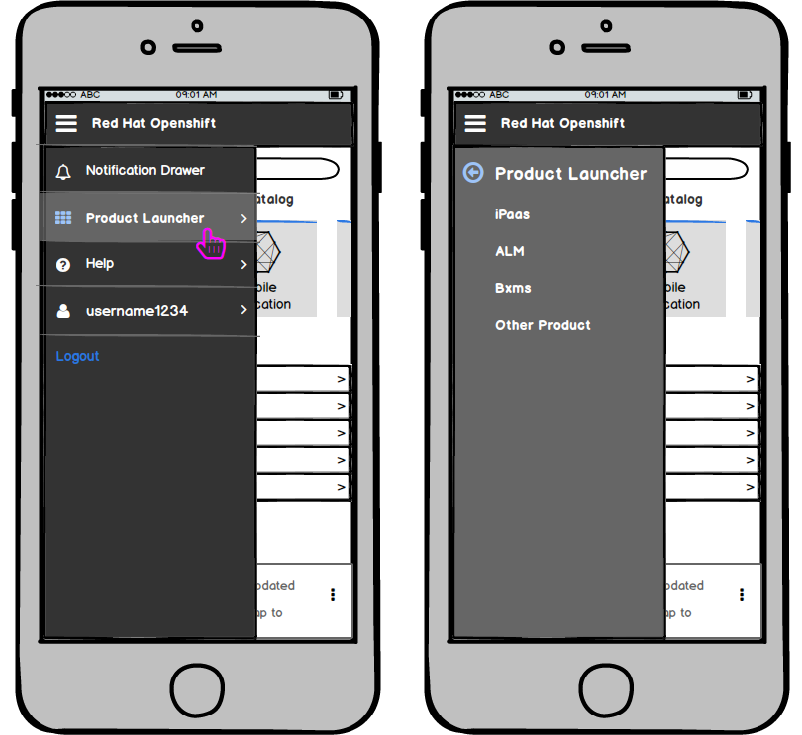
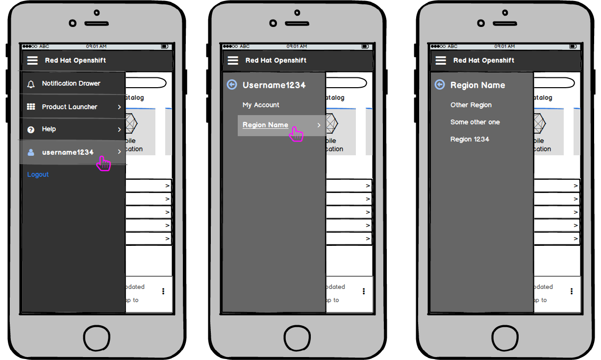
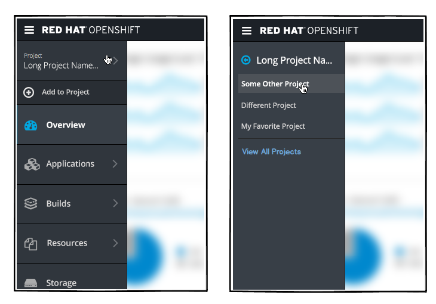
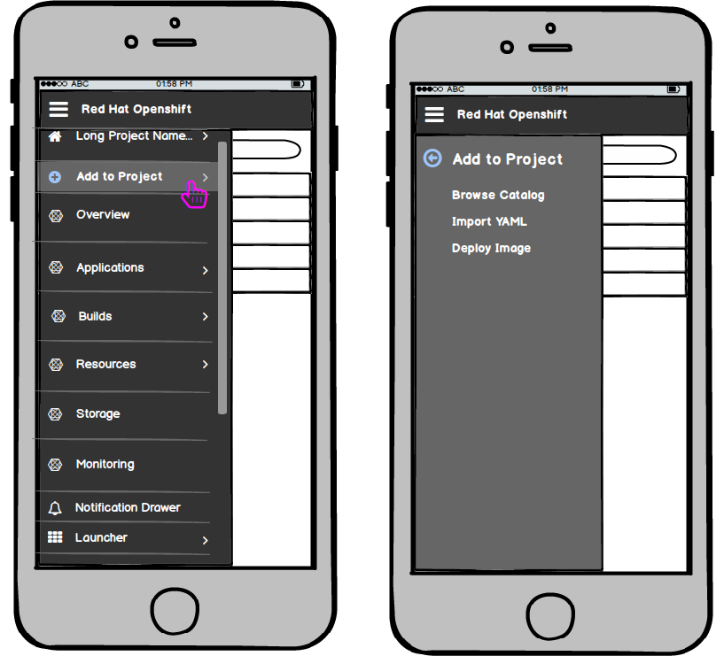

# Navigation

### Primary Masthead
  
On the landing page, the only navigation available is the Primary [Masthead](http://openshift.github.io/openshift-origin-design/web-console/4-patterns/masthead).

### Secondary Masthead
  
Once a user navigates to a specific project inside the console, a second horizontal bar will appear below the Primary [Masthead](http://openshift.github.io/openshift-origin-design/web-console/4-patterns/masthead).

### Vertical Navigation

- Below the two horizontal bars, a vertical navigation will display the primary menu options.
- The active page will be indicated visually by highlighting that primary navigation item.

- At this level, the hamburger menu remains shown so that the user can toggle the primary navigation to become just icons to get more horizontal real estate.
- Clicking the hamburger icon again would bring the navigation back to full size.

- If the user wants to navigate to the builds section, they can hover or click on the primary nav item to expose the secondary navigation.
- The hover state (Builds) is similar to the selected state (Overview) aside from the blue line on the far left side of the item.
- The navigation menus will follow the new “secondary navigation with flyout” pattern  added to PatternFly.

## Responsive States

### Landing Page
- On smaller viewports, the icons shown from left to right in the masthead should be placed in the hamburger menu from top to bottom with the exception of the notification drawer.
- The bell icon will remain in the top right corner of the masthead for easy access to the notification drawer.
- The drawer should follow PatternFly standards for the responsive behavior as detailed in the [Notification Drawer](http://www.patternfly.org/pattern-library/communication/notification-drawer/#/design) pattern.
- The labels are as follows: (with icons to the left of the labels)
	- Launcher
	- Help
	- [username]
	- Logout (no icon)
- **Note:** the logout option is duplicated below the user menu for easier access, but it still remains part of the user menu as well.
- **Note:** "Launcher" is a configurable label.
- For secondary and tertiary levels of navigation, the left navigation panel should be replaced, as described in the Responsive State section of the [Vertical Navigation](http://www.patternfly.org/pattern-library/navigation/vertical-navigation/#/design) pattern.

- Selecting the Help option will load the secondary navigation with all available resources and help links.
- The resource links that are initially shown on the landing page project panel should be included in this help menu and would load a tertiary level of navigation.

- Selecting the Launcher option will load the secondary navigation with all link options that are available.
- **Note:** All options under the Launcher menu are configurable.  

- Selecting the username should show the account options, region selector, and logout.
- The Region selector should be included in this user menu and would load a tertiary level of navigation, allowing a user to change the Region they are viewing.
- **Note:** The Logout option is duplicated underneath the user menu for easier access.

### Inside the Console

- Inside the console, the primary navigation options display in a vertical nav so the order of items inside the hamburger menu will change here.
- The hamburger menu will scroll if needed.
- On smaller viewports, the masthead icons shown from left to right should still be placed in the hamburger menu from top to bottom, but they will be placed after all primary navigation items.
- The notification drawer will remain in the top right corner of the masthead.
- Because there is also a secondary "masthead" or horizontal bar, those options will be considered part of the primary nav and should be displayed first in the hamburger menu.
- The labels are as follows from top to bottom: (with icons to the left of the labels)
	- [Project Name] (ability to change projects
	- Add to Project
	- **All Primary Navigation Items**
	- Launcher
	- Help
	- [username]
	- Logout (no icon)

- The project name option will allow users to navigate to a different project or go back to the full projects page.
- This list should only show the projects shown on the Homepage projects panel (5 projects max). After these projects, there should be a horizontal line and a link to navigate to the full projects page to see more.
- View All Projects should be a blue link to distinguish it from the project names listed.

- The add to project option will allow users to go back to the catalog, import YAML, or Deploy images directly into this project.
