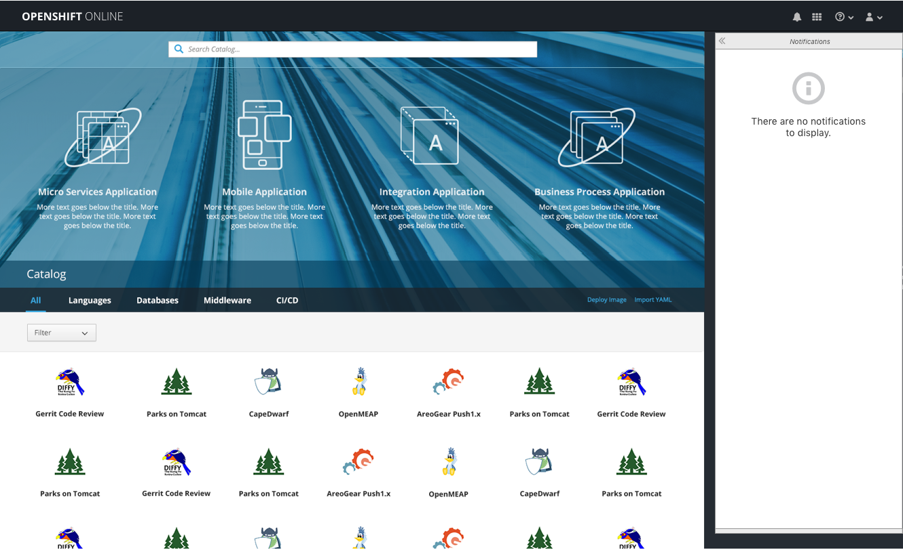
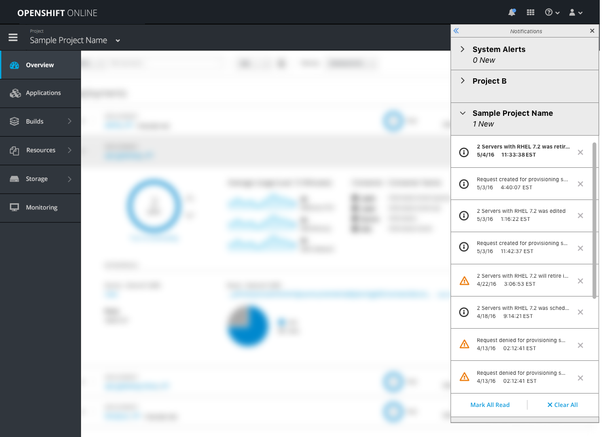
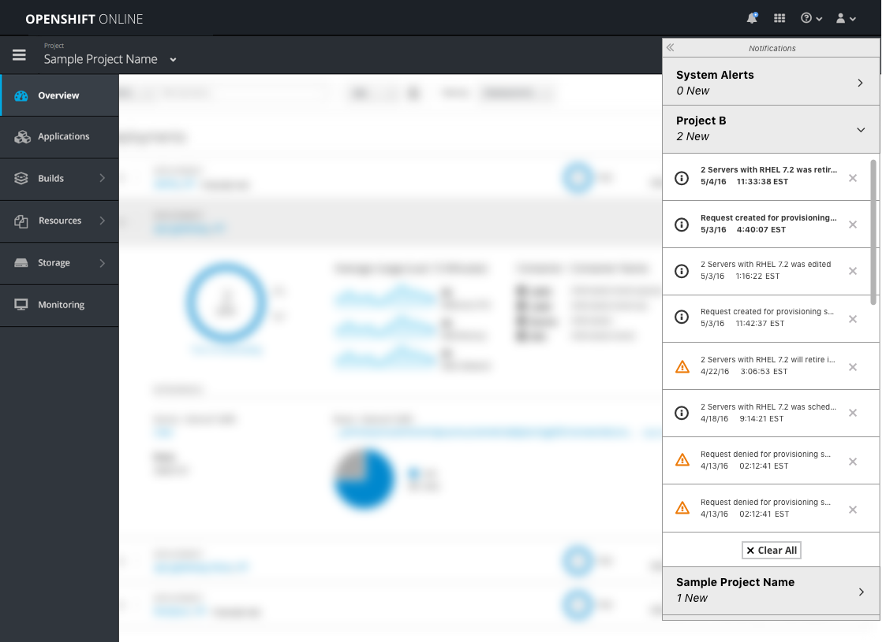
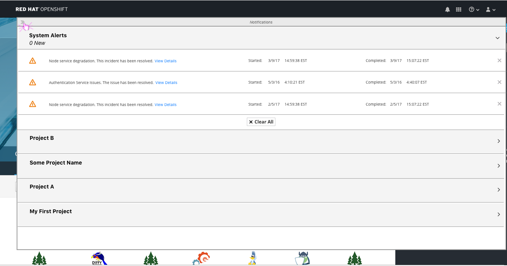

# Notification Drawer

## Open Questions
- Can we bring System Alerts (Online Only) into the notification drawer?
  - Note: Designs below assume yes.
- Should we have an additional section for Homepage Notifications/ general catalog alerts?
  Note: Designs below assume no.
- Do we want to try to keep events around longer than the current 2 hour timeframe?
- Can we get date/time info for events?
  - Note: Designs below assume yes.

## Design

**NOTE:** Sections below in **Bold** indicate design details that stray from the PatternFly [Notification Drawer](http://www.patternfly.org/pattern-library/communication/notification-drawer/) pattern.

- The bell icon is in the [Masthead](http://openshift.github.io/openshift-origin-design/web-console/4-patterns/masthead) and provides access to the notification drawer.
- **The fa-bell icon should always be used here. A blue badge will be shown to the top right corner of the bell to indicate when "New" notifications exist.**
- A "New" notification is displayed with bold text because it is an unread notification. **Notifications are marked as read by either clicking on the cell to unbold the text, or clicking the "Mark All Read" link at the bottom of the accordion section.**
- **Users can clear notifications individually or by clicking the clear all button to remove all notifications from the currently open accordion section.**
- There are two types of notifications that will be surfaced, System Alerts and Events.
- An accordion style is used inside the drawer for opening and closing one section at a time.
- If the drawer is closed and reopened, your last opened section will remain open.

### System Alerts (OpenShift ONLINE Only)
- For OpenShift Online, the first accordion section should always be the "System Alerts."
- Previously System Alerts were shown as a warning icon directly in the masthead.
- For any new System Alerts, badges will be shown until the message is marked as read.
- **Anytime there are unread System Alerts, this section of the accordion should default to open when users open the notification drawer.**
  - This would stray from PatternFly, but would call attention to System Alerts to be sure users saw them.
- The "xx New" label will always be displayed for the System Alerts section.

### Events
- Each Project will receive its own accordion section below the System Alerts (if present).
- Within a Project, the Events can be of two types, either Warnings or Informational.
- Toast notifications will also show for the majority of events that occur.

- When there are no Projects created, the notification drawer will be in the empty state
- Note: for OpenShift Online, the System Alerts section would be displayed at the top.

- When a Project is created, a new accordion section will be added to the top of the drawer (under System Alerts if they exist).
- **When on the homepage, opening the Notification Drawer for the first time will open the section for the most recent Project created (unless new system alerts exist).**
- **The label showing the number of new notifications will only be displayed for the Project section that is currently open.**

  [IMAGE]
- **There may be a delay while the notifications load for a specific project (a spinner icon should be displayed while waiting).**

#### Inside the Console

- **When first opening the drawer inside the console, the open accordion section should default to the current Project the user is working in.**
- The badge will appear when the current Project, (in this case, Sample Project Name) has a New notification.
- **Other Projects will not get updated when new notifications come in because their accordion section is not open (notice there is no label below “Project B”).**
- Users can check other Projects for notifications by opening another section in the accordion.

- If the user remains in Sample Project Name, (with the notification drawer open for Project B), they will continue to receive alerts regarding Sample Project Name via badge updates and toast notifications.
- **The badges will update for the console project only, regardless of the accordion section that is open.**

### Expand Functionality  

- The user can choose to expand/ collapse the drawer to see more details as needed.
