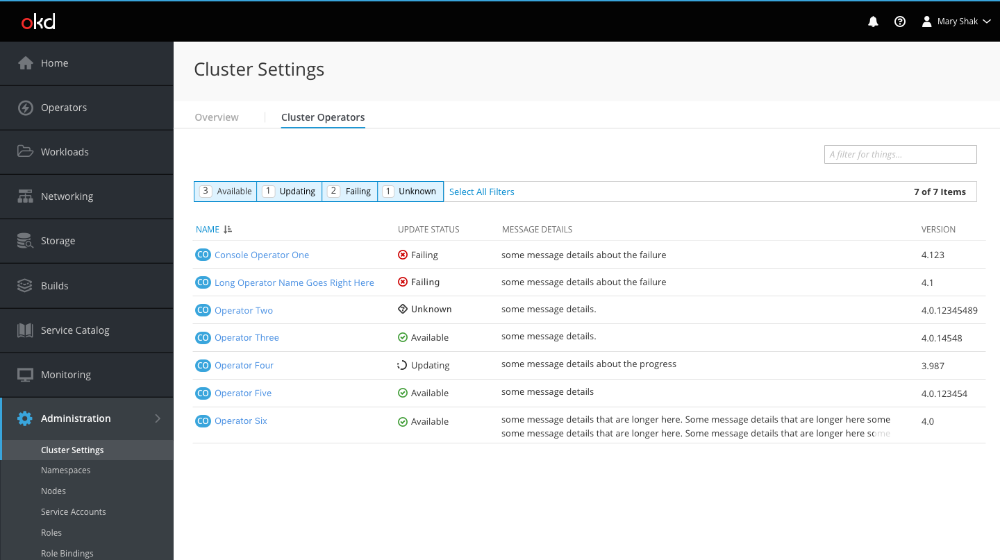
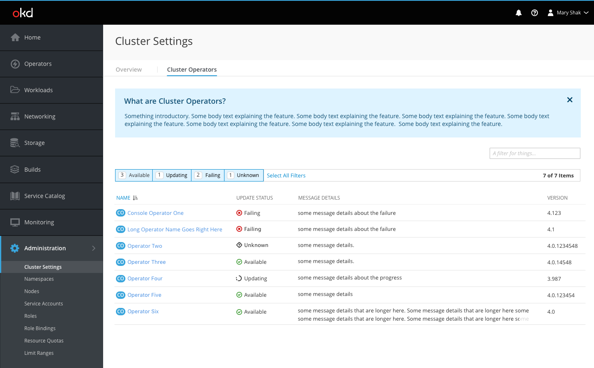
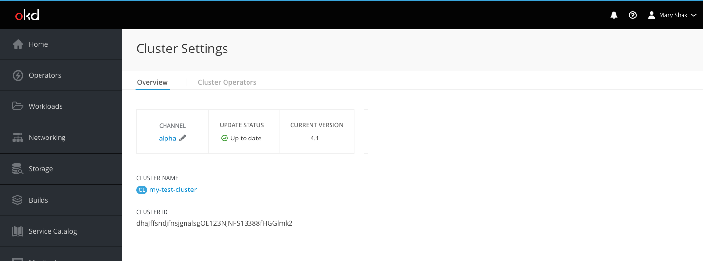
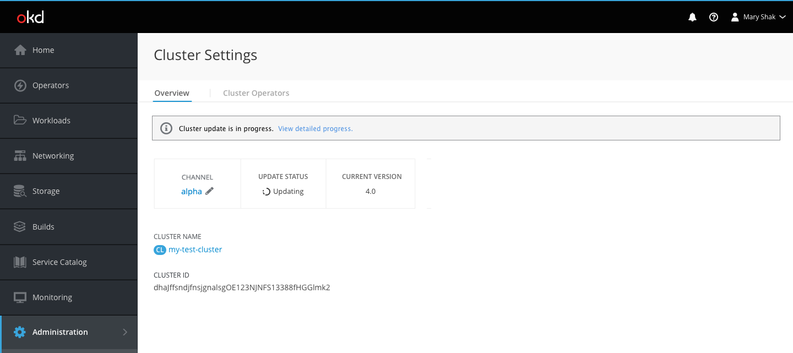
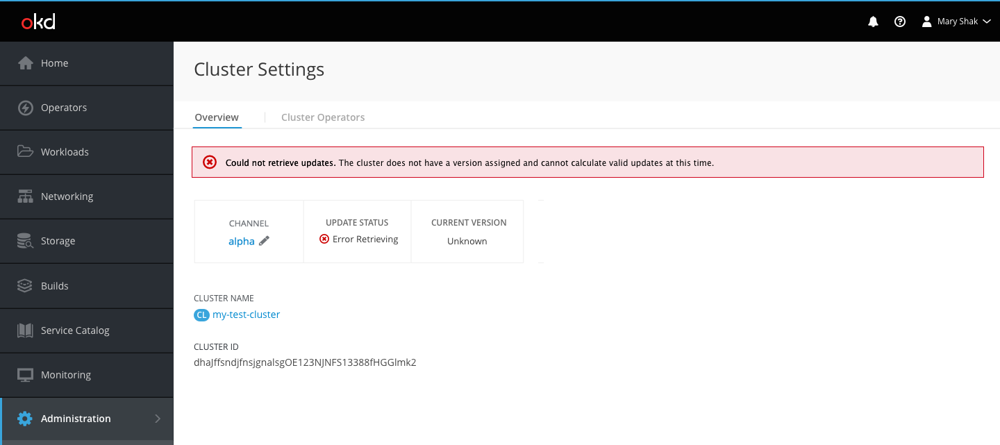
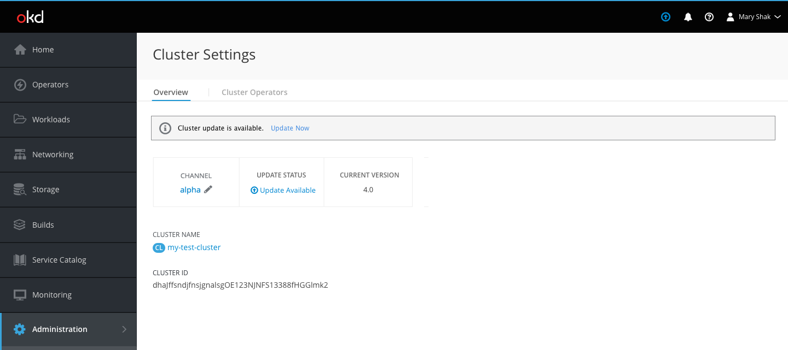
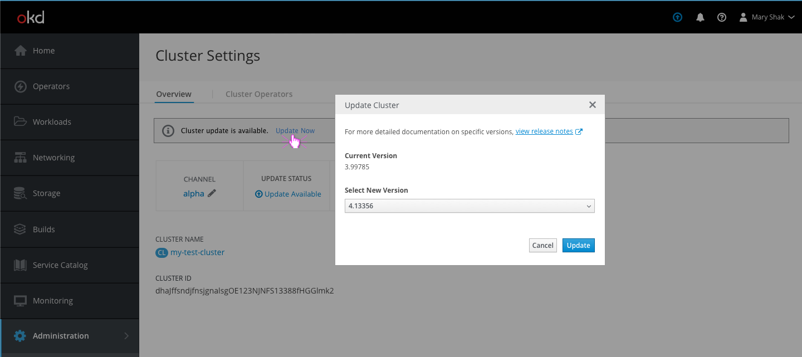
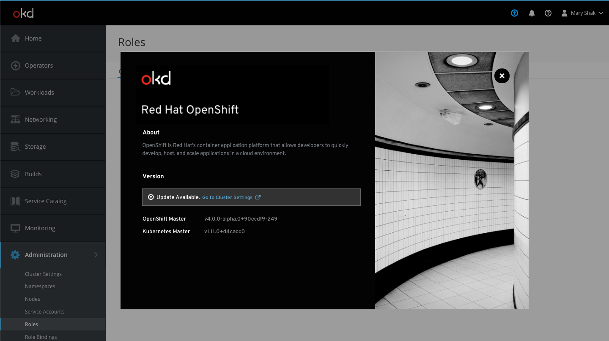

# Cluster Settings

- The Cluster Settings page is located under the Administration primary nav item.
- There are two main sections on the cluster settings page, the overview and the operators.

## Operators

- The Cluster Operators tab shows a list view of operators with search and filter components at the top.
- The list view columns include resource name and badge, status, message details, and version. For now there are no inline kebab actions available, but these may be added to the rows once they become available.
- The filter options are based on the possible status types: available, updating, failing, unknown.
- The status column includes the following icons:
   - Available should use the pficon-ok	icon
   - Updating should use the pficon-in-progress icon
   - Failing should use the pficon-error-circle-o	icon
   - Unknown should use the pficon-unknown icon
- Message details can use up to two lines. Once a message exceeds two lines, the end should be truncated and users can click the cluster operator to see the full message.

**Add Hint for First Time Users**

- When first time users arrive on this page, they may benefit from some explanation regarding cluster operators.
- This blue hint box can be dismissed at any time and will not show again to the same user once dismissed.

## Overview

- The overview tab will always have a top highlighted area with remaining fields listed below.
- The highlighted area shows the channel, update status, and version.

### Channel

- The channel can be edited by clicking the pencil.
- A modal will appear, giving the user an option to select a different channel from the dropdown and save changes.

### Update Status

**Up to Date**

- For clusters on the latest version, the pficon-ok will be displayed to the left of the "Up to date" status.

**Update in Progress**

- For clusters on currently going through an update, the pficon-in-progress will be displayed to the left of the "Updating" status.
- An informational inline notification will also appear at the top of the page telling the user the update is in progress.

**Error Retrieving Updates**

- For clusters that failed to generate the update status, the pficon-error-circle-o will be displayed to the left of the "Error Retrieving" status.
- A red error inline notification will also appear at the top of the page telling the user the system could not retrieve the updates.

**Update Available**

- For clusters with new updates available, a blue fa-arrow-circle-o-up will be displayed to the left of the "Update Available" status.
- An informational inline notification will also appear at the top of the page telling the user the update is available with a link to "Update Now."
- **Note** When an Update is available there will also be the same blue fa-arrow-circle-o-up icon in the masthead to inform users of this update. Clicking the icon will bring the user to this cluster settings overview page where they can take action.

- Clicking the link opens a modal with a dropdown of versions for the user to select from.
- Once the user selects the version to update to, they can click save and the status should change shortly to in-progress.

- If a user opens the about modal when an update is available, in addition to the blue masthead icon, users will get an inline notification below the "version" section to explain the update exists and link users directly to this cluster settings page to take action.

