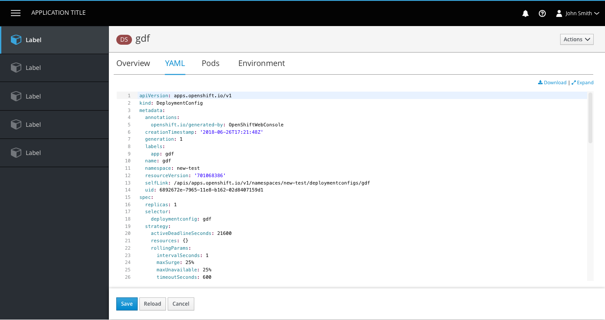
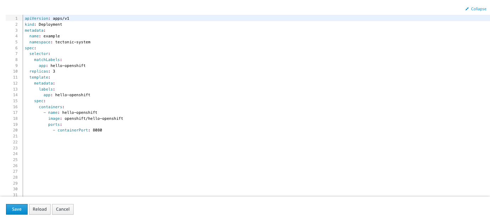
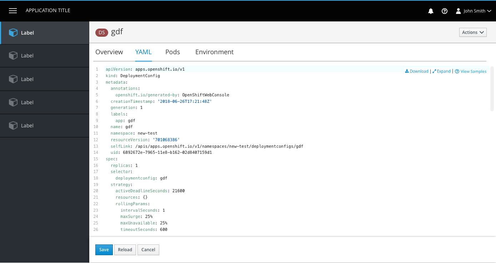
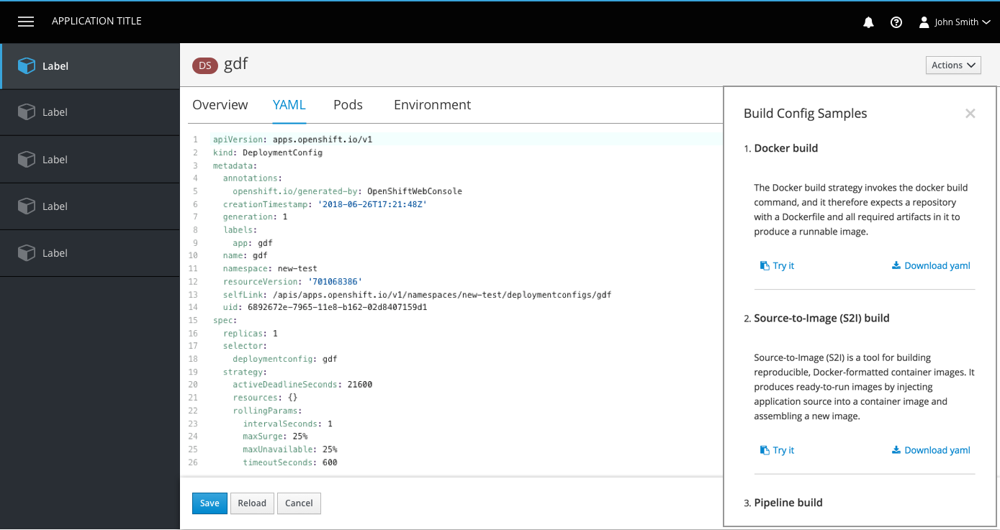
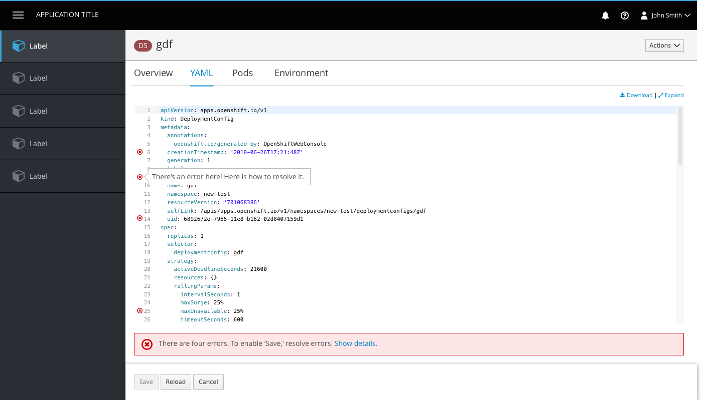
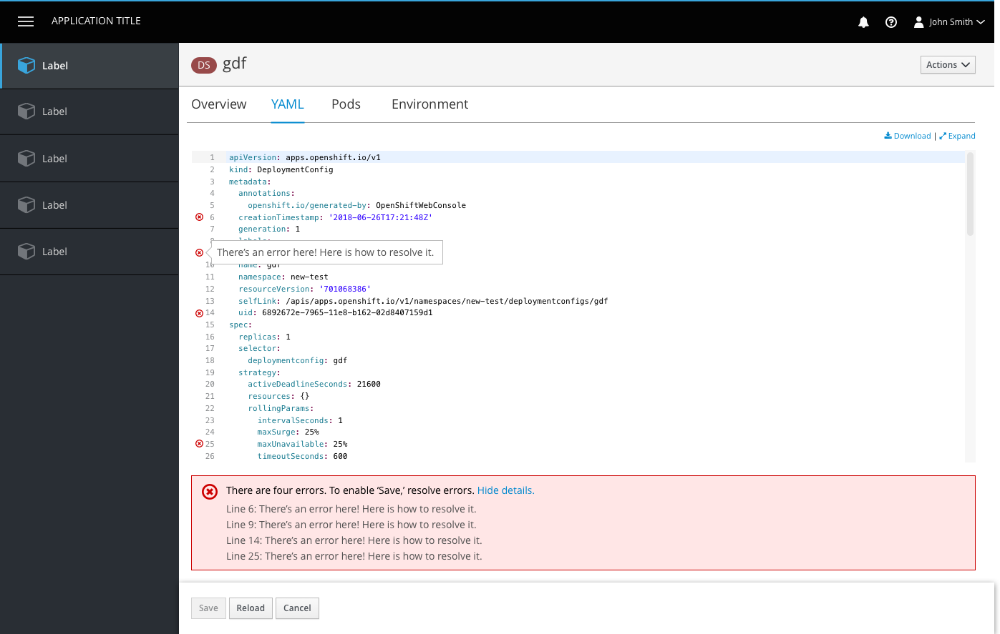
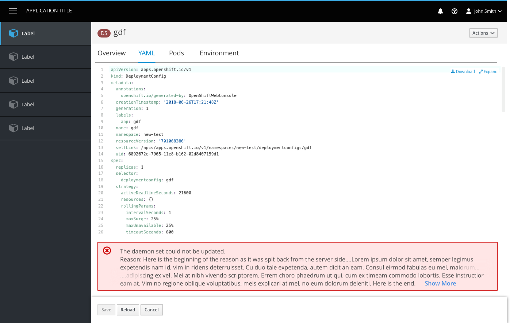
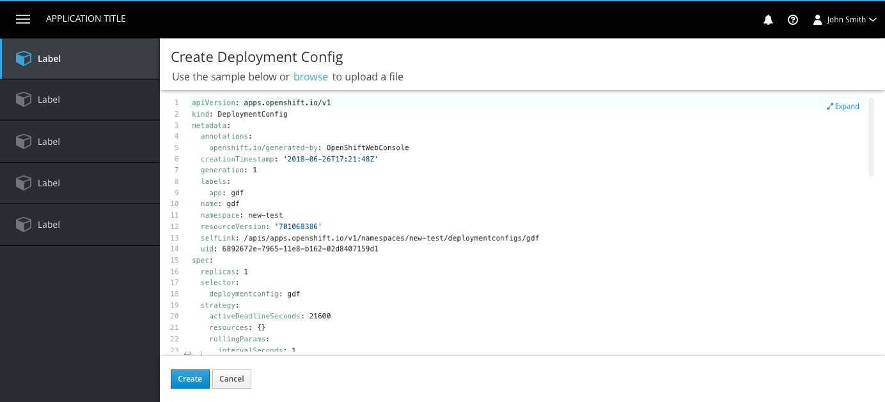
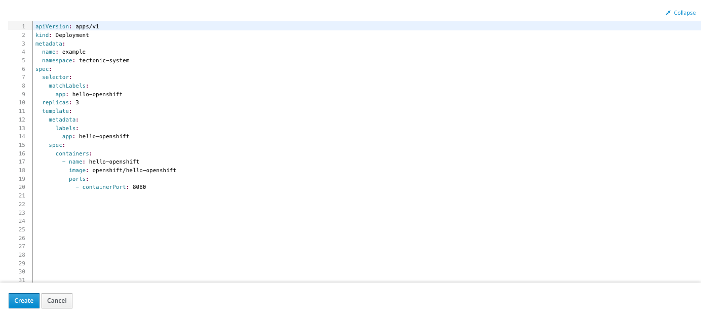

# Code Editor

## Edit YAML

- The code area is borderless at the top and has the button bar at the bottom as a separator.
- The Edit action can be removed from the Actions dropdown on every detail page. Users can access the tab as needed.
- The Download and Expand links are sticky in the top right corner of the YAML editor, with a vertical separator between them. The icons belong to the left of each link.
- Download will produce a YAML output for the user to view outside of OpenShift.
- Expand will allow a user to view the code in fullscreen mode.

- When the editor is expanded, it takes up the entire screen, covering the console entirely (including navigation and masthead).
- The bottom button bar remains visible in the expanded state.
- A new tab is not opened for the expanded view.
- A collapse icon and link will be sticky in the top right corner of the expanded view for users to exit full-screen mode.

- Some resources have additional YAML samples available for users to paste or download.
- These samples will be accessible via a third link, "View Samples."
- View Samples should use the help icon and should always be to the right of the Expand link.

- Clicking the link will open a [modaless overlay](https://www.patternfly.org/pattern-library/forms-and-controls/modeless-overlay/) with the YAML samples provided. Users can close the panel using the X in the top right corner.

#### Errors
- Errors are shown with an icon on the corresponding line. Users can hover over the icons to see details of each error.

- If errors exist, an inline notification will appear below the editor summarizing the number of errors. Users can click the Show Details link to view all error details in one place.
- The action bar is sticky at the bottom of the page and actions include Save, Reload, and Cancel.
- The Save button is disabled if changes have not been made or if there are still errors to resolve.
- The Reload button allows users to reload the code in the event that there was a change in the backend or they made a change that they would like to undo.
- The Cancel button does not save changes and brings users back to the page they were on prior to the edit page.

- For cases where save is enabled but a server side error occurs, an inline error notification will be displayed.
- **Note:** If the error message is too long, the middle should be truncated, leaving the beginning and the end of the message visible, where key information tends to show up.

- If save is enabled and a user clicks away from the editor (by clicking on another tab or a navigation item) a modal dialog will appear to remind the user they have unsaved changes.

## Create YAML

- The create page is a newly loaded page within the console.
- Users are presented with a preloaded YAML sample with which they can create their object (primary way to create new).
- Users may alternatively choose to browse their file directory and upload a file with which they can create their object (secondary way to create new). This would replace the original template contents.
- The expand link and functionality is available on the create page.
- The bottom button bar is sticky and actions are Create and Cancel. Both buttons are enabled unless there are errors detected, then create is hidden.
- Error handling is the same for both Create YAML and Edit YAML. See error handling above.
