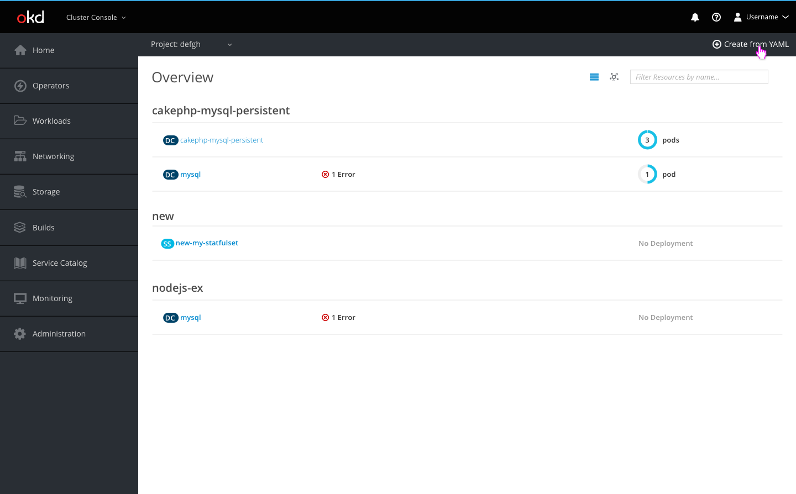
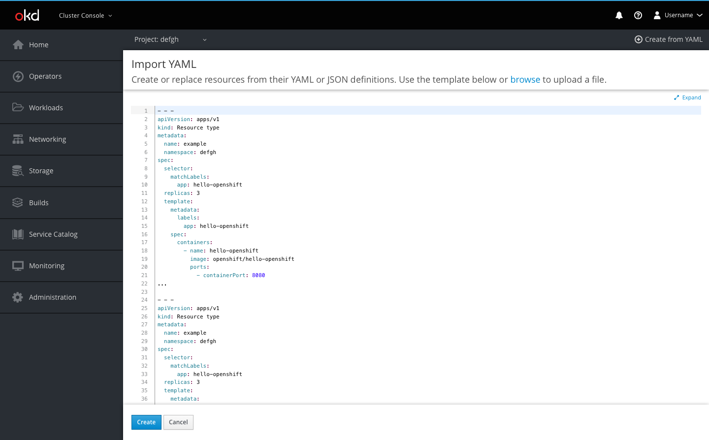
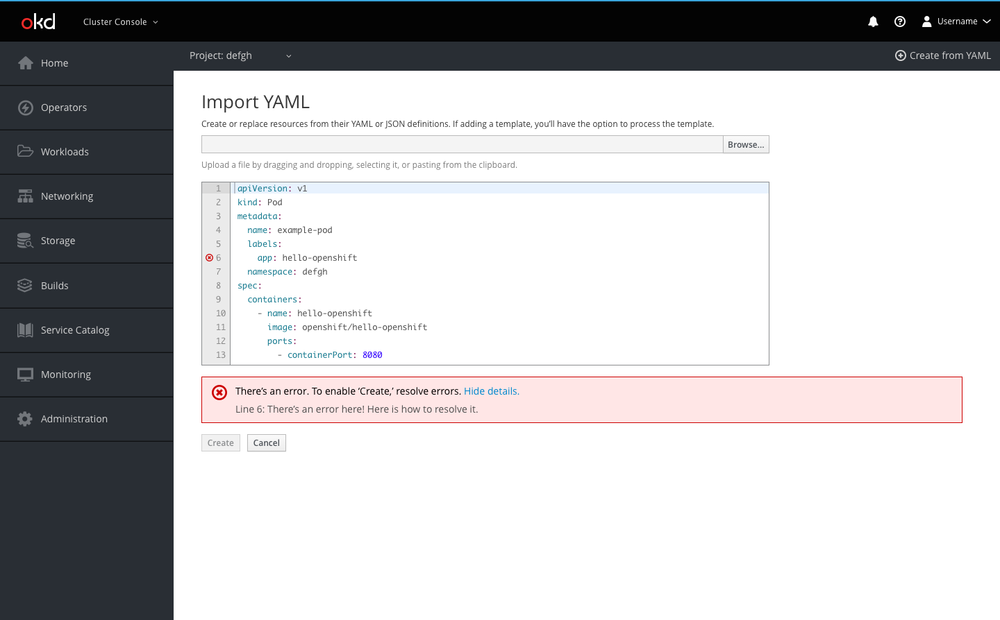
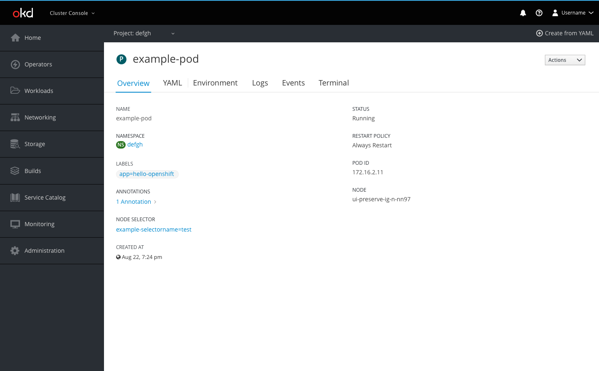

# Create from YAML

The Create from YAML action will be accessible from the Add to Project dropdown in the project selector bar, making it accessible from every page within the console.

**Create from YAML button**

* The Create from YAML button opens the embedded YAML editor

**Create page**

* Users can create resources using YAML or JSON by dragging and dropping a file, pasting in code, or browsing their directory to upload
* The button bar allows users to Create or Cancel
  * The Create button will create the resource(s) and redirect users to a success screen if there are no errors in the code
  * If there are errors, the button will prompt an inline notification to appear with error details
  * Cancel will bring the user back to the page they were previously on

**Error example**

* Errors are shown with an icon on the corresponding line
  * Users can hover over the icons to see details of each error
* When a user tries to click Create when there are errors, an inline notification will appear below the editor summarizing the number of errors
  * Users can click the Show Details link to view all error details in one place

**Template overlay**

* If a user chooses to import a file, when they click Create they will be presented with a modal overlay giving them the option to process the code as a template, save a template, or both

**Summary page**

* After users click Create, they are redirected to the results summary page
* The user will be able to see a list of the resources they created and in which project they were created
* Successful creations will be displayed with the pficon-ok to the left
  * The resource name for successful creations will link users to that resource's overview page
* Failed creations will be displayed with the pficon-error-circle-o to the left and a recommendation on how the user can remedy the error
* Users may also go to the project overview page using the link or go back to the page they were previously on using the Close button
