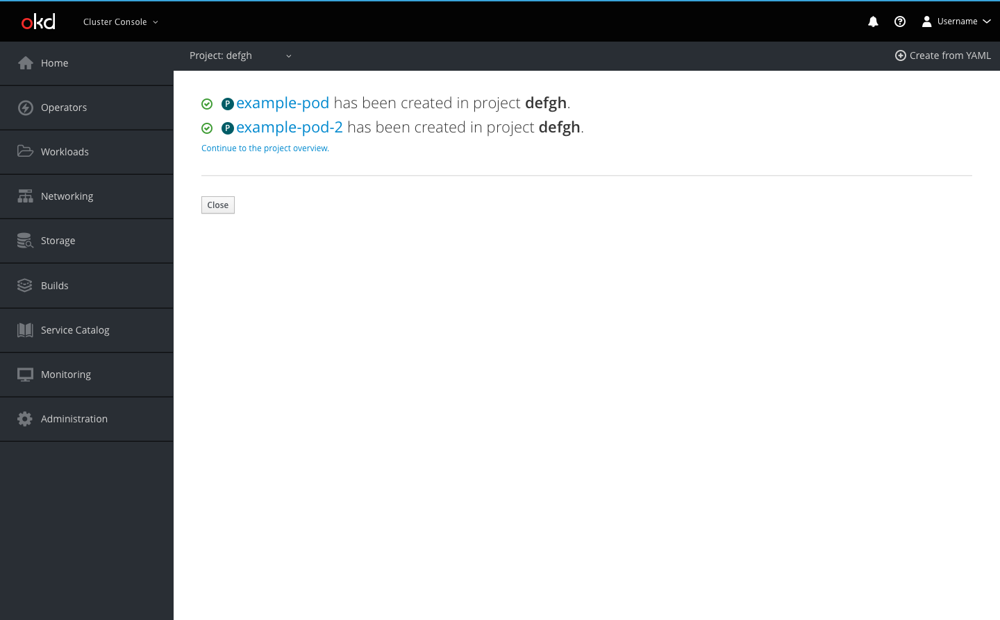

# Create from YAML

A Create from YAML button will be added to the project selector bar, making it accessible from every page within the console.

**Create from YAML button**

* The Create from YAML button will be in the project selector bar
* The Create from YAML button opens the embedded YAML editor

**Create page**

* Users can create resources using YAML or JSON by dragging and dropping a file, pasting in code, or browsing their directory to upload
* The button bar allows users to Create or Cancel
  * The Create button will create the resource(s) and redirect users to a success screen if there are no errors in the code. If there are errors, the button will prompt an inline notification to appear with error details.
  * Cancel will bring the user back to the page they were previously on

**Error example**

* Errors are shown with an icon on the corresponding line
  * Users can hover over the icons to see details of each error
* When a user tries to click Create when there are errors, an inline notification will appear below the editor summarizing the number of errors
  * Users can click the Show Details link to view all error details in one place

**Success pages**

* When only one resource is successfully created, the user is redirected to the overview page of that resource

* When more than one resource is successfully created, the user is redirected to a results summary page with links to each of the resources created
