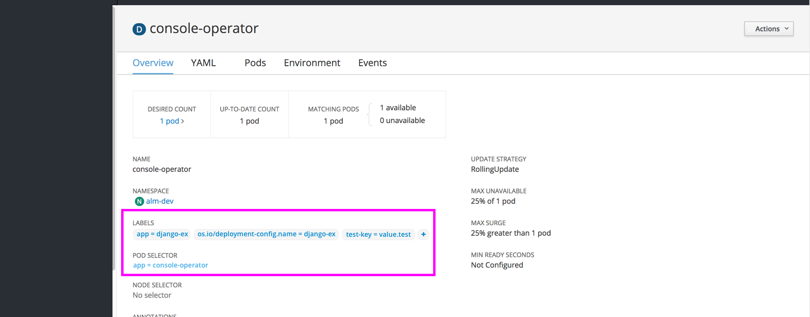
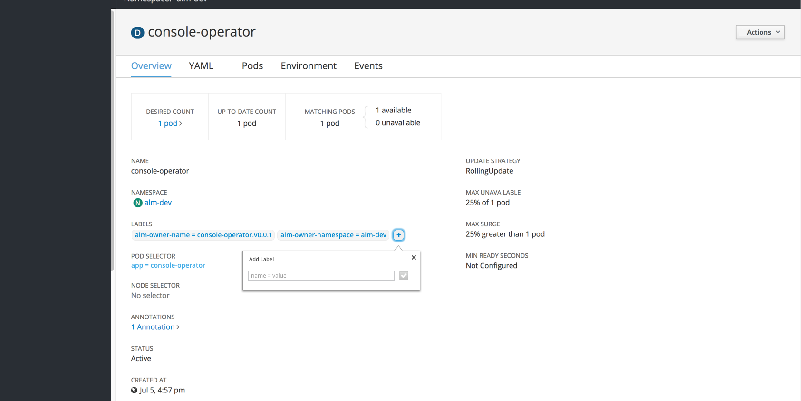
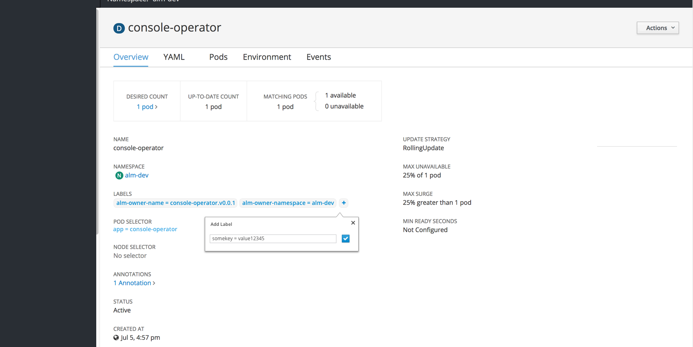
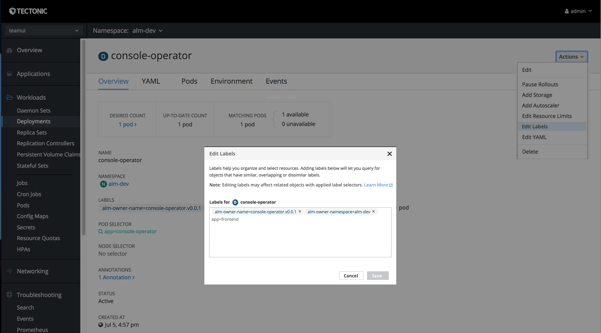
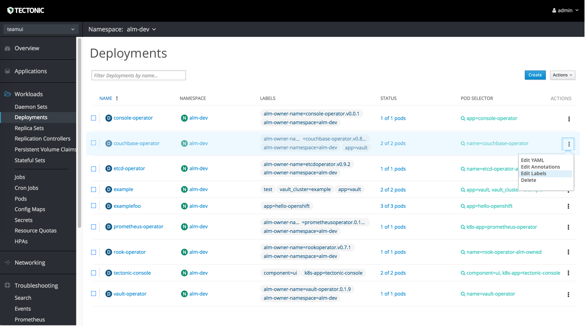
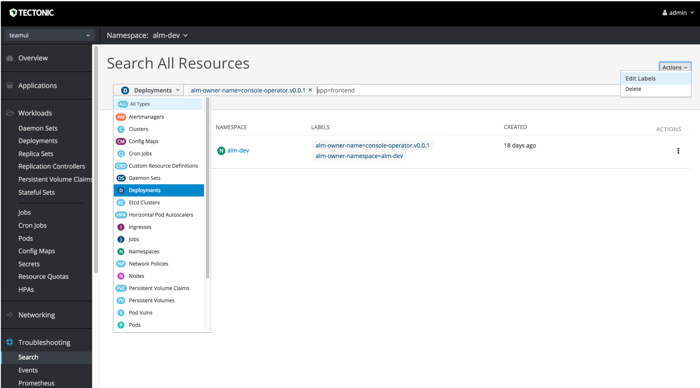

# Labels

## Styles

- Label text should match standard link text color, with the light grey background to differentiate from other links
- Label text color will not be matched to the corresponding resource badge color. All label colors will be the same across resource objects
- All pod selectors will be standard black font and the same across resource objects
- Editing labels will be done in paragraph form, using the equal sign between the key and value. When editing, each label will also have an x to delete individual labels as needed.

## Detail Pages
- Every resource detail page should include a section for “LABELS” just below name and namespace sections
- Clicking a label will jump to a filtered view of the New 'All Resources' Page

- There will be an option for a quick add + button for adding a label with a popover. The save button (checkmark icon) will be disabled until valid text is entered. Saving the label will add the new item to the list in the detail view.
- There will be an option to edit labels, visible in the Actions dropdown in the top right
- Clicking Edit Labels will open a modal where users can add, remove, and edit labels.
- There should be an added line of instructions with a "Learn More" link to documentation on how labels interact with label selectors.

## Summary Pages
- Every summary page should allow filter by name or label
- Every summary page should include a column titled “LABELS”
- Currently most pages do include labels, but this column would need to be added to PVCs, Stateful Sets, Cron Jobs, Config Maps, Secrets, etc.

- **Open Question:** Are there specific resources where we should hide the Labels column? Is it not needed in some cases?

- Each row should have kebabs on the right for individual edits
- Summary pages should have the ability to add bulk actions with an actions dropdown in the toolbar
- Each row should have checkboxes on the left for bulk editing

- When bulk editing, the edit modal will note the number of resources selected, with a summary of all labels associated with each selected resource below the edit area.
- Users will only be able to bulk edit the labels shared by all selections.

## New 'All Resources' Page

- Rename the current “Search” page to "Search All Resources”
- Add an ‘All Types’ option to the resource dropdown similar to events page
- Each row should have a checkbox on the left for bulk edits across different resource types. An Actions dropdown should be added in the top right with all available bulk actions listed. (Delete, Edit Labels, etc)
- Each row should have a kebab on the right for individual edits

- **Open Question:** Should “All Types” be the default or is there a performance concern/ time to load?
