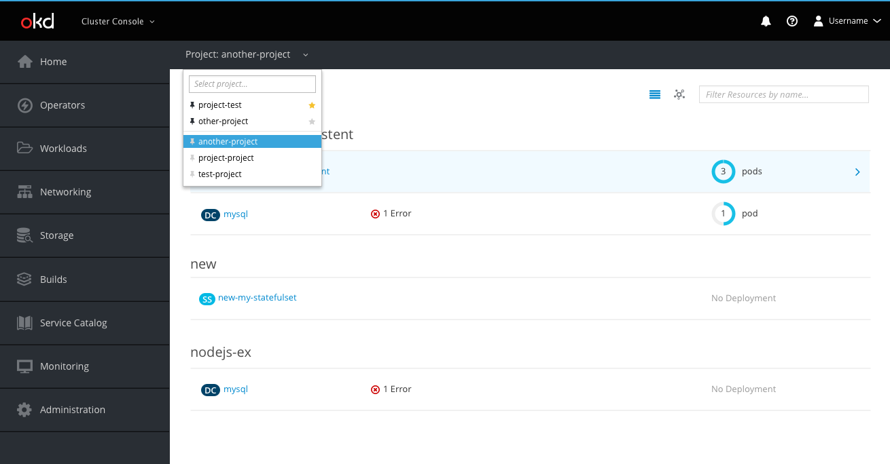

# Project Selector: Favorites and Defaults

The project selector will be accessible at all times from the secondary masthead.

* The project selector dropdown will have two sections; pinned projects and the default project will be in the first section of the list and all other projects will be in the second section of the list. The sections will be divided by a horizontal separator. Both sections will be sorted alphabetically, with the exception of the default project, which will always be the first project in the list.
* Pinned projects
  * Pinned projects are above the horizontal separator and have a black (pf-black) pin icon (pficon-thumb-tack) to the left of the project name.
  * Projects below the separator can be added to the pinned projects list by clicking its grey (pf-black-300) pin icon.
  * Pinned projects can be removed from the pinned list by clicking its black pin icon.
* Default project
  * The default project is the automatically selected project when a user logs in and navigates to a project specific page.
  * The default project is the first project in the list and has a yellow (pf-gold-300) star icon (fa-star) to the right of the project name.
  * Users may change the default project by clicking the grey (pf-black-300) star icon next to any of their pinned projects.
  * Only one project may be the default project at any given time.
  * If the user does not set a default project, the first project alphabetically will act as the default project.
