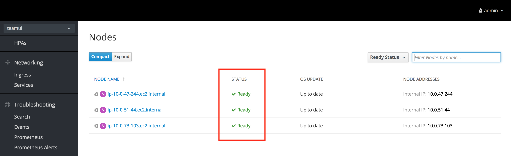
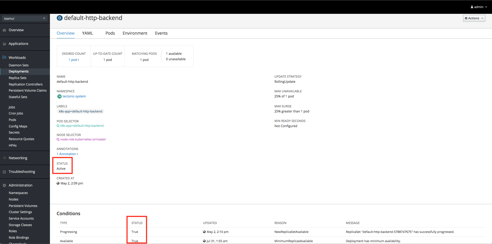
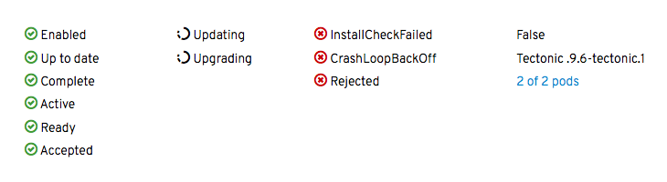

# Displaying Status
Status is primarily displayed on pages such as Summary and Details pages. Other pages status may appear on are Subscriptions and Search.

Summary Page

Details Page

## High Level Recommendations
Status can be displayed in a number of ways depending on the use case and page content. When displaying status in the console, use the following design recommendations regarding the visual treatment.

Example Statuses

#### Icons
* [Visual design](https://www.patternfly.org/styles/icons/)
  * Active/Ready/Complete: pficon-ok
  * Error/Failure: pficon-error-circle-o
  * Warning: pficon-warning-triangle-o
  * Updating/Progress: [spinner icon](https://www.patternfly.org/pattern-library/widgets/#spinner)
    * Note: When used in a list or table view, the static icon pficon-in-progress may be used instead
* [Colors](https://www.patternfly.org/styles/color-palette/)
  * Green: pf-green-400 #3f9c35
  * Red: pf-red-100 #cc0000
  * Orange: pf-orange-400 #ec7a08
  * Black: pf-black #030303

#### Spacing
* Dependent on context and element sizes
* Icon and text should never touch

#### Text
* [Sentence style](https://www.patternfly.org/styles/terminology-and-wording/)
  * Note: In cases where a status is a reason string condition, the status may remain in camel case with no spaces.
* [Color](https://www.patternfly.org/styles/color-palette/)
  * Black: pf-black #030303
  * Blue: pf-blue-400 #0088ce (for links only)
