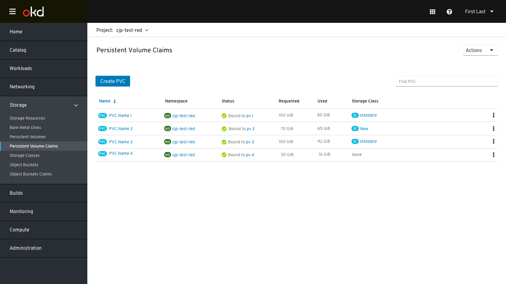
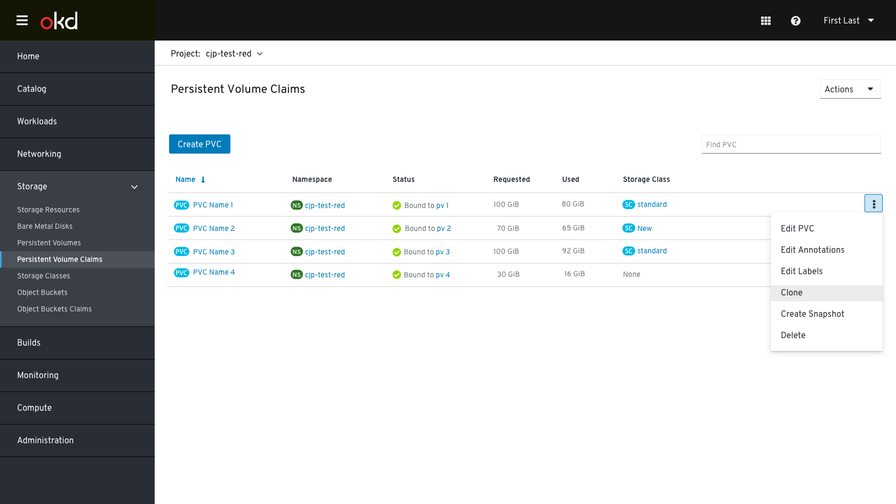
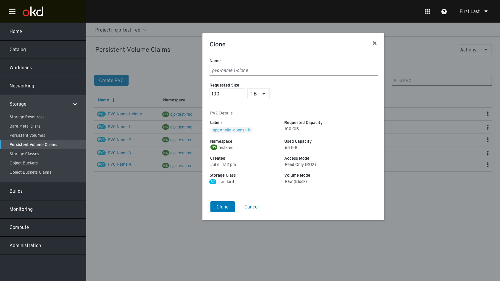
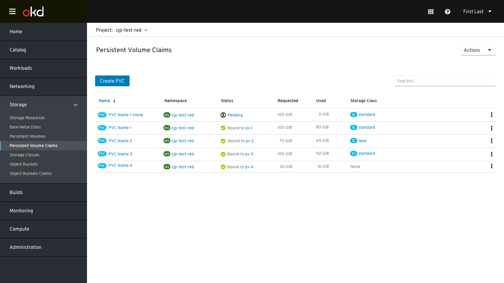
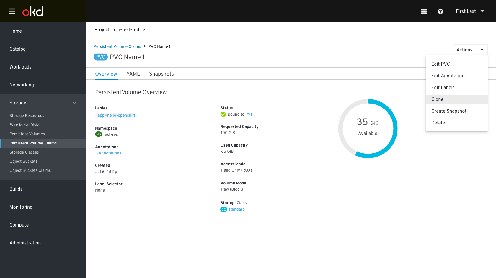

# Clone - PVC/PV

## Main use cases
Create clone (from where PVC/snapshot is)
All other List, View, Delete, Modify actions are that of a PV/PVC

#### Notes:
- Alpha support in Kubernetes v1.15
- critical for stateful workloads, especially databases
- similar behavior to creating a snapshot
- From user’s perspective, a clone is another PVC/PV; however contents of a clone is that its PV is populated from contents of a PV at creation time.
- After creation, the clone behaves just like any other PV.
- clone using create volume from existing snapshot or existing PV
- Cloning is only supported with CSI drivers (and not for in-tree or Flex drivers)
- To enable the Kubernetes Volume Cloning feature 
- enabled via the PersistentVolumeClaim.DataSource.Kind field
 
## User Stories
As a Developer, I want to be able to create a clone of a PVC.
- Name - suggest a default, e.g. clone-timestamp
- Select source PVC
- Requested size (this capacity must be specified and must be >= the capacity of the source volume)
- Scheduling support
- Note: The Create Clone action should only be exposed for PVCs backed by supported CSI drivers that support cloning.
 
#### Notes:
- Cloning action is only presented for drivers that support cloning.
- This may only apply to ceph-rbd (block-based PVs and snapshots).

## PVC/PV Clone Workflow
### List Page
 

Clicking on the clone option in the kebab menu will open the clone modal
 

#### Clone Modal
The clone modal includes a field for name and the pvc details. 
 

While cloning the status of the selected PVC will change to “Cloning” 
 

When cloning is done a new pvc will be created. The status depends with how the new PVC get bound. 

 
 

### Details Page

The same action menu we show in the list page when clicking on the kebab menu is also available when clicking on the actions menu in the details page. the clone modal is practically the same. 

