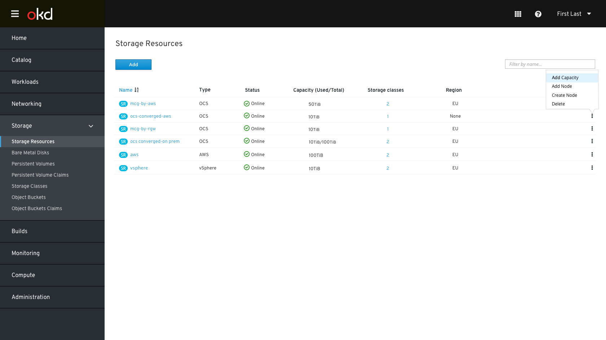
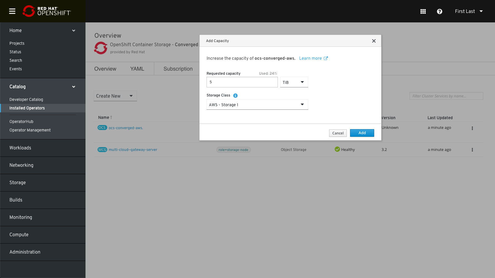
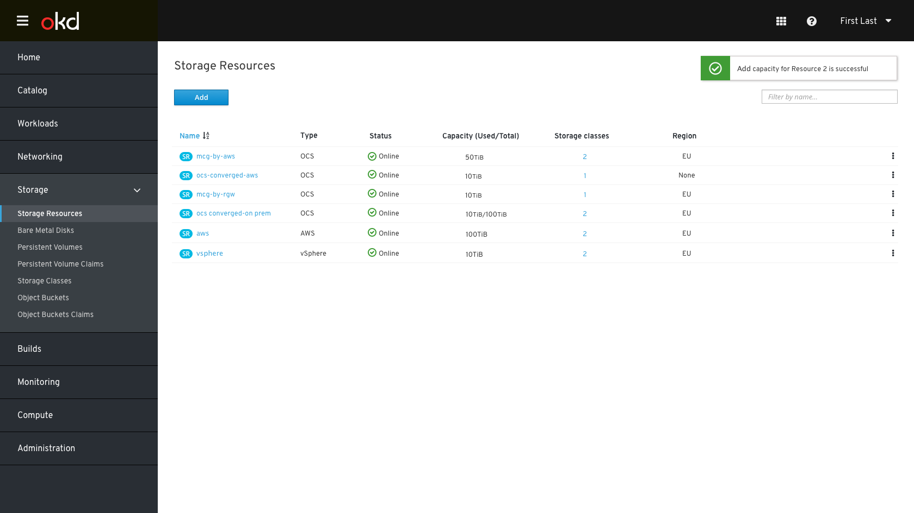
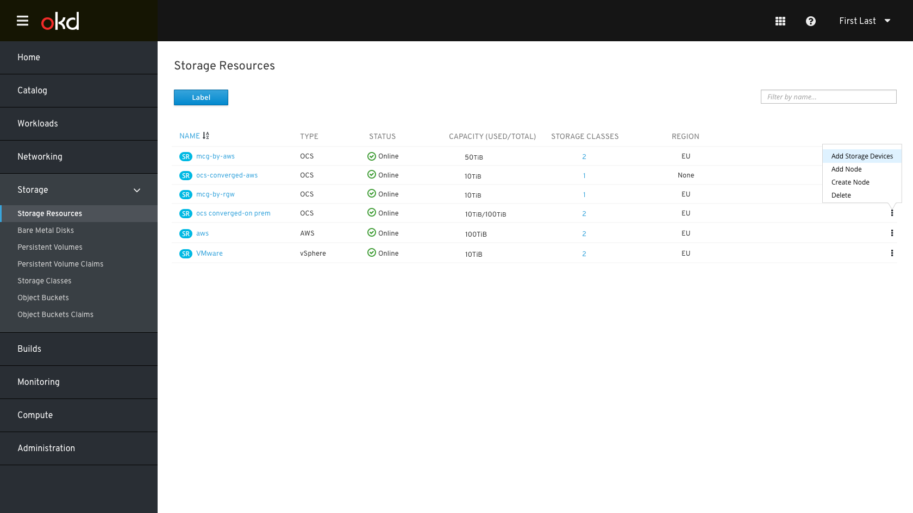
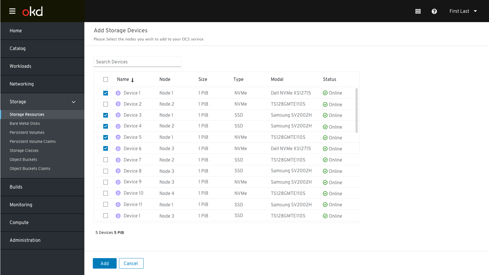
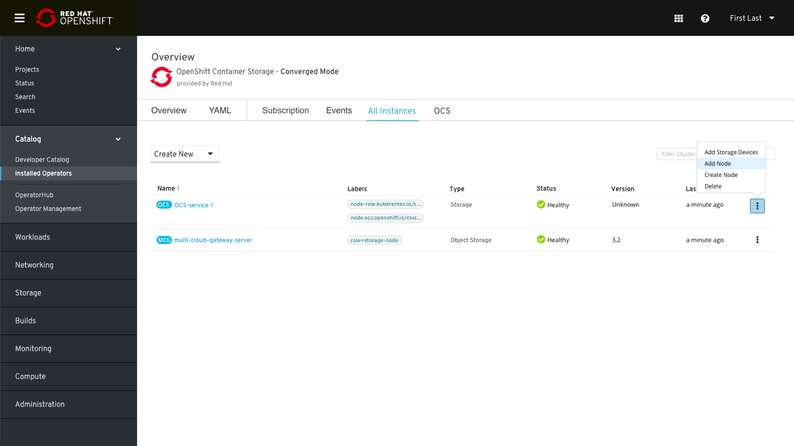
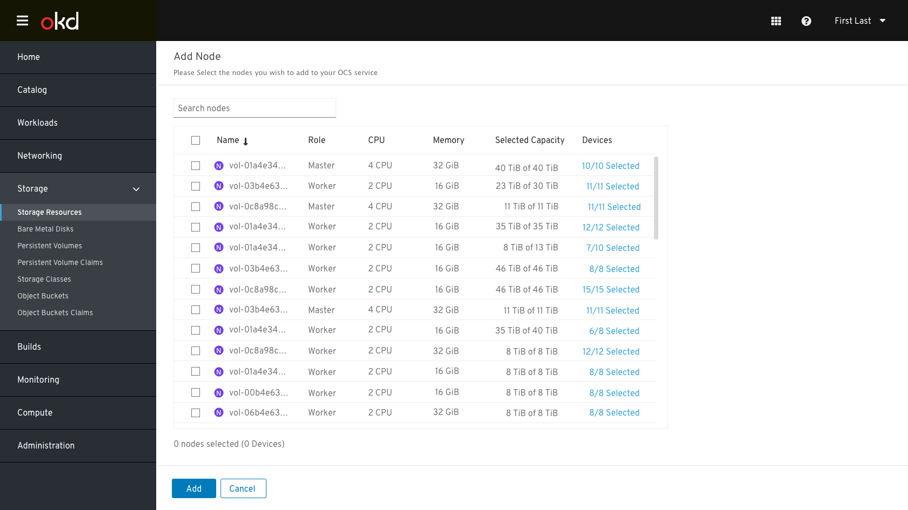
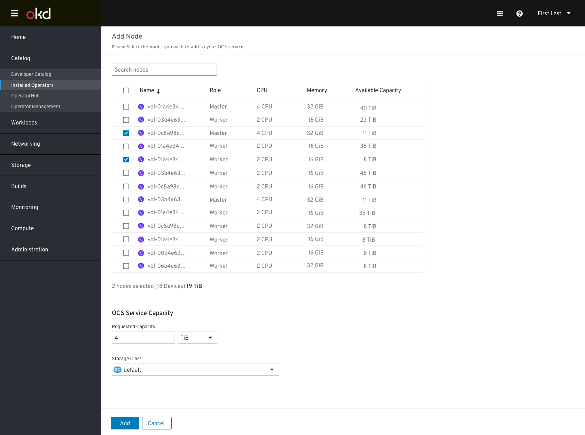

# Expand OCS Cluster

## Supported Deployments for OCS 4.2

- AWS (IPI & UPI)
- VMware (UPI only)
- RHHI.Next (Bare metal)

## Expand Resource Wireframes 
We added to the storage section a new entity for “Storage Resources” which lists all the different storage platforms that are applicable or currently configured on OpenShift:

## Add Capacity
To add capacity, the flow will be decided based on the platform OpenShift is deployed on:

- **Add Capacity** - add capacity by creating underlying storage devices/volumes (in the cloud, i.e. AWS/cloud)
- **Add Storage Devices** - use existing nodes & add available storage devices/volumes to select from (for UPI/unmanaged, i.e. VMware / Baremetal)

### Add Capacity (AWS/cloud)
 
In the resource kebab menu, the user will find an action called “Add Capacity” clicking on that will open the add modal.

 
In the “Add Capacity” modal, the user needs to decide on how much capacity he wants to add, and which storage class this request will be made against.

Note: The storage class presented should be filtered to only existing storage classes for the provisioners of the infrastructure OpenShift is deployed on, e.g. AWS or other cloud providers.
- Storage Class “Info tip”- The Storage Class will be used to request storage from the underlying infrastructure to create the backing persistent volumes that will be used to provide the OpenShift Container Storage (OCS) service.

While the expansion is in progress, we will present an “Expanding” status if possible.
Note: “Expanding" would cover Add Node, Add Capacity, and Expand/Grow Capacity (in the future).

When the expansion process is completed, the status will be changed back to online and a toast notification will be presented.
 

### Add Storage Devices (Baremetal)

Admin needs to select devices on the node/host, so they can be converted into CR, which in turn becomes the PVs.

Clicking on Add devices will open the “Add Storage Device” Form. 

After selecting the devices, clicking add will attach them to the OCS service. 

Note: based on the infrastructure the devices list will show different columns: 

- **For local storage for a baremetal node, device list should include**
    
    Device Name, Device UUID, Type, Capacity/Size, Model, Status

## Add Node
To add a node, the flow will be decided based on the platform OpenShift is deployed on:

- **Add Node** - use existing nodes & existing storage devices/volumes (in AWS) to select from [UPI / Unmanaged - AWS, VMware, Baremetal]
- **Create Node** - creating a new node along with a default of 1 PiB of capacity (in the cloud, i.e. AWS) [IPI]

### Add Existing Nodes

Clicking on adding node will open the Add Node form. 

Admin clicks on the node(s) he/she wishes to add, after selecting the nodes, the user can choose the ammount of capacity he needs for OCS.  

