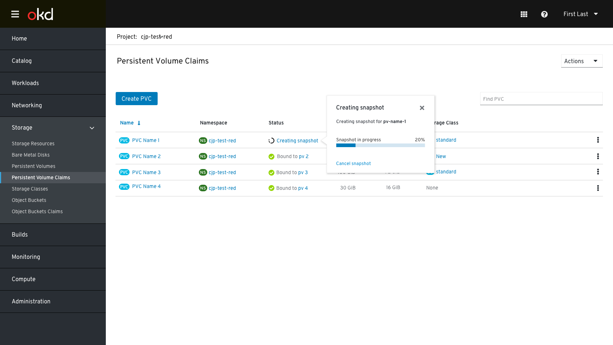

# PVC/PV Snapshots
 
## Main use cases
Create snapshot (from where PVC is)
List / View related snapshot(s) for a given PVC
Delete snapshot(s)
Create new PVC from a snapshot (import/restore snapshot)
 
## User Stories
- As a Developer, I want to be able to create a snapshot (from where PVC/PV is) to make a point-in-time copy of my data.  
- As a Developer, I want to create a new PVC/PV from a snapshot (import/restore snapshot)
- As a Developer, I want to delete 1 or more snapshot(s) when I no longer need to use the snapshot(s).
- As a Developer, I want to be able to list and view my snapshots for a given PVC/PV.
- As a Developer, I want to modify the schedule of a previously-scheduled snapshot.
- As a Developer, I want to know how much capacity the snapshots are taking. [Dashboard support for snapshots]
- As a Developer, I want to see recent snapshot-related events/activities. 

## PVC/PV Snapshot Workflow 
### List Pages 

In the list pages for PVC/PV, we added a “Create Snapshot” action to the kebab menu. 
  
### Snapshot Modal 
The snapshot light modal should include: 
- A field for the snapshot name
- A dropdown to select between: 
  - Single snapshot
  - Weekly snapshot
  - Monthly snapshot 
  - Cron scheduler  

### Schedule section includes:
#### For Monthly/Weekly:
- Time zone selection
- Day in month/week, hour, minutes and seconds fields
- Keep (history) How many instances of the scheduled snapshot the user wants to keep. (I think we should set a limit to how much versions users can save)

#### For Cron: 
- Text field for the cron format
- Keep (history) 

### Status Indication 
While snapshotting is in progress, the status indication shown is “Creating snapshot”. Clicking on the status indicator will show a popover with the progress indication. 
 

While a snapshot is in progress the only available action in the kebab menu will be “Stop Snapshot”. 

### Failure Scenario: 
If a PVC is not bound to a PV the snapshot action will fail. In that case snapshot action in the kebab menu will be disabled

### Details Pages

We added the Snapshots to the PVC Details page.  

#### Snapshots list:
The snapshot list is located under the PVC/PV. A tab item in the horizontal navigation will be dedicated for snapshots. The snapshot list is ordered by name as a default. For scheduled, a date will display the next snapshot. The list itself can be filtered to show "Taken" snapshots, "scheduled" snapshots or both (default).

 
Clicking on the snapshot name will open the details page.

#### Snapshot actions
The action available in the kebab menu are: 
- for old snapshot  
  - Restore
  - Create new PVC
  - Delete
- For future snapshots
  - Remove
  - Edit - Modify VolumeSnapshot schedule, cancel/pause/unpause?

##### Restore
Clicking restore will open a popup showing the snapshot details and the restore button. 

##### Delete
For old snapshot :

For Scheduled Snapshots

##### Edit Scheduled Snapshot
